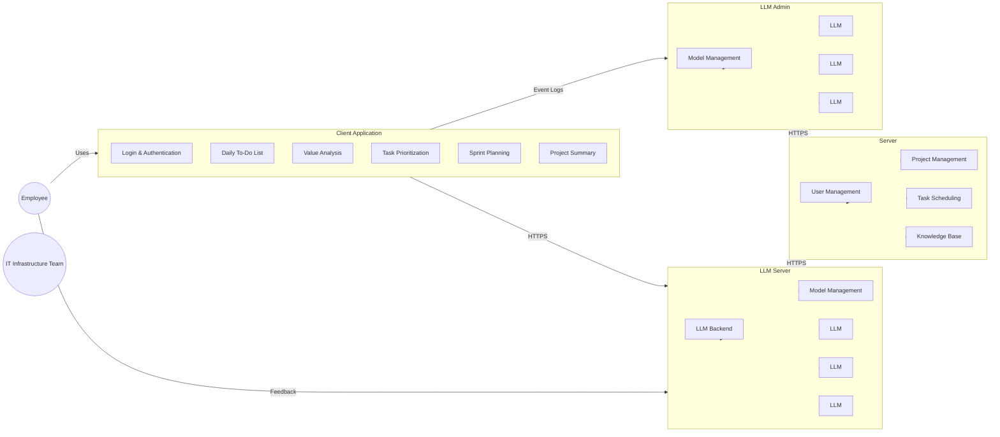

# UoR_APP Features & Architecture

## Full Featureset

### Core Features (Implemented/Planned)
- Project, task, and subtask management
- Team member management and permissions
- Sprint planning, prioritization, and daily planning
- Secure authentication (username, password, 2FA)
- Local-first, offline-capable design
- Dockerized deployment

### LLM/ML-Powered & Advanced Features (Planned)
- Modular LLM/ML-powered workflows
- Task delegation to local or server LLMs based on complexity
- Pluggable model system (swap models at backend, no client changes)
- Secure communication (HTTPS, gRPC)
- Load balancing for LLM inference
- No direct LLM chat: all model interactions are predefined and passive
- Version control: monitors changes, auto-generates commit messages, logs for team leads
- Analytics: bottleneck detection, task delay analysis, feedback-driven improvements
- Embedded tools: LibreOffice and VSCode integration for native editing
- Context switching: project summaries, task familiarization, knowledge base
- Feedback tools: suggestion box, bug report form, analytics pipeline

### User Roles
- **Employee:** Uses client app, views projects/tasks, submits feedback and daily reports
- **IT Infrastructure Team:** Accesses logs, model configs, server status, manages LLM deployments

### Authentication & Identity Management
- Username + password + 2FA
- User profiles: project memberships, schedules, task history, role-based permissions

### Core Workflows
- **Task Lifecycle & Planning:** BVA, subtask suggestion, prioritization, sprint planning
- **Daily Operations:** Auto-generated daily plan (Eisenhower Matrix), embedded tools, VCS, end-of-day reflection
- **Context Switching:** Project context summary, task familiarization
- **System Feedback:** Continuous analysis, feature rollout, feedback integration

### Optional/ML-Enhanced Features
- Commit message summarization from code diffs
- Task similarity matching for auto-subtasking
- Project health reports (velocity, blockers)
- Per-user workstyle adaptation
- Personal task memory ("you handled similar task in Q1")

---

## Architecture Overview

- **Client App:** React UI, to-do interface, embedded tools, local task execution, context workflows
- **Server App:** Node.js/Express backend, project/task DB, sprint planner, knowledge base, LLM executor, admin dashboard
- **LLM Infrastructure:** Modular execution, task allocation, predefined prompt chains

---

## Diagrams

### High-Level Architecture

---

## How to Contribute

- See the [README](../README.md) for setup and demo instructions.
- Open issues or pull requests for new features, bug fixes, or documentation improvements.
- Roadmap and open issues are tracked here.

---

## See Also

- [Project Brief](PROJECT_BRIEF.md)