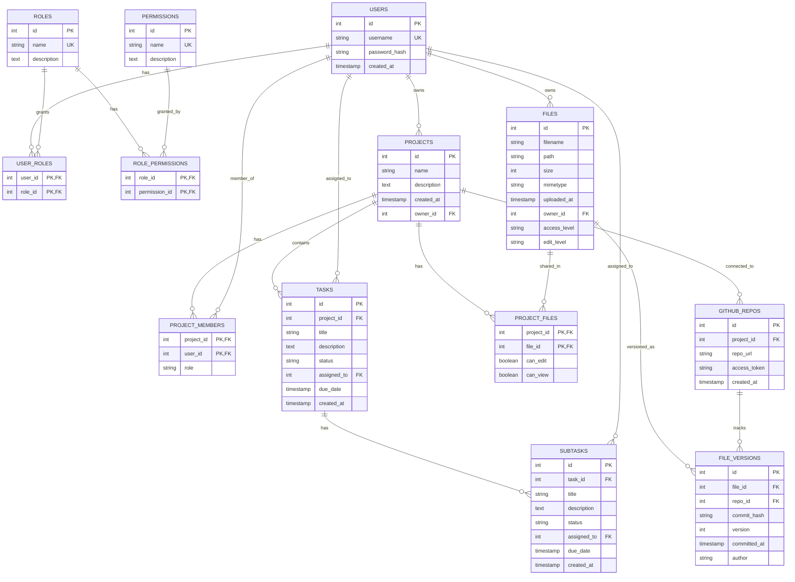

# Draft_2 Project Management Platform - System Architecture

## Overview

This document provides comprehensive system architecture documentation for the Draft_2 Project Management Platform, a full-stack web application built with Flask and React. The platform delivers modern project management capabilities with team collaboration, task management, and secure file sharing.

## Technology Stack

- **Frontend**: React 19.1.0, Vite 7.0.4, Material-UI 7.2.0
- **Backend**: Flask 3.0.0, SQLAlchemy 2.0.23
- **Database**: SQLite (development), PostgreSQL-ready (production)
- **Security**: bcrypt 4.1.2, Role-based access control
- **Infrastructure**: Docker
- **Development**: ESLint, Hot Module Replacement

---

## 1. System Architecture Overview

This high-level diagram shows the main system components and their interactions:


**Key Components:**
- **Port 5173**: Vite development server (React frontend)
- **Port 5000**: Flask API server (Backend)
- **Port 2200**: SSH server for secure connections
- **SQLite Database**: Local development database with production scalability
- **Docker Container**: Containerized deployment environment

---

## 2. Application Layer Architecture

This diagram shows detailed relationships between application layers and data flow:


**Authentication Flow:**
1. User submits credentials via React form
2. Frontend sends POST request to `/api/auth/login`
3. Flask validates credentials using bcrypt
4. Server responds with session token/user data
5. Frontend stores authentication state
6. Subsequent requests include authentication headers

---

## 3. Database Schema Diagram

This Entity Relationship Diagram shows all database tables and their relationships:



**Key Relationships:**
- **Users** can have multiple **Roles** with specific **Permissions**
- **Projects** have **Owners** and multiple **Members** with project-specific roles
- **Tasks** belong to **Projects** and can have multiple **Subtasks**
- **Files** have granular access controls and version tracking through **GitHub** integration

---

## 4. Component Architecture

This diagram shows the React frontend component hierarchy and routing structure:


**React Router Configuration:**
- `/` → [`Authentication.jsx`](ui/src/pages/Authentication.jsx:1) - Login/Register page
- `/dashboard` → [`Dashboard.jsx`](ui/src/pages/Dashboard.jsx:1) - Main user dashboard
- `/create-project` → [`ProjectCreation.jsx`](ui/src/pages/ProjectCreation.jsx:1) - Project creation
- `/admin-dashboard` → [`AdminDashboard.jsx`](ui/src/pages/AdminDashboard.jsx:1) - Admin controls
- `/employee-list` → [`EmployeeList.jsx`](ui/src/pages/EmployeeList.jsx:1) - User management
- `/add-user` → [`AddUser.jsx`](ui/src/pages/AddUser.jsx:1) - User registration

---

## 5. API Architecture

This diagram shows the Flask backend API structure and endpoint organization:


**Current API Implementation:**
- **Implemented**: [`/api/users`](app/api_server.py:7), [`/api/user-count`](app/api_server.py:22)
- **Database Layer**: [`db.py`](app/db.py:1) with SQLAlchemy models
- **Authentication**: bcrypt password hashing implemented
- **Planned**: Project, Task, File management endpoints

**API Response Format:**
```json
{
  "success": true,
  "data": {...},
  "message": "Operation completed successfully"
}
```

---

## 6. Deployment Architecture

This diagram shows the Docker containerization and infrastructure setup:


**Deployment Configuration:**
- **Base Image**: `python:3.11-slim` for minimal footprint
- **Non-root User**: `appuser` for security
- **Port Mapping**: 
  - 5000: Flask API server
  - 5173: Vite development server
  - 2200: SSH server
- **Volume Mounts**: Database persistence and configuration files
- **Environment Variables**: Configurable database path and server settings

**Docker Commands:**
```bash
# Build the container
docker build -t draft2-project-mgmt .

# Run with port mapping
docker run -p 5000:5000 -p 2200:2200 draft2-project-mgmt

# Development with volumes
docker run -v $(pwd)/app:/app -p 5000:5000 draft2-project-mgmt
```

---

## Security Architecture

### Authentication & Authorization


### Data Protection

- **Password Security**: bcrypt hashing with automatic salt generation
- **Database Security**: SQLAlchemy ORM prevents SQL injection
- **File Access Control**: Multi-level permissions (private, project, public)
- **Session Management**: Secure session handling (planned implementation)
- **Input Sanitization**: Client and server-side validation

---

## Performance Considerations

### Frontend Performance
- **Vite Build System**: Sub-second hot module replacement
- **React 19.1.0**: Latest React with concurrent features
- **Component Optimization**: Functional components with efficient hooks
- **Bundle Splitting**: Code splitting for optimal loading
- **Asset Optimization**: Lazy loading and tree shaking

### Backend Performance  
- **SQLAlchemy ORM**: Optimized query generation and connection pooling
- **Database Indexing**: Primary and foreign key indexing
- **API Design**: RESTful endpoints with efficient serialization
- **Caching Strategy**: Redis implementation planned for production

### Database Performance
- **Schema Design**: Normalized structure with appropriate constraints
- **Query Optimization**: Efficient JOIN operations and indexes
- **Connection Management**: SQLAlchemy session handling
- **Scalability**: PostgreSQL migration path for production

---

## Development Workflow

### Local Development Setup


### Production Deployment

1. **Database Migration**: SQLite → PostgreSQL for production scale
2. **Container Orchestration**: Docker Compose or Kubernetes
3. **Load Balancing**: Multiple Flask instances behind nginx
4. **Monitoring**: Application performance monitoring and logging
5. **Security Hardening**: HTTPS, security headers, rate limiting

---

## Technology Integration Points

### Current Integrations
- **Material-UI**: Professional component library with theming
- **React Router**: Client-side navigation and route protection  
- **SQLAlchemy**: Object-relational mapping with database abstraction
- **bcrypt**: Industry-standard password hashing
- **Docker**: Containerization for consistent deployment

### Planned Integrations
- **GitHub API**: Repository synchronization and version control
- **WebSockets**: Real-time collaboration features
- **Redis**: Caching and session management
- **AWS S3/Google Cloud**: Scalable file storage
- **OAuth Providers**: Third-party authentication (Google, Microsoft)

---

## Scalability Architecture

### Horizontal Scaling


### Vertical Scaling
- **CPU Optimization**: Multi-threading for Flask applications
- **Memory Management**: Efficient query caching and object pooling
- **Database Tuning**: Index optimization and query performance
- **CDN Integration**: Static asset delivery optimization

---

## Monitoring and Observability

### Application Monitoring
- **Performance Metrics**: Response time, throughput, error rates
- **Business Metrics**: User engagement, project creation, task completion
- **Infrastructure Metrics**: CPU, memory, disk usage, network I/O
- **Security Monitoring**: Authentication failures, suspicious activities

### Logging Strategy
- **Application Logs**: Structured logging with correlation IDs
- **Access Logs**: HTTP request logging with performance metrics
- **Error Logs**: Exception tracking and stack trace collection
- **Audit Logs**: User activity and data modification tracking

---

## Future Architecture Enhancements

### Microservices Evolution


### Cloud-Native Features
- **Container Orchestration**: Kubernetes deployment
- **Service Mesh**: Istio for service communication
- **Event-Driven Architecture**: Message queues for async processing
- **Auto-scaling**: Horizontal pod autoscaling based on metrics
- **Multi-region Deployment**: Geographic distribution for performance

---

## Conclusion

The Draft_2 Project Management Platform demonstrates a well-architected, modern web application with clear separation of concerns, scalable design patterns, and security-conscious implementation. The architecture provides:

1. **Solid Foundation**: React + Flask with professional component libraries
2. **Security-First Design**: bcrypt hashing, RBAC, input validation
3. **Scalable Architecture**: Clear migration path from SQLite to production databases
4. **Developer Experience**: Hot module replacement, comprehensive tooling
5. **Production Readiness**: Docker containerization, monitoring hooks

The modular design and comprehensive database schema position the platform for continued development and enterprise-scale deployment, with clear paths for microservices evolution and cloud-native enhancement.

**Next Steps:**
- Complete backend API implementation
- Implement real-time features with WebSockets
- Add comprehensive testing suite
- Performance optimization and caching
- Security hardening and compliance features