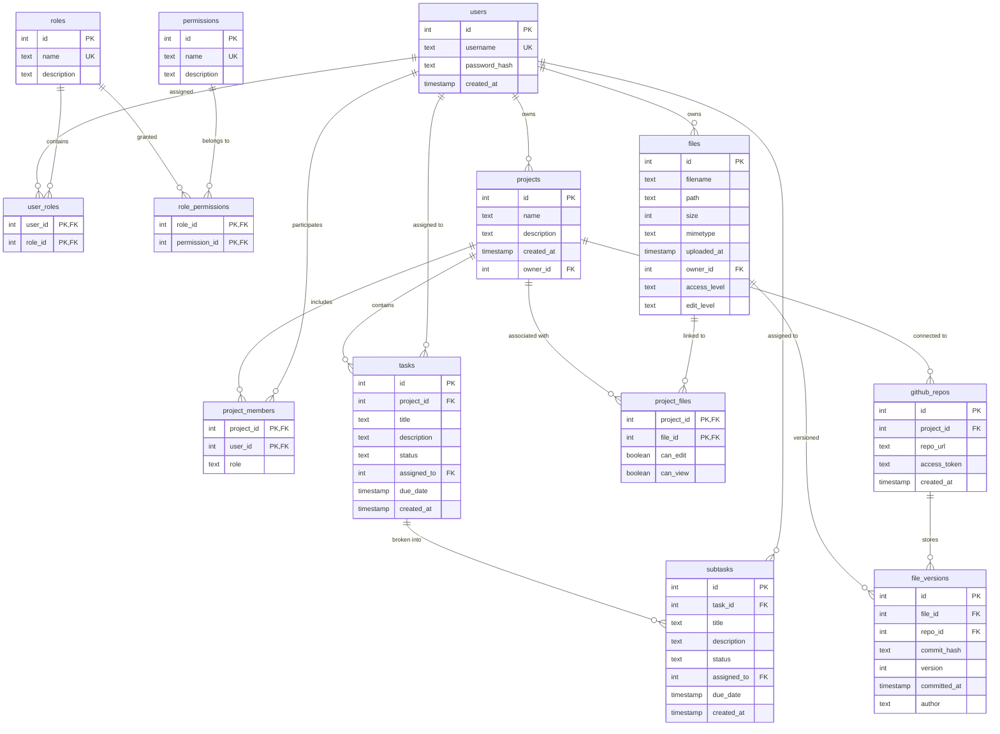

# Database Schema Documentation

## Database Overview

### Database Engine
- **Primary Database**: SQLite (for development and local deployment)
- **Production Migration Path**: PostgreSQL (recommended for scalability)
- **Database File Location**: [`app/auth.db`](app/auth.db) (configurable via `AUTH_DB_PATH` environment variable)
- **ORM Framework**: SQLAlchemy with declarative base models

### Connection Management
- **Engine Configuration**: SQLite with connection pooling disabled (`check_same_thread=False`)
- **Session Management**: SQLAlchemy SessionLocal with autocommit=False, autoflush=False
- **Connection String**: `sqlite:///app/auth.db` (default)

### Transaction Handling
- Manual transaction control via SQLAlchemy sessions
- Automatic rollback on exceptions
- Connection pooling managed by SQLAlchemy engine

---

## Entity Relationship Diagram



---

## Table Documentation

### Core Authentication Tables

#### users
**Purpose**: Central user account management and authentication

| Column | Type | Constraints | Description |
|--------|------|-------------|-------------|
| [`id`](app/schema.sql:4) | INTEGER | PRIMARY KEY, AUTOINCREMENT | Unique user identifier |
| [`username`](app/schema.sql:5) | TEXT | NOT NULL, UNIQUE | User login name |
| [`password_hash`](app/schema.sql:6) | TEXT | NOT NULL | Bcrypt hashed password (never plaintext) |
| [`created_at`](app/schema.sql:7) | TIMESTAMP | DEFAULT CURRENT_TIMESTAMP | Account creation timestamp |

**Relationships**:
- One-to-Many with [`projects`](app/schema.sql:40) (as owner)
- Many-to-Many with [`roles`](app/schema.sql:10) via [`user_roles`](app/schema.sql:30)
- One-to-Many with [`tasks`](app/schema.sql:58) and [`subtasks`](app/schema.sql:71) (as assignee)
- One-to-Many with [`files`](app/schema.sql:86) (as owner)

#### roles
**Purpose**: System role definitions for hierarchical access control

| Column | Type | Constraints | Description |
|--------|------|-------------|-------------|
| [`id`](app/schema.sql:11) | INTEGER | PRIMARY KEY, AUTOINCREMENT | Unique role identifier |
| [`name`](app/schema.sql:12) | TEXT | NOT NULL, UNIQUE | Role name (e.g., 'admin', 'user', 'manager') |
| [`description`](app/schema.sql:13) | TEXT | | Role description and purpose |

**Relationships**:
- Many-to-Many with [`users`](app/schema.sql:3) via [`user_roles`](app/schema.sql:30)
- Many-to-Many with [`permissions`](app/schema.sql:16) via [`role_permissions`](app/schema.sql:22)

#### permissions
**Purpose**: Granular permission definitions for fine-grained access control

| Column | Type | Constraints | Description |
|--------|------|-------------|-------------|
| [`id`](app/schema.sql:17) | INTEGER | PRIMARY KEY, AUTOINCREMENT | Unique permission identifier |
| [`name`](app/schema.sql:18) | TEXT | NOT NULL, UNIQUE | Permission name (e.g., 'create_project', 'edit_files') |
| [`description`](app/schema.sql:19) | TEXT | | Permission description and scope |

**Relationships**:
- Many-to-Many with [`roles`](app/schema.sql:10) via [`role_permissions`](app/schema.sql:22)

#### user_roles
**Purpose**: Many-to-Many relationship table for user-role assignments

| Column | Type | Constraints | Description |
|--------|------|-------------|-------------|
| [`user_id`](app/schema.sql:31) | INTEGER | PRIMARY KEY, FOREIGN KEY → users.id | User reference |
| [`role_id`](app/schema.sql:32) | INTEGER | PRIMARY KEY, FOREIGN KEY → roles.id | Role reference |

**Constraints**:
- Composite Primary Key: (user_id, role_id)
- CASCADE DELETE on both foreign keys

#### role_permissions
**Purpose**: Many-to-Many relationship table for role-permission mappings

| Column | Type | Constraints | Description |
|--------|------|-------------|-------------|
| [`role_id`](app/schema.sql:23) | INTEGER | PRIMARY KEY, FOREIGN KEY → roles.id | Role reference |
| [`permission_id`](app/schema.sql:24) | INTEGER | PRIMARY KEY, FOREIGN KEY → permissions.id | Permission reference |

**Constraints**:
- Composite Primary Key: (role_id, permission_id)
- CASCADE DELETE on both foreign keys

---

### Project Management Tables

#### projects
**Purpose**: Central project definition and ownership tracking

| Column | Type | Constraints | Description |
|--------|------|-------------|-------------|
| [`id`](app/schema.sql:41) | INTEGER | PRIMARY KEY, AUTOINCREMENT | Unique project identifier |
| [`name`](app/schema.sql:42) | TEXT | NOT NULL | Project name |
| [`description`](app/schema.sql:43) | TEXT | | Project description and goals |
| [`created_at`](app/schema.sql:44) | TIMESTAMP | DEFAULT CURRENT_TIMESTAMP | Project creation timestamp |
| [`owner_id`](app/schema.sql:45) | INTEGER | NOT NULL, FOREIGN KEY → users.id | Project owner reference |

**Relationships**:
- Many-to-One with [`users`](app/schema.sql:3) (owner relationship)
- One-to-Many with [`tasks`](app/schema.sql:58)
- Many-to-Many with [`users`](app/schema.sql:3) via [`project_members`](app/schema.sql:49)
- One-to-Many with [`github_repos`](app/schema.sql:110)

#### project_members
**Purpose**: Project team membership and role assignments

| Column | Type | Constraints | Description |
|--------|------|-------------|-------------|
| [`project_id`](app/schema.sql:50) | INTEGER | PRIMARY KEY, FOREIGN KEY → projects.id | Project reference |
| [`user_id`](app/schema.sql:51) | INTEGER | PRIMARY KEY, FOREIGN KEY → users.id | Team member reference |
| [`role`](app/schema.sql:52) | TEXT | | Project-specific role (e.g., 'developer', 'manager') |

**Constraints**:
- Composite Primary Key: (project_id, user_id)
- CASCADE DELETE on both foreign keys

#### tasks
**Purpose**: Project task management with assignment and status tracking

| Column | Type | Constraints | Description |
|--------|------|-------------|-------------|
| [`id`](app/schema.sql:59) | INTEGER | PRIMARY KEY, AUTOINCREMENT | Unique task identifier |
| [`project_id`](app/schema.sql:60) | INTEGER | NOT NULL, FOREIGN KEY → projects.id | Parent project reference |
| [`title`](app/schema.sql:61) | TEXT | NOT NULL | Task title |
| [`description`](app/schema.sql:62) | TEXT | | Detailed task description |
| [`status`](app/schema.sql:63) | TEXT | DEFAULT 'pending' | Task status (pending, in_progress, completed, etc.) |
| [`assigned_to`](app/schema.sql:64) | INTEGER | FOREIGN KEY → users.id | Assigned user reference |
| [`due_date`](app/schema.sql:65) | TIMESTAMP | | Task deadline |
| [`created_at`](app/schema.sql:66) | TIMESTAMP | DEFAULT CURRENT_TIMESTAMP | Task creation timestamp |

**Relationships**:
- Many-to-One with [`projects`](app/schema.sql:40)
- Many-to-One with [`users`](app/schema.sql:3) (assignee)
- One-to-Many with [`subtasks`](app/schema.sql:71)

#### subtasks
**Purpose**: Task decomposition for detailed work breakdown

| Column | Type | Constraints | Description |
|--------|------|-------------|-------------|
| [`id`](app/schema.sql:72) | INTEGER | PRIMARY KEY, AUTOINCREMENT | Unique subtask identifier |
| [`task_id`](app/schema.sql:73) | INTEGER | NOT NULL, FOREIGN KEY → tasks.id | Parent task reference |
| [`title`](app/schema.sql:74) | TEXT | NOT NULL | Subtask title |
| [`description`](app/schema.sql:75) | TEXT | | Detailed subtask description |
| [`status`](app/schema.sql:76) | TEXT | DEFAULT 'pending' | Subtask status |
| [`assigned_to`](app/schema.sql:77) | INTEGER | FOREIGN KEY → users.id | Assigned user reference |
| [`due_date`](app/schema.sql:78) | TIMESTAMP | | Subtask deadline |
| [`created_at`](app/schema.sql:79) | TIMESTAMP | DEFAULT CURRENT_TIMESTAMP | Subtask creation timestamp |

**Relationships**:
- Many-to-One with [`tasks`](app/schema.sql:58)
- Many-to-One with [`users`](app/schema.sql:3) (assignee)

---

### File Management Tables

#### files
**Purpose**: Central file metadata storage with access control

| Column | Type | Constraints | Description |
|--------|------|-------------|-------------|
| [`id`](app/schema.sql:87) | INTEGER | PRIMARY KEY, AUTOINCREMENT | Unique file identifier |
| [`filename`](app/schema.sql:88) | TEXT | NOT NULL | Original filename |
| [`path`](app/schema.sql:89) | TEXT | NOT NULL | File system path |
| [`size`](app/schema.sql:90) | INTEGER | | File size in bytes |
| [`mimetype`](app/schema.sql:91) | TEXT | | File MIME type |
| [`uploaded_at`](app/schema.sql:92) | TIMESTAMP | DEFAULT CURRENT_TIMESTAMP | Upload timestamp |
| [`owner_id`](app/schema.sql:93) | INTEGER | NOT NULL, FOREIGN KEY → users.id | File owner reference |
| [`access_level`](app/schema.sql:94) | TEXT | NOT NULL, DEFAULT 'private' | Access level: 'private', 'project', 'public' |
| [`edit_level`](app/schema.sql:95) | TEXT | NOT NULL, DEFAULT 'owner' | Edit permission: 'owner', 'project', 'any' |

**Relationships**:
- Many-to-One with [`users`](app/schema.sql:3) (owner)
- Many-to-Many with [`projects`](app/schema.sql:40) via [`project_files`](app/schema.sql:99)
- One-to-Many with [`file_versions`](app/schema.sql:119)

#### project_files
**Purpose**: File-project association with granular permissions

| Column | Type | Constraints | Description |
|--------|------|-------------|-------------|
| [`project_id`](app/schema.sql:100) | INTEGER | PRIMARY KEY, FOREIGN KEY → projects.id | Project reference |
| [`file_id`](app/schema.sql:101) | INTEGER | PRIMARY KEY, FOREIGN KEY → files.id | File reference |
| [`can_edit`](app/schema.sql:102) | BOOLEAN | NOT NULL, DEFAULT 0 | Edit permission flag |
| [`can_view`](app/schema.sql:103) | BOOLEAN | NOT NULL, DEFAULT 1 | View permission flag |

**Constraints**:
- Composite Primary Key: (project_id, file_id)
- CASCADE DELETE on both foreign keys

#### github_repos
**Purpose**: GitHub repository integration for version control

| Column | Type | Constraints | Description |
|--------|------|-------------|-------------|
| [`id`](app/schema.sql:111) | INTEGER | PRIMARY KEY, AUTOINCREMENT | Unique repository identifier |
| [`project_id`](app/schema.sql:112) | INTEGER | NOT NULL, FOREIGN KEY → projects.id | Associated project reference |
| [`repo_url`](app/schema.sql:113) | TEXT | NOT NULL | GitHub repository URL |
| [`access_token`](app/schema.sql:114) | TEXT | | GitHub API access token (encrypted in production) |
| [`created_at`](app/schema.sql:115) | TIMESTAMP | DEFAULT CURRENT_TIMESTAMP | Integration creation timestamp |

**Relationships**:
- Many-to-One with [`projects`](app/schema.sql:40)
- One-to-Many with [`file_versions`](app/schema.sql:119)

#### file_versions
**Purpose**: File version tracking with GitHub commit integration

| Column | Type | Constraints | Description |
|--------|------|-------------|-------------|
| [`id`](app/schema.sql:120) | INTEGER | PRIMARY KEY, AUTOINCREMENT | Unique version identifier |
| [`file_id`](app/schema.sql:121) | INTEGER | NOT NULL, FOREIGN KEY → files.id | File reference |
| [`repo_id`](app/schema.sql:122) | INTEGER | NOT NULL, FOREIGN KEY → github_repos.id | Repository reference |
| [`commit_hash`](app/schema.sql:123) | TEXT | NOT NULL | Git commit hash |
| [`version`](app/schema.sql:124) | INTEGER | NOT NULL | Version number |
| [`committed_at`](app/schema.sql:125) | TIMESTAMP | DEFAULT CURRENT_TIMESTAMP | Commit timestamp |
| [`author`](app/schema.sql:126) | TEXT | | Commit author |

**Relationships**:
- Many-to-One with [`files`](app/schema.sql:86)
- Many-to-One with [`github_repos`](app/schema.sql:110)

---

## Data Relationships

### User Authentication and Role-Based Access Control
- **Hierarchical Permissions**: Users → Roles → Permissions (many-to-many relationships)
- **Role Assignment**: Multiple roles per user for flexible access control
- **Permission Inheritance**: Roles aggregate permissions for simplified management

### Project-Team-Task Hierarchies
- **Project Ownership**: Each project has a single owner (users.id → projects.owner_id)
- **Team Membership**: Projects can have multiple members with specific roles
- **Task Assignment**: Tasks and subtasks can be assigned to team members
- **Task Decomposition**: Tasks can be broken down into multiple subtasks

### File Permissions and Project Associations
- **File Ownership**: Each file has a single owner with full control
- **Project Integration**: Files can be associated with multiple projects
- **Access Control**: Three-level access (private/project/public) and edit permissions
- **Version Control**: Files can have multiple versions tracked via GitHub integration

### GitHub Integration for Version Control
- **Repository Linking**: Projects can connect to GitHub repositories
- **Version Tracking**: File changes tracked via commit hashes
- **Author Attribution**: Commit authors preserved in version history

---

## Database Initialization

### Setup Procedures

#### Creating Database from Schema
```python
# Initialize database using db.py
from app.db import init_db
init_db()
```

#### Manual Schema Creation
```bash
# Direct SQL execution
sqlite3 app/auth.db < app/schema.sql
```

### Initial Data Seeding
The [`init_db()`](app/db.py:53) function:
1. Creates all tables from SQLAlchemy models
2. Executes additional schema.sql statements
3. Handles missing table creation gracefully

### Test Data Creation
```python
# Create test admin user (from db.py)
register_user("admin", "admin123", "admin")
```

### Migration Procedures
- **Current**: SQLite for development and small deployments
- **Future**: PostgreSQL migration path for production scalability
- **Strategy**: SQLAlchemy provides database-agnostic ORM for easier migration

---

## Data Integrity

### Foreign Key Constraints
- **CASCADE DELETE**: Automatically removes dependent records
  - [`user_roles`](app/schema.sql:30): User or role deletion removes assignments
  - [`project_members`](app/schema.sql:49): Project deletion removes memberships
  - [`tasks`](app/schema.sql:58): Project deletion removes all tasks
  - [`subtasks`](app/schema.sql:71): Task deletion removes all subtasks

- **SET NULL**: Preserves records but removes references
  - [`tasks.assigned_to`](app/schema.sql:64): User deletion unassigns tasks
  - [`subtasks.assigned_to`](app/schema.sql:77): User deletion unassigns subtasks

### Check Constraints
- **Status Values**: Enforce valid status values for tasks/subtasks
- **Access Levels**: Validate file access_level ('private', 'project', 'public')
- **Edit Levels**: Validate file edit_level ('owner', 'project', 'any')

### Unique Constraints
- [`users.username`](app/schema.sql:5): Prevent duplicate usernames
- [`roles.name`](app/schema.sql:12): Ensure unique role names
- [`permissions.name`](app/schema.sql:18): Ensure unique permission names

### Data Validation Rules
- **Password Security**: Only hashed passwords stored (via bcrypt)
- **Required Fields**: NOT NULL constraints on essential fields
- **Timestamp Defaults**: Automatic creation timestamps
- **Boolean Defaults**: Sensible defaults for permission flags

---

## Performance Considerations

### Indexing Strategy
- **Primary Keys**: Automatic B-tree indexes on all primary keys
- **Foreign Keys**: Consider indexing for join performance:
  ```sql
  CREATE INDEX idx_tasks_project_id ON tasks(project_id);
  CREATE INDEX idx_tasks_assigned_to ON tasks(assigned_to);
  CREATE INDEX idx_files_owner_id ON files(owner_id);
  ```

### Query Optimization
- **Composite Indexes**: For multi-column queries on junction tables
- **Partial Indexes**: For filtered queries (e.g., active tasks only)
- **Join Optimization**: Proper foreign key indexing for relationship queries

### Scalability Considerations
- **Connection Pooling**: Implement for high-concurrency scenarios
- **Read Replicas**: Separate read/write operations for scaling
- **Partitioning**: Consider table partitioning for large datasets

### Migration to PostgreSQL
**Benefits**:
- Better concurrent access control
- Advanced indexing options (GIN, GiST)
- Full-text search capabilities
- JSON column support for metadata
- Better performance with large datasets

**Migration Strategy**:
1. Update SQLAlchemy engine configuration
2. Adjust schema for PostgreSQL-specific features
3. Implement connection pooling
4. Add database-specific optimizations

---

## Sample Queries

### User Authentication Queries
```sql
-- Authenticate user with role checking
SELECT u.id, u.username, r.name as role_name
FROM users u
JOIN user_roles ur ON u.id = ur.user_id
JOIN roles r ON ur.role_id = r.id
WHERE u.username = ? AND u.password_hash = ?;

-- Check user permissions
SELECT p.name as permission
FROM users u
JOIN user_roles ur ON u.id = ur.user_id
JOIN roles r ON ur.role_id = r.id
JOIN role_permissions rp ON r.id = rp.role_id
JOIN permissions p ON rp.permission_id = p.id
WHERE u.id = ?;
```

### Project and Task Retrieval
```sql
-- Get user's projects with role
SELECT p.id, p.name, p.description, pm.role
FROM projects p
JOIN project_members pm ON p.id = pm.project_id
WHERE pm.user_id = ?
ORDER BY p.created_at DESC;

-- Get project tasks with assignee information
SELECT t.id, t.title, t.status, t.due_date, u.username as assignee
FROM tasks t
LEFT JOIN users u ON t.assigned_to = u.id
WHERE t.project_id = ?
ORDER BY t.created_at DESC;

-- Get task subtasks
SELECT st.id, st.title, st.status, st.due_date
FROM subtasks st
WHERE st.task_id = ?
ORDER BY st.created_at ASC;
```

### Permission Checking
```sql
-- Check if user can edit a file
SELECT f.id
FROM files f
LEFT JOIN project_files pf ON f.id = pf.file_id
LEFT JOIN project_members pm ON pf.project_id = pm.project_id
WHERE f.id = ? AND (
    f.owner_id = ? OR
    (f.edit_level = 'project' AND pm.user_id = ?) OR
    (f.edit_level = 'any')
);

-- Check project membership
SELECT pm.role
FROM project_members pm
WHERE pm.project_id = ? AND pm.user_id = ?;
```

### Reporting Queries
```sql
-- Project statistics
SELECT 
    p.id,
    p.name,
    COUNT(DISTINCT pm.user_id) as member_count,
    COUNT(DISTINCT t.id) as task_count,
    COUNT(DISTINCT CASE WHEN t.status = 'completed' THEN t.id END) as completed_tasks
FROM projects p
LEFT JOIN project_members pm ON p.id = pm.project_id
LEFT JOIN tasks t ON p.id = t.project_id
GROUP BY p.id, p.name;

-- User workload
SELECT 
    u.username,
    COUNT(DISTINCT t.id) as assigned_tasks,
    COUNT(DISTINCT CASE WHEN t.status = 'pending' THEN t.id END) as pending_tasks
FROM users u
LEFT JOIN tasks t ON u.id = t.assigned_to
GROUP BY u.id, u.username;
```

---

## Database Configuration Files

### Primary Schema: [`app/schema.sql`](app/schema.sql)
Complete table definitions with constraints and relationships

### Database Models: [`app/db.py`](app/db.py)
SQLAlchemy ORM models and connection management

### API Integration: [`app/api_server.py`](app/api_server.py)
Flask API endpoints using database models

---

*Generated from Draft_2 project management platform schema*
*Last Updated: 2025-07-20*