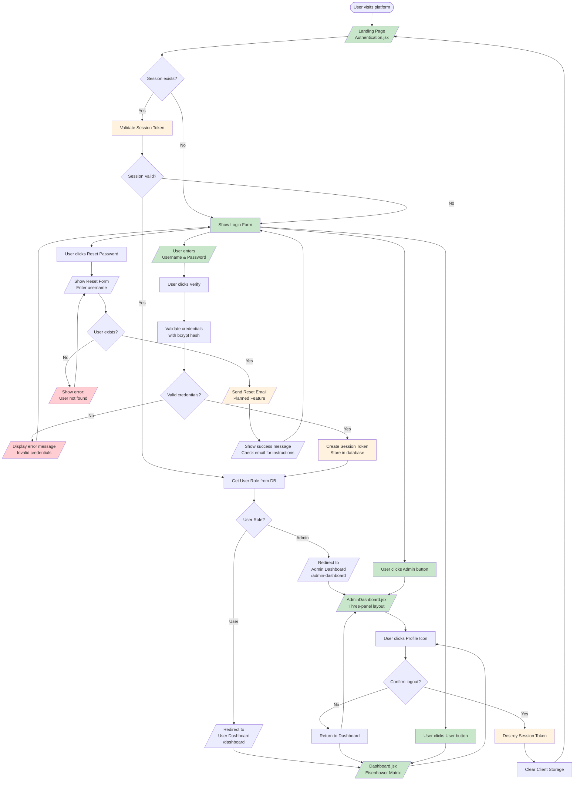
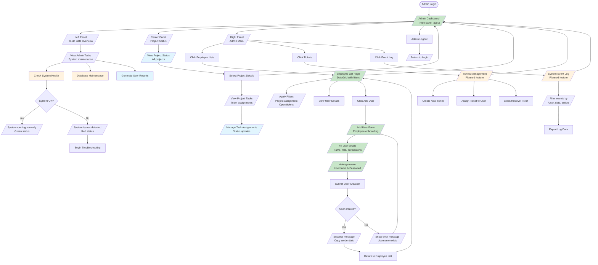
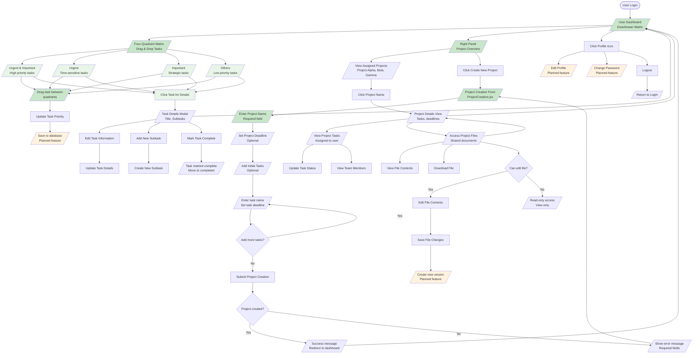
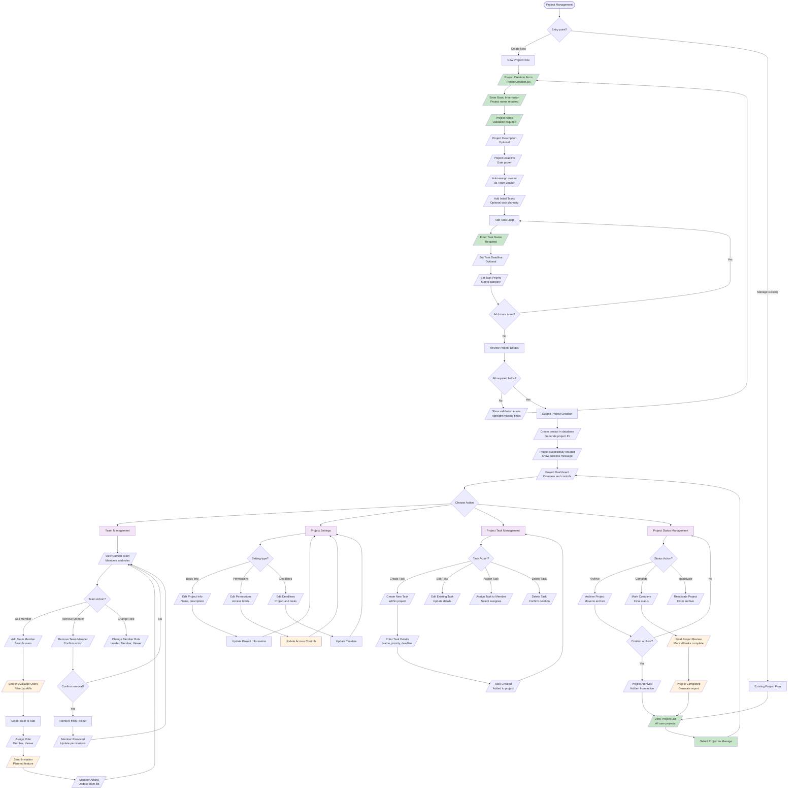
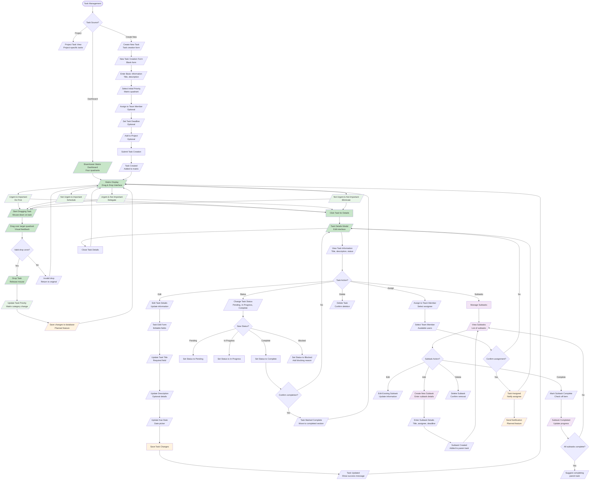
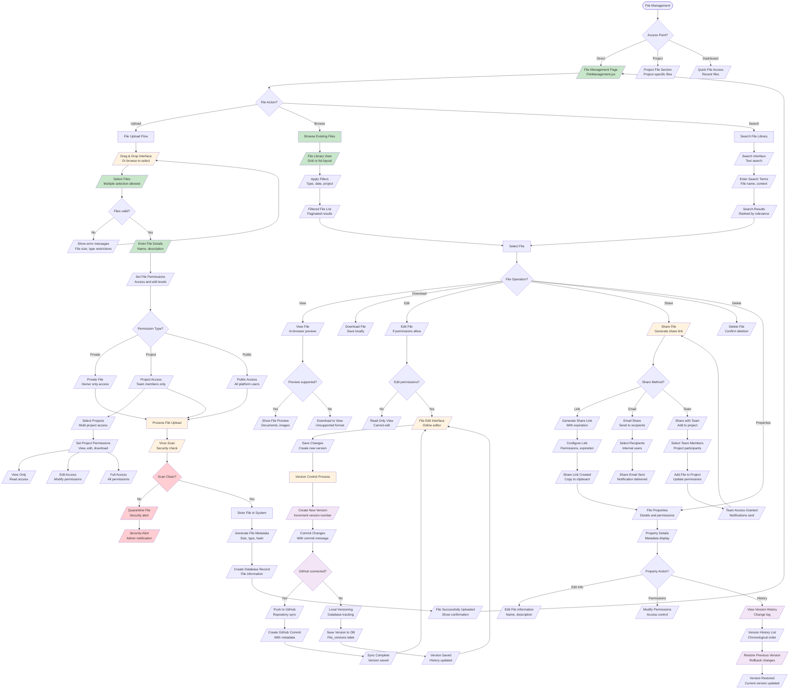

# User Flow Diagrams - Draft_2 Project Management Platform

This document contains comprehensive user flow diagrams for the Draft_2 Project Management Platform, showing complete user journeys through various platform features including current implementation and planned enhancements.

---

## Table of Contents

1. [User Authentication Flow](#1-user-authentication-flow)
2. [Admin User Flow](#2-admin-user-flow)
3. [Regular User Flow](#3-regular-user-flow)
4. [Project Management Flow](#4-project-management-flow)
5. [Task Management Flow](#5-task-management-flow)
6. [File Management Flow](#6-file-management-flow)
7. [Employee Onboarding Flow](#7-employee-onboarding-flow)
8. [Error Handling Flows](#8-error-handling-flows)

---

## 1. User Authentication Flow

Complete login/logout process showing role selection, authentication, and dashboard redirection based on user roles.

**Current Implementation Status:**
- ✅ Landing page and login UI
- ✅ Role selection buttons (Admin/User)
- ✅ Database schema for authentication
- ✅ Password hashing with bcrypt
- ❌ Session management (planned)
- ❌ Password reset functionality (planned)

---

## 2. Admin User Flow

Administrative workflows showing user management, system administration, and project oversight functions.

**Current Implementation Status:**
- ✅ Admin dashboard three-panel layout
- ✅ Employee list with DataGrid
- ✅ Add user functionality
- ✅ User creation with auto-generated credentials
- ❌ Tickets management system (planned)
- ❌ Event logging system (planned)
- ❌ Project oversight tools (planned)

---

## 3. Regular User Flow

Standard user workflows showing task management, project participation, and file access.

**Current Implementation Status:**
- ✅ Eisenhower Matrix dashboard
- ✅ Drag-and-drop task management
- ✅ Project creation form
- ✅ Project overview panel
- ❌ Task persistence to database (planned)
- ❌ File management integration (planned)
- ❌ User profile settings (planned)

---

## 4. Project Management Flow

Project-related workflows including creation, team assignment, settings configuration, and lifecycle management.

**Current Implementation Status:**
- ✅ Project creation form with task planning
- ✅ Project name and deadline setting
- ✅ Initial task creation during project setup
- ✅ Database schema for projects and team members
- ❌ Team management interface (planned)
- ❌ Project settings management (planned)
- ❌ Project lifecycle controls (planned)

---

## 5. Task Management Flow

Task-related workflows showing creation, assignment, drag-and-drop prioritization using Eisenhower Matrix, status updates, and subtask management.

**Current Implementation Status:**
- ✅ Eisenhower Matrix with four quadrants
- ✅ Drag-and-drop task movement
- ✅ Visual feedback during drag operations  
- ✅ Task details display with subtasks
- ✅ Task list management
- ❌ Task persistence to database (planned)
- ❌ Task assignment system (planned)
- ❌ Subtask CRUD operations (planned)

---

## 6. File Management Flow

File-related workflows showing upload process, permission assignment, sharing with team members, and version control.

**Current Implementation Status:**
- ✅ File management page structure
- ✅ Database schema for files and permissions
- ✅ Project file relationships
- ✅ GitHub repository integration schema
- ❌ File upload interface (planned)
- ❌ Permission management system (planned)
- ❌ Version control implementation (planned)

---

## 7. Employee Onboarding Flow

New user setup showing registration process, profile creation, initial project assignment, and first-time user guidance.

```mermaid
flowchart TD
    OnboardStart([Employee Onboarding]) --> OnboardEntry{Entry Method?}
    
    OnboardEntry -->|Admin Creates| AdminOnboard[Admin-Initiated Onboarding]
    OnboardEntry -->|Self Register| SelfOnboard[/Self-Registration<br/>Planned feature/]
    OnboardEntry -->|Invitation| InviteOnboard[/Invitation-Based<br/>Email invite/]
    
    %% Admin-Initiated Onboarding Currently Implemented
    AdminOnboard --> AdminAccess[/Admin accesses<br/>Add User page/]
    AdminAccess --> OnboardForm[/Employee Onboard Form<br/>AddUser.jsx/]
    
    OnboardForm --> PersonalInfo[/Enter Personal Information<br/>Required fields/]
    PersonalInfo --> FirstName[/Enter First Name<br/>Required/]
    FirstName --> MiddleName[/Enter Middle Name<br/>Optional/]
    MiddleName --> LastName[/Enter Last Name<br/>Required/]
    LastName --> JobRole[/Enter Job Role<br/>Position title/]
    
    JobRole --> RoleSelection[/Select User Role<br/>Admin or Employee/]
    RoleSelection --> AutoGeneration[/Auto-Generate Credentials<br/>Username and password/]
    
    %% Credential Generation Process
    AutoGeneration --> GenerateUsername[/Generate Username<br/>Initials + employee count/]
    GenerateUsername --> UsernameCheck{Username available?}
    UsernameCheck -->|No| IncrementCounter[/Increment counter<br/>Try next number/]
    IncrementCounter --> GenerateUsername
    
    UsernameCheck -->|Yes| GeneratePassword[/Generate Default Password<br/>"changeme123"/]
    GeneratePassword --> DisplayCredentials[/Display Generated Credentials<br/>Copy buttons available/]
    
    DisplayCredentials --> AdminReview[/Admin Reviews Information<br/>Verify details/]
    AdminReview --> SubmitOnboard[/Submit Onboarding<br/>Create user account/]
    
    SubmitOnboard --> CreateUser[/Create User in Database<br/>Hash password with bcrypt/]
    CreateUser --> UserCreated{User created successfully?}
    
    UserCreated -->|No| OnboardError[/Display Error Message<br/>Username conflict/]
    OnboardError --> OnboardForm
    
    UserCreated -->|Yes| OnboardSuccess[/Onboarding Success<br/>User account created/]
    OnboardSuccess --> NotifyAdmin[/Notify Admin<br/>Success confirmation/]
    NotifyAdmin --> CredentialHandoff[/Credential Handoff<br/>Admin provides to employee/]
    
    %% First Login Experience
    CredentialHandoff --> FirstLogin[/Employee First Login<br/>Use generated credentials/]
    FirstLogin --> PasswordChange[/Prompt Password Change<br/>Security requirement/]
    PasswordChange --> NewPassword[/Enter New Password<br/>Complexity requirements/]
    NewPassword --> ConfirmPassword[/Confirm New Password<br/>Match validation/]
    
    ConfirmPassword --> PasswordValid{Password valid?}
    PasswordValid -->|No| PasswordError[/Password Error<br/>Requirements not met/]
    PasswordError --> NewPassword
    
    PasswordValid -->|Yes| UpdatePassword[/Update Password<br/>Hash and store/]
    UpdatePassword --> PasswordUpdated[/Password Successfully Updated<br/>Security improved/]
    
    %% Profile Setup
    PasswordUpdated --> ProfileSetup[/Profile Setup Wizard<br/>First-time configuration/]
    ProfileSetup --> ProfilePhoto[/Upload Profile Photo<br/>Optional/]
    ProfilePhoto --> ContactInfo[/Enter Contact Information<br/>Email, phone/]
    ContactInfo --> Preferences[/Set User Preferences<br/>Notifications, timezone/]
    Preferences --> Skills[/Add Skills and Expertise<br/>For project matching/]
    
    %% Initial Project Assignment
    Skills --> ProjectAssignment[/Initial Project Assignment<br/>Admin or auto-assign/]
    ProjectAssignment --> AvailableProjects[/Review Available Projects<br/>Suitable for new user/]
    AvailableProjects --> ProjectMatch{Suitable projects?}
    
    ProjectMatch -->|Yes| SelectProject[/Select Initial Project<br/>Admin decision/]
    ProjectMatch -->|No| CreateTrainingProject[/Create Training Project<br/>Onboarding tasks/]
    
    SelectProject --> AssignRole[/Assign Project Role<br/>Team member level/]
    CreateTrainingProject --> TrainingTasks[/Add Training Tasks<br/>Learning objectives/]
    
    AssignRole --> ProjectAccess[/Grant Project Access<br/>Files and tasks/]
    TrainingTasks --> ProjectAccess
    
    %% Welcome and Orientation
    ProjectAccess --> WelcomeMessage[/Send Welcome Message<br/>Platform introduction/]
    WelcomeMessage --> OrientationTour[/Platform Orientation Tour<br/>Feature walkthrough/]
    
    OrientationTour --> TourSteps[/Interactive Tour Steps<br/>Key features/]
    TourSteps --> Dashboard[/Dashboard Overview<br/>Eisenhower Matrix/]
    Dashboard --> ProjectPanel[/Project Panel Tour<br/>Assigned projects/]
    ProjectPanel --> TaskManagement[/Task Management Tour<br/>Drag and drop demo/]
    TaskManagement --> FileAccess[/File Access Tour<br/>Document sharing/]
    
    %% Onboarding Completion
    FileAccess --> OnboardingTasks[/Complete Onboarding Tasks<br/>Checklist items/]
    OnboardingTasks --> TaskChecklist{All tasks complete?}
    TaskChecklist -->|No| PendingTasks[/Show Pending Tasks<br/>Complete remaining/]
    TaskChecklist -->|Yes| OnboardingComplete[/Onboarding Complete<br/>Full platform access/]
    
    PendingTasks --> OnboardingTasks
    OnboardingComplete --> WelcomeComplete[/Welcome Process Finished<br/>Ready for work/]
    
    %% Self-Registration Flow Planned
    SelfOnboard --> SelfRegForm[/Self-Registration Form<br/>Public access/]
    SelfRegForm --> ApprovalRequired[/Approval Required<br/>Admin review/]
    ApprovalRequired --> AdminApproval{Admin approves?}
    AdminApproval -->|Yes| AutoOnboard[/Automatic Onboarding<br/>Follow standard flow/]
    AdminApproval -->|No| RegistrationRejected[/Registration Rejected<br/>Notify applicant/]
    
    %% Invitation-Based Onboarding Planned
    InviteOnboard --> EmailInvite[/Email Invitation Sent<br/>Unique registration link/]
    EmailInvite --> ClickInvite[/User Clicks Invite Link<br/>Validate token/]
    ClickInvite --> InviteValid{Invite valid?}
    InviteValid -->|No| ExpiredInvite[/Expired Invitation<br/>Contact admin/]
    InviteValid -->|Yes| InviteRegForm[/Registration Form<br/>Pre-filled data/]
    InviteRegForm --> CompleteRegistration[/Complete Registration<br/>Set password/]
    CompleteRegistration --> AutoOnboard
    
    AutoOnboard --> ProfileSetup
    
    %% Navigation and Completion
    WelcomeComplete --> RegularUserFlow[/Regular User Dashboard<br/>Full platform access/]
    
    classDef currentFeature fill:#c8e6c9
    classDef plannedFeature fill:#fff3e0
    classDef onboardingFeature fill:#e8f5e8
    classDef securityFeature fill:#ffcdd2
    
    class AdminOnboard,OnboardForm,PersonalInfo,AutoGeneration,DisplayCredentials,CreateUser currentFeature
    class SelfOnboard,InviteOnboard,OrientationTour,WelcomeMessage,ProjectAssignment plannedFeature
    class ProfileSetup,OnboardingTasks,TourSteps,WelcomeComplete onboardingFeature
    class PasswordChange,UpdatePassword,PasswordValid securityFeature
```

**Current Implementation Status:**
- ✅ Admin-initiated employee onboarding form
- ✅ Personal information collection
- ✅ Auto-generation of username and password
- ✅ Role selection (Admin/Employee)
- ✅ Database user creation with bcrypt hashing
- ❌ Self-registration system (planned)
- ❌ Invitation-based onboarding (planned)
- ❌ Profile setup wizard (planned)
- ❌ Platform orientation tour (planned)

---

## 8. Error Handling Flows

Error scenarios showing authentication failures, permission denied scenarios, network connectivity issues, and data validation errors.

```mermaid
flowchart TD
    ErrorScenarios([Error Handling]) --> ErrorTypes{Error Category?}
    
    ErrorTypes -->|Authentication| AuthErrors[Authentication Errors]
    ErrorTypes -->|Authorization| AuthzErrors[Authorization Errors]
    ErrorTypes -->|Network| NetworkErrors[Network Connectivity]
    ErrorTypes -->|Validation| ValidationErrors[Data Validation]
    ErrorTypes -->|System| SystemErrors[System Errors]
    
    %% Authentication Error Handling
    AuthErrors --> AuthScenarios{Auth Error Type?}
    
    AuthScenarios -->|Login Failed| LoginError[/Login Failure<br/>Invalid credentials/]
    AuthScenarios -->|Session Expired| SessionError[/Session Expired<br/>Token invalid/]
    AuthScenarios -->|Account Locked| AccountLocked[/Account Locked<br/>Multiple failed attempts/]
    AuthScenarios -->|Password Reset| PasswordError[/Password Reset Error<br/>Invalid token/]
    
    LoginError --> LoginErrorDisplay[/Display Error Message<br/>"Invalid username or password"/]
    LoginErrorDisplay --> LoginRetry{Retry attempt?}
    LoginRetry -->|Yes| ClearForm[/Clear Password Field<br/>Focus username/]
    LoginRetry -->|No| ExitLogin[/Exit to Home Page<br/>User gives up/]
    ClearForm --> LoginForm[/Return to Login Form<br/>Try again/]
    
    SessionError --> SessionExpiredMsg[/Display Session Expired<br/>"Please log in again"/]
    SessionExpiredMsg --> ClearSession[/Clear Local Storage<br/>Remove tokens/]
    ClearSession --> RedirectLogin[/Redirect to Login<br/>Force re-authentication/]
    
    AccountLocked --> LockoutMessage[/Display Lockout Message<br/>"Account temporarily locked"/]
    LockoutMessage --> ContactAdmin[/Show Contact Information<br/>"Contact administrator"/]
    ContactAdmin --> LockoutTimer[/Start Unlock Timer<br/>Automatic unlock after time/]
    
    %% Authorization Error Handling
    AuthzErrors --> AuthzScenarios{Authorization Error?}
    
    AuthzScenarios -->|Access Denied| AccessDenied[/Access Denied<br/>Insufficient permissions/]
    AuthzScenarios -->|Feature Restricted| FeatureRestricted[/Feature Not Available<br/>Role limitations/]
    AuthzScenarios -->|Resource Forbidden| ResourceForbidden[/Resource Forbidden<br/>File/project access/]
    
    AccessDenied --> AccessDeniedMsg[/Show Access Denied Message<br/>"You don't have permission"/]
    AccessDeniedMsg --> AccessOptions{Provide options?}
    AccessOptions -->|Request Access| RequestAccess[/Request Access Button<br/>Email admin/]
    AccessOptions -->|Alternative| ShowAlternative[/Show Alternative Actions<br/>What user can do/]
    AccessOptions -->|Return| ReturnToPrevious[/Return to Previous Page<br/>Go back/]
    
    RequestAccess --> AccessRequest[/Generate Access Request<br/>Email to admin/]
    AccessRequest --> RequestSent[/Confirmation Message<br/>"Request sent to admin"/]
    
    %% Network Error Handling
    NetworkErrors --> NetworkScenarios{Network Error Type?}
    
    NetworkScenarios -->|Connection Lost| ConnectionLost[/Connection Lost<br/>Network unavailable/]
    NetworkScenarios -->|Timeout| RequestTimeout[/Request Timeout<br/>Server not responding/]
    NetworkScenarios -->|Server Error| ServerError[/Server Error<br/>500, 502, 503 errors/]
    NetworkScenarios -->|API Unavailable| APIDown[/API Service Down<br/>Backend unavailable/]
    
    ConnectionLost --> OfflineDetection[/Detect Offline Status<br/>Browser API/]
    OfflineDetection --> OfflineMode[/Enter Offline Mode<br/>Limited functionality/]
    OfflineMode --> OfflineMessage[/Show Offline Banner<br/>"Working offline"/]
    OfflineMessage --> CacheData[/Use Cached Data<br/>Local storage/]
    CacheData --> ReconnectCheck[/Monitor Connection<br/>Periodic checks/]
    ReconnectCheck --> ConnectionRestored{Connection restored?}
    ConnectionRestored -->|Yes| SyncData[/Sync Offline Changes<br/>Upload pending/]
    ConnectionRestored -->|No| ContinueOffline[/Continue Offline<br/>Keep checking/]
    
    RequestTimeout --> TimeoutMessage[/Show Timeout Message<br/>"Request taking too long"/]
    TimeoutMessage --> TimeoutActions{User action?}
    TimeoutActions -->|Retry| RetryRequest[/Retry Request<br/>Exponential backoff/]
    TimeoutActions -->|Cancel| CancelRequest[/Cancel Request<br/>Return to form/]
    
    RetryRequest --> RetryCount{Retry limit reached?}
    RetryCount -->|No| AttemptRetry[/Attempt Retry<br/>With delay/]
    RetryCount -->|Yes| MaxRetries[/Max Retries Reached<br/>Show error/]
    AttemptRetry --> RetryResult{Request successful?}
    RetryResult -->|Yes| RequestSuccess[/Request Successful<br/>Continue normal flow/]
    RetryResult -->|No| RetryRequest
    
    ServerError --> ServerErrorMsg[/Show Server Error<br/>"System temporarily unavailable"/]
    ServerErrorMsg --> ErrorReporting[/Log Error Details<br/>For debugging/]
    ErrorReporting --> ServerErrorActions{User options?}
    ServerErrorActions -->|Try Again| RetryServerRequest[/Retry in few minutes<br/>Server recovery/]
    ServerErrorActions -->|Report Bug| ReportBug[/Bug Report Form<br/>User feedback/]
    
    %% Data Validation Error Handling
    ValidationErrors --> ValidationScenarios{Validation Error Type?}
    
    ValidationScenarios -->|Form Validation| FormErrors[/Form Validation Errors<br/>Required fields/]
    ValidationScenarios -->|Data Format| FormatErrors[/Data Format Errors<br/>Invalid email, phone/]
    ValidationScenarios -->|Business Rules| BusinessErrors[/Business Rule Violations<br/>Duplicate username/]
    ValidationScenarios -->|File Validation| FileErrors[/File Validation Errors<br/>Size, type restrictions/]
    
    FormErrors --> FormErrorDisplay[/Highlight Error Fields<br/>Red border, error text/]
    FormErrorDisplay --> FormErrorSummary[/Show Error Summary<br/>List of issues/]
    FormErrorSummary --> FormFocus[/Focus First Error Field<br/>Accessibility/]
    FormFocus --> FormCorrection[/User Corrects Errors<br/>Real-time validation/]
    FormCorrection --> FormRevalidation[/Re-validate Fields<br/>Live feedback/]
    FormRevalidation --> ValidationPassed{All fields valid?}
    ValidationPassed -->|No| FormErrorDisplay
    ValidationPassed -->|Yes| FormSubmitEnabled[/Enable Submit Button<br/>Allow submission/]
    
    FormatErrors --> FormatErrorMsg[/Show Format Error<br/>"Please enter valid email"/]
    FormatErrorMsg --> FormatExample[/Show Format Example<br/>"example@domain.com"/]
    FormatExample --> FormatHelper[/Input Format Helper<br/>Mask or placeholder/]
    
    BusinessErrors --> BusinessErrorMsg[/Show Business Error<br/>"Username already exists"/]
    BusinessErrorMsg --> BusinessSuggestion[/Provide Suggestions<br/>"Try: user123"/]
    BusinessSuggestion --> BusinessAlternative[/Offer Alternatives<br/>Different approach/]
    
    %% System Error Handling
    SystemErrors --> SystemScenarios{System Error Type?}
    
    SystemScenarios -->|Database Error| DatabaseError[/Database Connection Error<br/>Data unavailable/]
    SystemScenarios -->|Memory Error| MemoryError[/Memory/Performance Error<br/>System overload/]
    SystemScenarios -->|File System| FileSystemError[/File System Error<br/>Storage issues/]
    SystemScenarios -->|Configuration| ConfigError[/Configuration Error<br/>Setup issues/]
    
    DatabaseError --> DatabaseErrorMsg[/Show Database Error<br/>"Data temporarily unavailable"/]
    DatabaseErrorMsg --> DatabaseFallback[/Use Cached Data<br/>Fallback mechanism/]
    DatabaseFallback --> DatabaseRecovery[/Attempt Recovery<br/>Reconnect database/]
    
    MemoryError --> MemoryErrorMsg[/Show Performance Warning<br/>"System running slowly"/]
    MemoryErrorMsg --> ReduceLoad[/Reduce System Load<br/>Limit operations/]
    ReduceLoad --> GarbageCollection[/Force Cleanup<br/>Free memory/]
    
    %% Error Recovery and Logging
    SyncData --> RecoveryComplete[/Recovery Complete<br/>Normal operation/]
    RequestSuccess --> RecoveryComplete
    FormSubmitEnabled --> RecoveryComplete
    DatabaseRecovery --> RecoveryComplete
    
    %% Error Logging and Monitoring
    ErrorReporting --> ErrorLog[/Log to Error System<br/>Stack trace, context/]
    ErrorLog --> ErrorNotification[/Notify Administrators<br/>Critical errors only/]
    ErrorNotification --> ErrorTracking[/Error Tracking System<br/>Analytics and trends/]
    
    %% User Support and Feedback
    ReportBug --> BugReportForm[/Bug Report Form<br/>User description/]
    BugReportForm --> BugSubmitted[/Bug Report Submitted<br/>Thank you message/]
    BugSubmitted --> SupportTicket[/Create Support Ticket<br/>Track resolution/]
    
    classDef errorState fill:#ffcdd2
    classDef warningState fill:#fff3e0
    classDef recoveryState fill:#c8e6c9
    classDef systemState fill:#f3e5f5
    
    class LoginError,SessionError,AccessDenied,ConnectionLost,ValidationErrors,SystemErrors errorState
    class TimeoutMessage,OfflineMessage,MemoryErrorMsg,ServerErrorMsg warningState
    class RecoveryComplete,SyncData,RequestSuccess,FormSubmitEnabled recoveryState
    class ErrorLog,ErrorTracking,BugReportForm,SupportTicket systemState
```

**Current Implementation Status:**
- ✅ Basic form validation in AddUser component
- ✅ API error handling with try-catch blocks
- ✅ User feedback with success/error alerts
- ✅ Form field validation (required fields)
- ❌ Session management and expiration (planned)
- ❌ Offline mode support (planned)
- ❌ Comprehensive error logging system (planned)
- ❌ User support ticket system (planned)

---

## Implementation Status Summary

### ✅ Fully Implemented Features
- User authentication UI with role selection
- Eisenhower Matrix dashboard with drag-and-drop
- Admin employee onboarding workflow
- Project creation form with task planning
- Employee list with DataGrid
- Basic error handling and validation
- Database schema for all major features

### ⚠️ Partially Implemented Features
- File management (UI structure exists, functionality pending)
- Task management (frontend complete, backend integration needed)
- Project management (creation form ready, full lifecycle pending)
- User management (basic CRUD, advanced features pending)

### ❌ Planned Features
- Session management and authentication middleware
- Real-time collaboration with WebSockets
- File upload and version control system
- Advanced error handling and recovery
- Comprehensive notification system
- Mobile-responsive enhancements
- Advanced analytics and reporting

---

## User Experience Considerations

### Current User Journey Highlights
1. **Intuitive Authentication**: Simple role-based access with clear visual cues
2. **Drag-and-Drop Task Management**: Engaging Eisenhower Matrix interface
3. **Streamlined Employee Onboarding**: Automated credential generation
4. **Professional UI**: Material-UI components provide consistent experience
5. **Responsive Design**: Mobile-friendly layouts across all components

### Planned UX Enhancements
1. **Real-time Updates**: Live collaboration and notifications
2. **Offline Support**: Continued functionality without internet
3. **Progressive Web App**: Mobile app-like experience
4. **Accessibility**: WCAG 2.1 AA compliance
5. **Personalization**: Customizable dashboard and preferences

---

## Security and Error Handling Notes

### Security Measures Implemented
- bcrypt password hashing for secure authentication
- SQL injection prevention through ORM
- Input validation on forms
- Role-based access control framework

### Error Handling Philosophy
- **User-Friendly Messages**: Clear, actionable error descriptions
- **Graceful Degradation**: System continues functioning when possible
- **Recovery Mechanisms**: Multiple paths to resolve issues
- **Comprehensive Logging**: Detailed error tracking for debugging
- **Progressive Enhancement**: Core functionality works, enhanced features add value

These user flow diagrams represent the comprehensive user journey through the Draft_2 Project Management Platform, showing both current implementation and planned features for a complete project management solution.