# LLM Benchmark Report

## Model Performance Summary

| Model | Test Type | Num Tests | Accuracy (avg) | Precision (avg) | Time Avg (s) | Time Min (s) | Time Max (s) |
| ----- | --------- | --------- | -------------- | --------------- | ------------ | ------------ | ------------ |
| deepseek-r1:8b | Commit Summary | 139 | 0.791 | 0.791 | 54.614 | 0.020 | 461.949 |
| deepseek-r1:8b | Eisenhower | 35 | 1.000 | 1.000 | 25.885 | 1.000 | 60.094 |
| tinyllama:1.1b | Commit Summary | 15 | 0.200 | 0.200 | 1.497 | 0.487 | 3.204 |
| tinyllama:1.1b | Eisenhower | 15 | 1.000 | 1.000 | 16.622 | 1.211 | 153.570 |
| tinyllama:1.1b | Sprint Planner | 15 | 1.000 | 1.000 | 7.743 | 3.004 | 17.114 |

## Detailed Per-Test Results

### Model: deepseek-r1:8b

#### Test Type: Commit Summary

| Test # | Accuracy | Precision | Time (s) | Input / Task | Model Output |
|--------|---------|-----------|-----------|---------------|--------------|
| 1 | 1.000 | 1.000 | 36.12 | N/A | N/A |
| 2 | 0.000 | 0.000 | 38.33 | N/A | N/A |
| 3 | 1.000 | 1.000 | 46.29 | N/A | N/A |
| 4 | 1.000 | 1.000 | 57.65 | N/A | N/A |
| 5 | 1.000 | 1.000 | 42.68 | N/A | N/A |
| 6 | 1.000 | 1.000 | 37.45 | N/A | N/A |
| 7 | 0.000 | 0.000 | 43.14 | N/A | N/A |
| 8 | 1.000 | 1.000 | 40.33 | N/A | N/A |
| 9 | 1.000 | 1.000 | 54.59 | N/A | N/A |
| 10 | 1.000 | 1.000 | 60.10 | N/A | N/A |
| 11 | 1.000 | 1.000 | 37.76 | N/A | N/A |
| 12 | 1.000 | 1.000 | 240.52 | N/A | N/A |
| 13 | 1.000 | 1.000 | 41.81 | N/A | N/A |
| 14 | 1.000 | 1.000 | 50.12 | N/A | N/A |
| 15 | 1.000 | 1.000 | 35.27 | N/A | N/A |
| 16 | 1.000 | 1.000 | 50.29 | N/A | N/A |
| 17 | 0.000 | 0.000 | 22.72 | N/A | N/A |
| 18 | 1.000 | 1.000 | 32.89 | N/A | N/A |
| 19 | 1.000 | 1.000 | 47.50 | N/A | N/A |
| 20 | 1.000 | 1.000 | 70.52 | N/A | N/A |
| 21 | 1.000 | 1.000 | 50.58 | N/A | N/A |
| 22 | 1.000 | 1.000 | 28.38 | N/A | N/A |
| 23 | 1.000 | 1.000 | 47.73 | N/A | N/A |
| 24 | 1.000 | 1.000 | 32.41 | N/A | N/A |
| 25 | 1.000 | 1.000 | 46.10 | N/A | N/A |
| 26 | 1.000 | 1.000 | 73.45 | N/A | N/A |
| 27 | 1.000 | 1.000 | 44.76 | N/A | N/A |
| 28 | 1.000 | 1.000 | 43.86 | N/A | N/A |
| 29 | 1.000 | 1.000 | 29.39 | N/A | N/A |
| 30 | 0.000 | 0.000 | 64.89 | N/A | N/A |
| 31 | 1.000 | 1.000 | 57.53 | N/A | N/A |
| 32 | 1.000 | 1.000 | 81.26 | N/A | N/A |
| 33 | 1.000 | 1.000 | 50.99 | N/A | N/A |
| 34 | 0.000 | 0.000 | 81.17 | N/A | N/A |
| 35 | 1.000 | 1.000 | 65.46 | N/A | N/A |
| 36 | 1.000 | 1.000 | 51.79 | N/A | N/A |
| 37 | 1.000 | 1.000 | 31.60 | N/A | N/A |
| 38 | 1.000 | 1.000 | 40.55 | N/A | N/A |
| 39 | 0.000 | 0.000 | 31.14 | N/A | N/A |
| 40 | 1.000 | 1.000 | 51.25 | N/A | N/A |
| 41 | 1.000 | 1.000 | 48.28 | N/A | N/A |
| 42 | 1.000 | 1.000 | 53.42 | N/A | N/A |
| 43 | 1.000 | 1.000 | 42.09 | N/A | N/A |
| 44 | 1.000 | 1.000 | 55.17 | N/A | N/A |
| 45 | 0.000 | 0.000 | 31.73 | N/A | N/A |
| 46 | 1.000 | 1.000 | 51.37 | N/A | N/A |
| 47 | 1.000 | 1.000 | 58.07 | N/A | N/A |
| 48 | 1.000 | 1.000 | 45.34 | N/A | N/A |
| 49 | 1.000 | 1.000 | 53.09 | N/A | N/A |
| 50 | 1.000 | 1.000 | 461.95 | N/A | N/A |
| 51 | 1.000 | 1.000 | 22.81 | N/A | N/A |
| 52 | 1.000 | 1.000 | 54.84 | N/A | N/A |
| 53 | 1.000 | 1.000 | 43.33 | N/A | N/A |
| 54 | 1.000 | 1.000 | 60.89 | N/A | N/A |
| 55 | 1.000 | 1.000 | 46.40 | N/A | N/A |
| 56 | 1.000 | 1.000 | 40.35 | N/A | N/A |
| 57 | 1.000 | 1.000 | 115.94 | N/A | N/A |
| 58 | 1.000 | 1.000 | 16.01 | N/A | N/A |
| 59 | 1.000 | 1.000 | 97.55 | N/A | N/A |
| 60 | 1.000 | 1.000 | 50.59 | N/A | N/A |
| 61 | 1.000 | 1.000 | 45.87 | N/A | N/A |
| 62 | 1.000 | 1.000 | 61.42 | N/A | N/A |
| 63 | 1.000 | 1.000 | 28.63 | N/A | N/A |
| 64 | 1.000 | 1.000 | 81.94 | N/A | N/A |
| 65 | 1.000 | 1.000 | 45.61 | N/A | N/A |
| 66 | 1.000 | 1.000 | 18.85 | N/A | N/A |
| 67 | 1.000 | 1.000 | 32.10 | N/A | N/A |
| 68 | 1.000 | 1.000 | 34.92 | N/A | N/A |
| 69 | 1.000 | 1.000 | 26.54 | N/A | N/A |
| 70 | 1.000 | 1.000 | 70.50 | N/A | N/A |
| 71 | 1.000 | 1.000 | 72.08 | N/A | N/A |
| 72 | 1.000 | 1.000 | 35.85 | N/A | N/A |
| 73 | 1.000 | 1.000 | 47.33 | N/A | N/A |
| 74 | 1.000 | 1.000 | 43.28 | N/A | N/A |
| 75 | 1.000 | 1.000 | 38.23 | N/A | N/A |
| 76 | 1.000 | 1.000 | 48.59 | N/A | N/A |
| 77 | 1.000 | 1.000 | 58.96 | N/A | N/A |
| 78 | 1.000 | 1.000 | 60.22 | N/A | N/A |
| 79 | 1.000 | 1.000 | 60.83 | N/A | N/A |
| 80 | 1.000 | 1.000 | 29.70 | N/A | N/A |
| 81 | 1.000 | 1.000 | 37.94 | N/A | N/A |
| 82 | 1.000 | 1.000 | 36.75 | N/A | N/A |
| 83 | 1.000 | 1.000 | 192.43 | N/A | N/A |
| 84 | 1.000 | 1.000 | 52.11 | N/A | N/A |
| 85 | 1.000 | 1.000 | 60.26 | N/A | N/A |
| 86 | 1.000 | 1.000 | 29.01 | N/A | N/A |
| 87 | 0.000 | 0.000 | 38.16 | N/A | N/A |
| 88 | 1.000 | 1.000 | 33.85 | N/A | N/A |
| 89 | 1.000 | 1.000 | 59.26 | N/A | N/A |
| 90 | 0.000 | 0.000 | 53.20 | N/A | N/A |
| 91 | 1.000 | 1.000 | 38.38 | N/A | N/A |
| 92 | 1.000 | 1.000 | 95.73 | N/A | N/A |
| 93 | 1.000 | 1.000 | 50.19 | N/A | N/A |
| 94 | 1.000 | 1.000 | 41.36 | N/A | N/A |
| 95 | 1.000 | 1.000 | 313.50 | N/A | N/A |
| 96 | 1.000 | 1.000 | 68.31 | N/A | N/A |
| 97 | 1.000 | 1.000 | 59.00 | N/A | N/A |
| 98 | 1.000 | 1.000 | 44.81 | N/A | N/A |
| 99 | 0.000 | 0.000 | 43.53 | N/A | N/A |
| 100 | 0.000 | 0.000 | 40.04 | N/A | N/A |
| 101 | 1.000 | 1.000 | 41.37 | N/A | N/A |
| 102 | 1.000 | 1.000 | 55.47 | N/A | N/A |
| 103 | 1.000 | 1.000 | 306.72 | N/A | N/A |
| 104 | 1.000 | 1.000 | 52.65 | N/A | N/A |
| 105 | 1.000 | 1.000 | 75.17 | N/A | N/A |
| 106 | 1.000 | 1.000 | 108.24 | N/A | N/A |
| 107 | 0.000 | 0.000 | 53.97 | N/A | N/A |
| 108 | 1.000 | 1.000 | 88.84 | N/A | N/A |
| 109 | 1.000 | 1.000 | 239.71 | N/A | N/A |
| 110 | 0.000 | 0.000 | 0.10 | N/A | N/A |
| 111 | 0.000 | 0.000 | 0.02 | N/A | N/A |
| 112 | 0.000 | 0.000 | 0.02 | N/A | N/A |
| 113 | 0.000 | 0.000 | 0.02 | N/A | N/A |
| 114 | 0.000 | 0.000 | 0.02 | N/A | N/A |
| 115 | 0.000 | 0.000 | 0.02 | N/A | N/A |
| 116 | 0.000 | 0.000 | 0.02 | N/A | N/A |
| 117 | 0.000 | 0.000 | 0.02 | N/A | N/A |
| 118 | 0.000 | 0.000 | 0.02 | N/A | N/A |
| 119 | 0.000 | 0.000 | 0.02 | N/A | N/A |
| 120 | 0.000 | 0.000 | 0.02 | N/A | N/A |
| 121 | 0.000 | 0.000 | 0.02 | N/A | N/A |
| 122 | 0.000 | 0.000 | 0.02 | N/A | N/A |
| 123 | 0.000 | 0.000 | 0.02 | N/A | N/A |
| 124 | 0.000 | 0.000 | 0.02 | N/A | N/A |
| 125 | 1.000 | 1.000 | 58.95 | N/A | N/A |
| 126 | 1.000 | 1.000 | 44.15 | N/A | N/A |
| 127 | 1.000 | 1.000 | 54.78 | N/A | N/A |
| 128 | 1.000 | 1.000 | 38.25 | N/A | N/A |
| 129 | 1.000 | 1.000 | 39.62 | N/A | N/A |
| 130 | 0.000 | 0.000 | 41.11 | N/A | N/A |
| 131 | 1.000 | 1.000 | 42.34 | N/A | N/A |
| 132 | 1.000 | 1.000 | 27.63 | N/A | N/A |
| 133 | 1.000 | 1.000 | 40.17 | N/A | N/A |
| 134 | 1.000 | 1.000 | 54.13 | N/A | N/A |
| 135 | 1.000 | 1.000 | 57.11 | N/A | N/A |
| 136 | 0.000 | 0.000 | 60.02 | N/A | N/A |
| 137 | 1.000 | 1.000 | 51.70 | N/A | N/A |
| 138 | 1.000 | 1.000 | 56.24 | N/A | N/A |
| 139 | 1.000 | 1.000 | 33.76 | N/A | N/A |

#### Test Type: Eisenhower

| Test # | Accuracy | Precision | Time (s) | Input / Task | Model Output |
|--------|---------|-----------|-----------|---------------|--------------|
| 1 | 1.000 | 1.000 | 60.02 | N/A | N/A |
| 2 | 1.000 | 1.000 | 58.21 | N/A | N/A |
| 3 | 1.000 | 1.000 | 60.09 | N/A | N/A |
| 4 | 1.000 | 1.000 | 48.98 | N/A | N/A |
| 5 | 1.000 | 1.000 | 60.02 | N/A | N/A |
| 6 | 1.000 | 1.000 | 60.01 | N/A | N/A |
| 7 | 1.000 | 1.000 | 58.50 | N/A | N/A |
| 8 | 1.000 | 1.000 | 60.01 | N/A | N/A |
| 9 | 1.000 | 1.000 | 60.02 | N/A | N/A |
| 10 | 1.000 | 1.000 | 60.01 | N/A | N/A |
| 11 | 1.000 | 1.000 | 60.02 | N/A | N/A |
| 12 | 1.000 | 1.000 | 60.02 | N/A | N/A |
| 13 | 1.000 | 1.000 | 60.02 | N/A | N/A |
| 14 | 1.000 | 1.000 | 60.02 | N/A | N/A |
| 15 | 1.000 | 1.000 | 60.01 | N/A | N/A |
| 16 | 1.000 | 1.000 | 1.00 | N/A | N/A |
| 17 | 1.000 | 1.000 | 1.00 | N/A | N/A |
| 18 | 1.000 | 1.000 | 1.00 | N/A | N/A |
| 19 | 1.000 | 1.000 | 1.00 | N/A | N/A |
| 20 | 1.000 | 1.000 | 1.00 | N/A | N/A |
| 21 | 1.000 | 1.000 | 1.00 | N/A | N/A |
| 22 | 1.000 | 1.000 | 1.00 | N/A | N/A |
| 23 | 1.000 | 1.000 | 1.00 | N/A | N/A |
| 24 | 1.000 | 1.000 | 1.00 | N/A | N/A |
| 25 | 1.000 | 1.000 | 1.00 | N/A | N/A |
| 26 | 1.000 | 1.000 | 1.00 | N/A | N/A |
| 27 | 1.000 | 1.000 | 1.00 | N/A | N/A |
| 28 | 1.000 | 1.000 | 1.00 | N/A | N/A |
| 29 | 1.000 | 1.000 | 1.00 | N/A | N/A |
| 30 | 1.000 | 1.000 | 1.00 | N/A | N/A |
| 31 | 1.000 | 1.000 | 1.00 | N/A | N/A |
| 32 | 1.000 | 1.000 | 1.00 | N/A | N/A |
| 33 | 1.000 | 1.000 | 1.00 | N/A | N/A |
| 34 | 1.000 | 1.000 | 1.00 | N/A | N/A |
| 35 | 1.000 | 1.000 | 1.00 | N/A | N/A |

### Model: tinyllama:1.1b

#### Test Type: Commit Summary

| Test # | Accuracy | Precision | Time (s) | Input / Task | Model Output |
|--------|---------|-----------|-----------|---------------|--------------|
| 1 | 0.000 | 0.000 | 3.20 | N/A | N/A |
| 2 | 1.000 | 1.000 | 1.21 | N/A | N/A |
| 3 | 0.000 | 0.000 | 1.68 | N/A | N/A |
| 4 | 0.000 | 0.000 | 1.13 | N/A | N/A |
| 5 | 0.000 | 0.000 | 0.49 | N/A | N/A |
| 6 | 1.000 | 1.000 | 0.87 | N/A | N/A |
| 7 | 0.000 | 0.000 | 1.41 | N/A | N/A |
| 8 | 0.000 | 0.000 | 1.36 | N/A | N/A |
| 9 | 0.000 | 0.000 | 2.59 | N/A | N/A |
| 10 | 0.000 | 0.000 | 3.18 | N/A | N/A |
| 11 | 0.000 | 0.000 | 1.17 | N/A | N/A |
| 12 | 1.000 | 1.000 | 1.61 | N/A | N/A |
| 13 | 0.000 | 0.000 | 1.24 | N/A | N/A |
| 14 | 0.000 | 0.000 | 0.58 | N/A | N/A |
| 15 | 0.000 | 0.000 | 0.73 | N/A | N/A |

#### Test Type: Eisenhower

| Test # | Accuracy | Precision | Time (s) | Input / Task | Model Output |
|--------|---------|-----------|-----------|---------------|--------------|
| 1 | 1.000 | 1.000 | 17.73 | N/A | N/A |
| 2 | 1.000 | 1.000 | 153.57 | N/A | N/A |
| 3 | 1.000 | 1.000 | 5.42 | N/A | N/A |
| 4 | 1.000 | 1.000 | 4.61 | N/A | N/A |
| 5 | 1.000 | 1.000 | 9.26 | N/A | N/A |
| 6 | 1.000 | 1.000 | 5.74 | N/A | N/A |
| 7 | 1.000 | 1.000 | 4.61 | N/A | N/A |
| 8 | 1.000 | 1.000 | 10.27 | N/A | N/A |
| 9 | 1.000 | 1.000 | 11.88 | N/A | N/A |
| 10 | 1.000 | 1.000 | 4.88 | N/A | N/A |
| 11 | 1.000 | 1.000 | 1.21 | N/A | N/A |
| 12 | 1.000 | 1.000 | 4.86 | N/A | N/A |
| 13 | 1.000 | 1.000 | 5.35 | N/A | N/A |
| 14 | 1.000 | 1.000 | 4.66 | N/A | N/A |
| 15 | 1.000 | 1.000 | 5.28 | N/A | N/A |

#### Test Type: Sprint Planner

| Test # | Accuracy | Precision | Time (s) | Input / Task | Model Output |
|--------|---------|-----------|-----------|---------------|--------------|
| 1 | 1.000 | 1.000 | 8.33 | N/A | N/A |
| 2 | 1.000 | 1.000 | 4.58 | N/A | N/A |
| 3 | 1.000 | 1.000 | 9.48 | N/A | N/A |
| 4 | 1.000 | 1.000 | 7.82 | N/A | N/A |
| 5 | 1.000 | 1.000 | 3.00 | N/A | N/A |
| 6 | 1.000 | 1.000 | 7.53 | N/A | N/A |
| 7 | 1.000 | 1.000 | 6.00 | N/A | N/A |
| 8 | 1.000 | 1.000 | 5.79 | N/A | N/A |
| 9 | 1.000 | 1.000 | 5.58 | N/A | N/A |
| 10 | 1.000 | 1.000 | 10.90 | N/A | N/A |
| 11 | 1.000 | 1.000 | 5.07 | N/A | N/A |
| 12 | 1.000 | 1.000 | 17.11 | N/A | N/A |
| 13 | 1.000 | 1.000 | 4.51 | N/A | N/A |
| 14 | 1.000 | 1.000 | 13.72 | N/A | N/A |
| 15 | 1.000 | 1.000 | 6.73 | N/A | N/A |

## Model Benchmark Gantt Diagram

```mermaid
gantt
    title Model Task Execution Times
    dateFormat  SS
    deepseek-r1_8b_Commit_Summary_0 :done, 0, 36.12
    deepseek-r1_8b_Commit_Summary_37 :done, 37, 38.33
    deepseek-r1_8b_Commit_Summary_76 :done, 76, 46.29
    deepseek-r1_8b_Commit_Summary_123 :done, 123, 57.65
    deepseek-r1_8b_Commit_Summary_181 :done, 181, 42.68
    deepseek-r1_8b_Commit_Summary_224 :done, 224, 37.45
    deepseek-r1_8b_Commit_Summary_262 :done, 262, 43.14
    deepseek-r1_8b_Commit_Summary_306 :done, 306, 40.33
    deepseek-r1_8b_Commit_Summary_347 :done, 347, 54.59
    deepseek-r1_8b_Commit_Summary_402 :done, 402, 60.10
    deepseek-r1_8b_Commit_Summary_463 :done, 463, 37.76
    deepseek-r1_8b_Commit_Summary_501 :done, 501, 240.52
    deepseek-r1_8b_Commit_Summary_742 :done, 742, 41.81
    deepseek-r1_8b_Commit_Summary_784 :done, 784, 50.12
    deepseek-r1_8b_Commit_Summary_835 :done, 835, 35.27
    deepseek-r1_8b_Commit_Summary_871 :done, 871, 50.29
    deepseek-r1_8b_Commit_Summary_922 :done, 922, 22.72
    deepseek-r1_8b_Commit_Summary_945 :done, 945, 32.89
    deepseek-r1_8b_Commit_Summary_978 :done, 978, 47.50
    deepseek-r1_8b_Commit_Summary_1026 :done, 1026, 70.52
    deepseek-r1_8b_Commit_Summary_1097 :done, 1097, 50.58
    deepseek-r1_8b_Commit_Summary_1148 :done, 1148, 28.38
    deepseek-r1_8b_Commit_Summary_1177 :done, 1177, 47.73
    deepseek-r1_8b_Commit_Summary_1225 :done, 1225, 32.41
    deepseek-r1_8b_Commit_Summary_1258 :done, 1258, 46.10
    deepseek-r1_8b_Commit_Summary_1305 :done, 1305, 73.45
    deepseek-r1_8b_Commit_Summary_1379 :done, 1379, 44.76
    deepseek-r1_8b_Commit_Summary_1424 :done, 1424, 43.86
    deepseek-r1_8b_Commit_Summary_1468 :done, 1468, 29.39
    deepseek-r1_8b_Commit_Summary_1498 :done, 1498, 64.89
    deepseek-r1_8b_Commit_Summary_1563 :done, 1563, 57.53
    deepseek-r1_8b_Commit_Summary_1621 :done, 1621, 81.26
    deepseek-r1_8b_Commit_Summary_1703 :done, 1703, 50.99
    deepseek-r1_8b_Commit_Summary_1754 :done, 1754, 81.17
    deepseek-r1_8b_Commit_Summary_1836 :done, 1836, 65.46
    deepseek-r1_8b_Commit_Summary_1902 :done, 1902, 51.79
    deepseek-r1_8b_Commit_Summary_1954 :done, 1954, 31.60
    deepseek-r1_8b_Commit_Summary_1986 :done, 1986, 40.55
    deepseek-r1_8b_Commit_Summary_2027 :done, 2027, 31.14
    deepseek-r1_8b_Commit_Summary_2059 :done, 2059, 51.25
    deepseek-r1_8b_Commit_Summary_2111 :done, 2111, 48.28
    deepseek-r1_8b_Commit_Summary_2160 :done, 2160, 53.42
    deepseek-r1_8b_Commit_Summary_2214 :done, 2214, 42.09
    deepseek-r1_8b_Commit_Summary_2257 :done, 2257, 55.17
    deepseek-r1_8b_Commit_Summary_2313 :done, 2313, 31.73
    deepseek-r1_8b_Commit_Summary_2345 :done, 2345, 51.37
    deepseek-r1_8b_Commit_Summary_2397 :done, 2397, 58.07
    deepseek-r1_8b_Commit_Summary_2456 :done, 2456, 45.34
    deepseek-r1_8b_Commit_Summary_2502 :done, 2502, 53.09
    deepseek-r1_8b_Commit_Summary_2556 :done, 2556, 461.95
    deepseek-r1_8b_Commit_Summary_3018 :done, 3018, 22.81
    deepseek-r1_8b_Commit_Summary_3041 :done, 3041, 54.84
    deepseek-r1_8b_Commit_Summary_3096 :done, 3096, 43.33
    deepseek-r1_8b_Commit_Summary_3140 :done, 3140, 60.89
    deepseek-r1_8b_Commit_Summary_3201 :done, 3201, 46.40
    deepseek-r1_8b_Commit_Summary_3248 :done, 3248, 40.35
    deepseek-r1_8b_Commit_Summary_3289 :done, 3289, 115.94
    deepseek-r1_8b_Commit_Summary_3405 :done, 3405, 16.01
    deepseek-r1_8b_Commit_Summary_3422 :done, 3422, 97.55
    deepseek-r1_8b_Commit_Summary_3520 :done, 3520, 50.59
    deepseek-r1_8b_Commit_Summary_3571 :done, 3571, 45.87
    deepseek-r1_8b_Commit_Summary_3617 :done, 3617, 61.42
    deepseek-r1_8b_Commit_Summary_3679 :done, 3679, 28.63
    deepseek-r1_8b_Commit_Summary_3708 :done, 3708, 81.94
    deepseek-r1_8b_Commit_Summary_3790 :done, 3790, 45.61
    deepseek-r1_8b_Commit_Summary_3836 :done, 3836, 18.85
    deepseek-r1_8b_Commit_Summary_3855 :done, 3855, 32.10
    deepseek-r1_8b_Commit_Summary_3888 :done, 3888, 34.92
    deepseek-r1_8b_Commit_Summary_3923 :done, 3923, 26.54
    deepseek-r1_8b_Commit_Summary_3950 :done, 3950, 70.50
    deepseek-r1_8b_Commit_Summary_4021 :done, 4021, 72.08
    deepseek-r1_8b_Commit_Summary_4094 :done, 4094, 35.85
    deepseek-r1_8b_Commit_Summary_4130 :done, 4130, 47.33
    deepseek-r1_8b_Commit_Summary_4178 :done, 4178, 43.28
    deepseek-r1_8b_Commit_Summary_4222 :done, 4222, 38.23
    deepseek-r1_8b_Commit_Summary_4261 :done, 4261, 48.59
    deepseek-r1_8b_Commit_Summary_4310 :done, 4310, 58.96
    deepseek-r1_8b_Commit_Summary_4369 :done, 4369, 60.22
    deepseek-r1_8b_Commit_Summary_4430 :done, 4430, 60.83
    deepseek-r1_8b_Commit_Summary_4491 :done, 4491, 29.70
    deepseek-r1_8b_Commit_Summary_4521 :done, 4521, 37.94
    deepseek-r1_8b_Commit_Summary_4559 :done, 4559, 36.75
    deepseek-r1_8b_Commit_Summary_4596 :done, 4596, 192.43
    deepseek-r1_8b_Commit_Summary_4789 :done, 4789, 52.11
    deepseek-r1_8b_Commit_Summary_4842 :done, 4842, 60.26
    deepseek-r1_8b_Commit_Summary_4903 :done, 4903, 29.01
    deepseek-r1_8b_Commit_Summary_4933 :done, 4933, 38.16
    deepseek-r1_8b_Commit_Summary_4972 :done, 4972, 33.85
    deepseek-r1_8b_Commit_Summary_5006 :done, 5006, 59.26
    deepseek-r1_8b_Commit_Summary_5066 :done, 5066, 53.20
    deepseek-r1_8b_Commit_Summary_5120 :done, 5120, 38.38
    deepseek-r1_8b_Commit_Summary_5159 :done, 5159, 95.73
    deepseek-r1_8b_Commit_Summary_5255 :done, 5255, 50.19
    deepseek-r1_8b_Commit_Summary_5306 :done, 5306, 41.36
    deepseek-r1_8b_Commit_Summary_5348 :done, 5348, 313.50
    deepseek-r1_8b_Commit_Summary_5662 :done, 5662, 68.31
    tinyllama_1.1b_Commit_Summary_5731 :done, 5731, 3.20
    tinyllama_1.1b_Commit_Summary_5735 :done, 5735, 1.21
    tinyllama_1.1b_Commit_Summary_5737 :done, 5737, 1.68
    tinyllama_1.1b_Commit_Summary_5739 :done, 5739, 1.13
    tinyllama_1.1b_Commit_Summary_5741 :done, 5741, 0.49
    tinyllama_1.1b_Commit_Summary_5742 :done, 5742, 0.87
    tinyllama_1.1b_Commit_Summary_5743 :done, 5743, 1.41
    tinyllama_1.1b_Commit_Summary_5745 :done, 5745, 1.36
    tinyllama_1.1b_Commit_Summary_5747 :done, 5747, 2.59
    tinyllama_1.1b_Commit_Summary_5750 :done, 5750, 3.18
    tinyllama_1.1b_Commit_Summary_5754 :done, 5754, 1.17
    tinyllama_1.1b_Commit_Summary_5756 :done, 5756, 1.61
    tinyllama_1.1b_Commit_Summary_5758 :done, 5758, 1.24
    tinyllama_1.1b_Commit_Summary_5760 :done, 5760, 0.58
    tinyllama_1.1b_Commit_Summary_5761 :done, 5761, 0.73
    tinyllama_1.1b_Eisenhower_5762 :done, 5762, 17.73
    tinyllama_1.1b_Eisenhower_5780 :done, 5780, 153.57
    tinyllama_1.1b_Eisenhower_5934 :done, 5934, 5.42
    tinyllama_1.1b_Eisenhower_5940 :done, 5940, 4.61
    tinyllama_1.1b_Eisenhower_5945 :done, 5945, 9.26
    tinyllama_1.1b_Eisenhower_5955 :done, 5955, 5.74
    tinyllama_1.1b_Eisenhower_5961 :done, 5961, 4.61
    tinyllama_1.1b_Eisenhower_5966 :done, 5966, 10.27
    tinyllama_1.1b_Eisenhower_5977 :done, 5977, 11.88
    tinyllama_1.1b_Eisenhower_5989 :done, 5989, 4.88
    tinyllama_1.1b_Eisenhower_5994 :done, 5994, 1.21
    tinyllama_1.1b_Eisenhower_5996 :done, 5996, 4.86
    tinyllama_1.1b_Eisenhower_6001 :done, 6001, 5.35
    tinyllama_1.1b_Eisenhower_6007 :done, 6007, 4.66
    tinyllama_1.1b_Eisenhower_6012 :done, 6012, 5.28
    tinyllama_1.1b_Sprint_Planner_6018 :done, 6018, 8.33
    tinyllama_1.1b_Sprint_Planner_6027 :done, 6027, 4.58
    tinyllama_1.1b_Sprint_Planner_6032 :done, 6032, 9.48
    tinyllama_1.1b_Sprint_Planner_6042 :done, 6042, 7.82
    tinyllama_1.1b_Sprint_Planner_6050 :done, 6050, 3.00
    tinyllama_1.1b_Sprint_Planner_6054 :done, 6054, 7.53
    tinyllama_1.1b_Sprint_Planner_6062 :done, 6062, 6.00
    tinyllama_1.1b_Sprint_Planner_6068 :done, 6068, 5.79
    tinyllama_1.1b_Sprint_Planner_6074 :done, 6074, 5.58
    tinyllama_1.1b_Sprint_Planner_6080 :done, 6080, 10.90
    tinyllama_1.1b_Sprint_Planner_6091 :done, 6091, 5.07
    tinyllama_1.1b_Sprint_Planner_6097 :done, 6097, 17.11
    tinyllama_1.1b_Sprint_Planner_6115 :done, 6115, 4.51
    tinyllama_1.1b_Sprint_Planner_6120 :done, 6120, 13.72
    tinyllama_1.1b_Sprint_Planner_6134 :done, 6134, 6.73
    deepseek-r1_8b_Commit_Summary_6141 :done, 6141, 59.00
    deepseek-r1_8b_Commit_Summary_6200 :done, 6200, 44.81
    deepseek-r1_8b_Commit_Summary_6245 :done, 6245, 43.53
    deepseek-r1_8b_Commit_Summary_6289 :done, 6289, 40.04
    deepseek-r1_8b_Commit_Summary_6330 :done, 6330, 41.37
    deepseek-r1_8b_Commit_Summary_6372 :done, 6372, 55.47
    deepseek-r1_8b_Commit_Summary_6428 :done, 6428, 306.72
    deepseek-r1_8b_Commit_Summary_6735 :done, 6735, 52.65
    deepseek-r1_8b_Commit_Summary_6788 :done, 6788, 75.17
    deepseek-r1_8b_Commit_Summary_6864 :done, 6864, 108.24
    deepseek-r1_8b_Commit_Summary_6973 :done, 6973, 53.97
    deepseek-r1_8b_Commit_Summary_7027 :done, 7027, 88.84
    deepseek-r1_8b_Commit_Summary_7116 :done, 7116, 239.71
    deepseek-r1_8b_Commit_Summary_7356 :done, 7356, 0.10
    deepseek-r1_8b_Commit_Summary_7357 :done, 7357, 0.02
    deepseek-r1_8b_Commit_Summary_7358 :done, 7358, 0.02
    deepseek-r1_8b_Commit_Summary_7359 :done, 7359, 0.02
    deepseek-r1_8b_Commit_Summary_7360 :done, 7360, 0.02
    deepseek-r1_8b_Commit_Summary_7361 :done, 7361, 0.02
    deepseek-r1_8b_Commit_Summary_7362 :done, 7362, 0.02
    deepseek-r1_8b_Commit_Summary_7363 :done, 7363, 0.02
    deepseek-r1_8b_Commit_Summary_7364 :done, 7364, 0.02
    deepseek-r1_8b_Commit_Summary_7365 :done, 7365, 0.02
    deepseek-r1_8b_Commit_Summary_7366 :done, 7366, 0.02
    deepseek-r1_8b_Commit_Summary_7367 :done, 7367, 0.02
    deepseek-r1_8b_Commit_Summary_7368 :done, 7368, 0.02
    deepseek-r1_8b_Commit_Summary_7369 :done, 7369, 0.02
    deepseek-r1_8b_Commit_Summary_7370 :done, 7370, 0.02
    deepseek-r1_8b_Commit_Summary_7371 :done, 7371, 58.95
    deepseek-r1_8b_Commit_Summary_7430 :done, 7430, 44.15
    deepseek-r1_8b_Commit_Summary_7475 :done, 7475, 54.78
    deepseek-r1_8b_Commit_Summary_7530 :done, 7530, 38.25
    deepseek-r1_8b_Commit_Summary_7569 :done, 7569, 39.62
    deepseek-r1_8b_Commit_Summary_7609 :done, 7609, 41.11
    deepseek-r1_8b_Commit_Summary_7651 :done, 7651, 42.34
    deepseek-r1_8b_Commit_Summary_7694 :done, 7694, 27.63
    deepseek-r1_8b_Commit_Summary_7722 :done, 7722, 40.17
    deepseek-r1_8b_Commit_Summary_7763 :done, 7763, 54.13
    deepseek-r1_8b_Commit_Summary_7818 :done, 7818, 57.11
    deepseek-r1_8b_Commit_Summary_7876 :done, 7876, 60.02
    deepseek-r1_8b_Commit_Summary_7937 :done, 7937, 51.70
    deepseek-r1_8b_Commit_Summary_7989 :done, 7989, 56.24
    deepseek-r1_8b_Commit_Summary_8046 :done, 8046, 33.76
    deepseek-r1_8b_Eisenhower_8080 :done, 8080, 60.02
    deepseek-r1_8b_Eisenhower_8141 :done, 8141, 58.21
    deepseek-r1_8b_Eisenhower_8200 :done, 8200, 60.09
    deepseek-r1_8b_Eisenhower_8261 :done, 8261, 48.98
    deepseek-r1_8b_Eisenhower_8310 :done, 8310, 60.02
    deepseek-r1_8b_Eisenhower_8371 :done, 8371, 60.01
    deepseek-r1_8b_Eisenhower_8432 :done, 8432, 58.50
    deepseek-r1_8b_Eisenhower_8491 :done, 8491, 60.01
    deepseek-r1_8b_Eisenhower_8552 :done, 8552, 60.02
    deepseek-r1_8b_Eisenhower_8613 :done, 8613, 60.01
    deepseek-r1_8b_Eisenhower_8674 :done, 8674, 60.02
    deepseek-r1_8b_Eisenhower_8735 :done, 8735, 60.02
    deepseek-r1_8b_Eisenhower_8796 :done, 8796, 60.02
    deepseek-r1_8b_Eisenhower_8857 :done, 8857, 60.02
    deepseek-r1_8b_Eisenhower_8918 :done, 8918, 60.01
    deepseek-r1_8b_Eisenhower_8979 :done, 8979, 1.00
    deepseek-r1_8b_Eisenhower_8981 :done, 8981, 1.00
    deepseek-r1_8b_Eisenhower_8983 :done, 8983, 1.00
    deepseek-r1_8b_Eisenhower_8985 :done, 8985, 1.00
    deepseek-r1_8b_Eisenhower_8987 :done, 8987, 1.00
    deepseek-r1_8b_Eisenhower_8989 :done, 8989, 1.00
    deepseek-r1_8b_Eisenhower_8991 :done, 8991, 1.00
    deepseek-r1_8b_Eisenhower_8993 :done, 8993, 1.00
    deepseek-r1_8b_Eisenhower_8995 :done, 8995, 1.00
    deepseek-r1_8b_Eisenhower_8997 :done, 8997, 1.00
    deepseek-r1_8b_Eisenhower_8999 :done, 8999, 1.00
    deepseek-r1_8b_Eisenhower_9001 :done, 9001, 1.00
    deepseek-r1_8b_Eisenhower_9003 :done, 9003, 1.00
    deepseek-r1_8b_Eisenhower_9005 :done, 9005, 1.00
    deepseek-r1_8b_Eisenhower_9007 :done, 9007, 1.00
    deepseek-r1_8b_Eisenhower_9009 :done, 9009, 1.00
    deepseek-r1_8b_Eisenhower_9011 :done, 9011, 1.00
    deepseek-r1_8b_Eisenhower_9013 :done, 9013, 1.00
    deepseek-r1_8b_Eisenhower_9015 :done, 9015, 1.00
    deepseek-r1_8b_Eisenhower_9017 :done, 9017, 1.00
```

