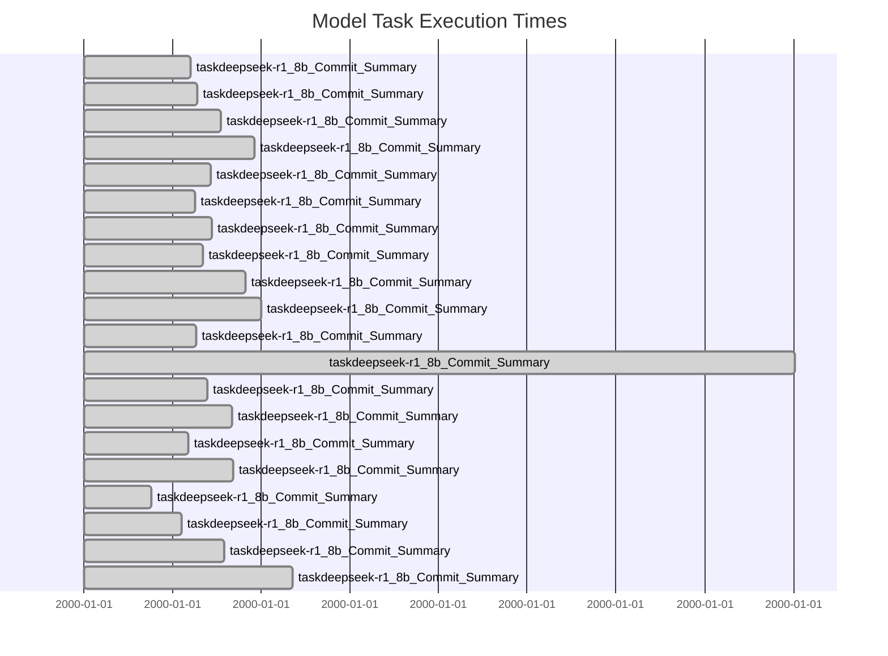

# LLM Benchmark Report

## Model Performance Summary

| Model | Commit Accuracy | Eisenhower Accuracy | Sprint Accuracy | Avg Time (s) |
|-------|----------------|------------------|----------------|--------------|
| deepseek-r1:8b | 0.890 | 0.000 | 0.000 | 63.221 |
| tinyllama:1.1b | 0.200 | 1.000 | 1.000 | 8.621 |

## Model Benchmark Diagram

