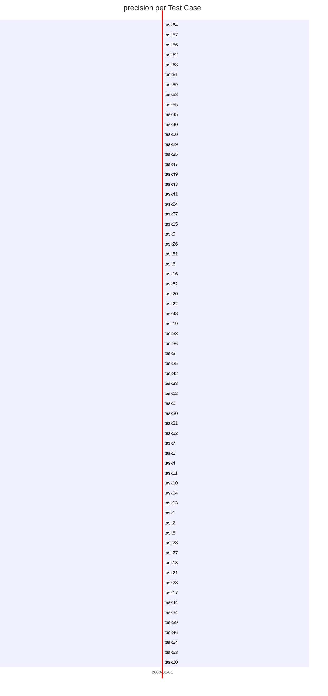
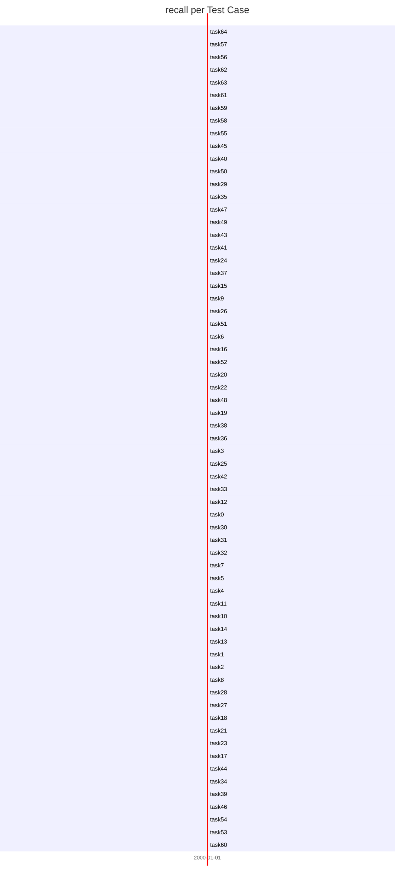
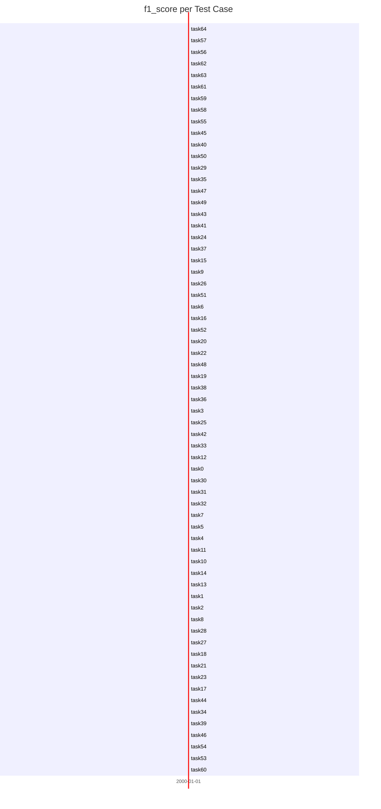
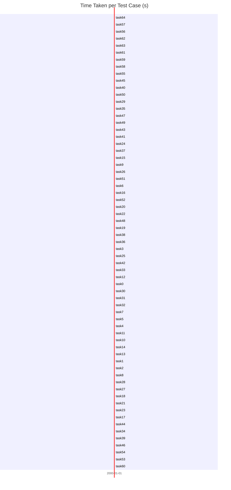

# DeepSeek R1 8B - Commit Summary Benchmark Report

## Full Test Results

| model          | test_type      |   accuracy |   precision |   recall |   f1_score |    time_s |
|:---------------|:---------------|-----------:|------------:|---------:|-----------:|----------:|
| deepseek-r1:8b | Commit Summary |   1        |  1          | 1        | 1          | 64.2068   |
| deepseek-r1:8b | Commit Summary |   1        |  1          | 1        | 1          | 42.6864   |
| deepseek-r1:8b | Commit Summary |   1        |  1          | 1        | 1          | 30.0737   |
| deepseek-r1:8b | Commit Summary |   1        |  1          | 1        | 1          | 42.3154   |
| deepseek-r1:8b | Commit Summary |   1        |  1          | 1        | 1          | 41.8298   |
| deepseek-r1:8b | Commit Summary |   1        |  1          | 1        | 1          | 44.7872   |
| deepseek-r1:8b | Commit Summary |   1        |  1          | 1        | 1          | 46.4307   |
| deepseek-r1:8b | Commit Summary |   1        |  1          | 1        | 1          | 42.7415   |
| deepseek-r1:8b | Commit Summary |   1        |  1          | 1        | 1          | 55.2842   |
| tinyllama:1.1b | Sprint Planner |   1        |  0.0574713  | 1        | 0.108696   |  2.54953  |
| tinyllama:1.1b | Sprint Planner |   1        |  0.0555556  | 1        | 0.105263   |  1.8756   |
| tinyllama:1.1b | Sprint Planner |   1        |  0.048      | 1        | 0.0916031  |  4.24457  |
| tinyllama:1.1b | Eisenhower     |   1        |  0.0344828  | 1        | 0.0666667  |  3.51377  |
| tinyllama:1.1b | Sprint Planner |   1        |  0.0294118  | 1        | 0.0571429  |  2.7896   |
| tinyllama:1.1b | Sprint Planner |   1        |  0.0294118  | 1        | 0.0571429  |  5.08549  |
| tinyllama:1.1b | Sprint Planner |   0.75     |  0.027027   | 0.75     | 0.0521739  |  3.1124   |
| tinyllama:1.1b | Sprint Planner |   1        |  0.026738   | 1        | 0.0520833  |  6.27021  |
| tinyllama:1.1b | Sprint Planner |   1        |  0.0266667  | 1        | 0.0519481  |  3.33101  |
| tinyllama:1.1b | Eisenhower     |   0.666667 |  0.0258065  | 0.666667 | 0.0496894  |  2.9067   |
| tinyllama:1.1b | Sprint Planner |   1        |  0.0252525  | 1        | 0.0492611  |  5.80204  |
| tinyllama:1.1b | Eisenhower     |   0.833333 |  0.0239234  | 0.833333 | 0.0465116  |  4.00044  |
| tinyllama:1.1b | Commit Summary |   1        |  0.0232558  | 1        | 0.0454545  |  1.07664  |
| tinyllama:1.1b | Eisenhower     |   0.833333 |  0.0218341  | 0.833333 | 0.0425532  |  5.12779  |
| tinyllama:1.1b | Sprint Planner |   0.666667 |  0.0217391  | 0.666667 | 0.0421053  |  3.81581  |
| tinyllama:1.1b | Commit Summary |   1        |  0.0212766  | 1        | 0.0416667  |  1.03511  |
| tinyllama:1.1b | Eisenhower     |   1        |  0.020339   | 1        | 0.0398671  |  4.98569  |
| tinyllama:1.1b | Sprint Planner |   1        |  0.0178571  | 1        | 0.0350877  |  4.85584  |
| tinyllama:1.1b | Eisenhower     |   0.666667 |  0.0140351  | 0.666667 | 0.0274914  |  5.5483   |
| tinyllama:1.1b | Eisenhower     |   0.6      |  0.0133929  | 0.6      | 0.0262009  |  4.09678  |
| tinyllama:1.1b | Sprint Planner |   0.25     |  0.0135135  | 0.25     | 0.025641   |  1.91099  |
| tinyllama:1.1b | Eisenhower     |   0.666667 |  0.0130719  | 0.666667 | 0.025641   |  2.81755  |
| tinyllama:1.1b | Sprint Planner |   0.5      |  0.0120482  | 0.5      | 0.0235294  |  5.80239  |
| tinyllama:1.1b | Sprint Planner |   0.5      |  0.0108696  | 0.5      | 0.0212766  |  5.74164  |
| tinyllama:1.1b | Commit Summary |   1        |  0.0106383  | 1        | 0.0210526  |  1.70038  |
| tinyllama:1.1b | Eisenhower     |   0.333333 |  0.0100503  | 0.333333 | 0.0195122  |  3.26919  |
| tinyllama:1.1b | Sprint Planner |   0.8      |  0.00917431 | 0.8      | 0.0181406  | 10.0189   |
| tinyllama:1.1b | Eisenhower     |   0.5      |  0.00587084 | 0.5      | 0.0116054  | 10.7237   |
| tinyllama:1.1b | Commit Summary |   1        |  0.00396825 | 1        | 0.00790514 |  5.65994  |
| tinyllama:1.1b | Commit Summary |   0        |  0          | 0        | 0          |  2.32472  |
| tinyllama:1.1b | Eisenhower     |   0        |  0          | 0        | 0          |  4.20582  |
| tinyllama:1.1b | Eisenhower     |   0        |  0          | 0        | 0          |  7.34575  |
| tinyllama:1.1b | Eisenhower     |   0        |  0          | 0        | 0          |  5.85588  |
| tinyllama:1.1b | Commit Summary |   0        |  0          | 0        | 0          |  1.25719  |
| tinyllama:1.1b | Commit Summary |   0        |  0          | 0        | 0          |  0.561472 |
| tinyllama:1.1b | Commit Summary |   0        |  0          | 0        | 0          |  0.677793 |
| tinyllama:1.1b | Commit Summary |   0        |  0          | 0        | 0          |  1.3351   |
| tinyllama:1.1b | Commit Summary |   0        |  0          | 0        | 0          |  0.857977 |
| tinyllama:1.1b | Commit Summary |   0        |  0          | 0        | 0          |  0.593059 |
| tinyllama:1.1b | Commit Summary |   0        |  0          | 0        | 0          |  1.24578  |
| tinyllama:1.1b | Commit Summary |   0        |  0          | 0        | 0          |  0.513068 |
| tinyllama:1.1b | Commit Summary |   0        |  0          | 0        | 0          |  0.82516  |
| tinyllama:1.1b | Commit Summary |   0        |  0          | 0        | 0          |  1.3103   |
| tinyllama:1.1b | Eisenhower     |   0        |  0          | 0        | 0          |  2.96438  |
| tinyllama:1.1b | Eisenhower     |   0        |  0          | 0        | 0          |  3.78722  |
| tinyllama:1.1b | Eisenhower     |   0        |  0          | 0        | 0          |  3.77916  |
| tinyllama:1.1b | Eisenhower     |   0        |  0          | 0        | 0          |  7.04562  |
| tinyllama:1.1b | Eisenhower     |   0        |  0          | 0        | 0          |  4.83018  |
| tinyllama:1.1b | Eisenhower     |   0        |  0          | 0        | 0          |  4.04296  |
| tinyllama:1.1b | Sprint Planner |   0        |  0          | 0        | 0          |  1.68041  |
| tinyllama:1.1b | Eisenhower     |   0        |  0          | 0        | 0          |  1.80875  |
| tinyllama:1.1b | Sprint Planner |   0        |  0          | 0        | 0          |  7.41251  |
| tinyllama:1.1b | Sprint Planner |   0        |  0          | 0        | 0          |  2.57457  |
| tinyllama:1.1b | Sprint Planner |   0        |  0          | 0        | 0          |  1.94418  |
| tinyllama:1.1b | Sprint Planner |   0        |  0          | 0        | 0          |  2.58781  |
| deepseek-r1:8b | Commit Summary |   0        |  0          | 0        | 0          | 39.2053   |

## Top 5 Test Cases

| model          | test_type      |   accuracy |   precision |   recall |   f1_score |   time_s |
|:---------------|:---------------|-----------:|------------:|---------:|-----------:|---------:|
| deepseek-r1:8b | Commit Summary |          1 |           1 |        1 |          1 |  64.2068 |
| deepseek-r1:8b | Commit Summary |          1 |           1 |        1 |          1 |  42.6864 |
| deepseek-r1:8b | Commit Summary |          1 |           1 |        1 |          1 |  30.0737 |
| deepseek-r1:8b | Commit Summary |          1 |           1 |        1 |          1 |  42.3154 |
| deepseek-r1:8b | Commit Summary |          1 |           1 |        1 |          1 |  41.8298 |

## Worst 5 Test Cases

| model          | test_type      |   accuracy |   precision |   recall |   f1_score |   time_s |
|:---------------|:---------------|-----------:|------------:|---------:|-----------:|---------:|
| tinyllama:1.1b | Sprint Planner |          0 |           0 |        0 |          0 |  7.41251 |
| tinyllama:1.1b | Sprint Planner |          0 |           0 |        0 |          0 |  2.57457 |
| tinyllama:1.1b | Sprint Planner |          0 |           0 |        0 |          0 |  1.94418 |
| tinyllama:1.1b | Sprint Planner |          0 |           0 |        0 |          0 |  2.58781 |
| deepseek-r1:8b | Commit Summary |          0 |           0 |        0 |          0 | 39.2053  |

## accuracy per Test Case

## precision per Test Case

## recall per Test Case

## f1_score per Test Case

