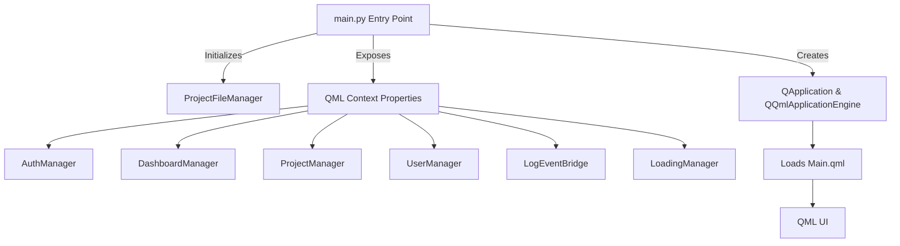
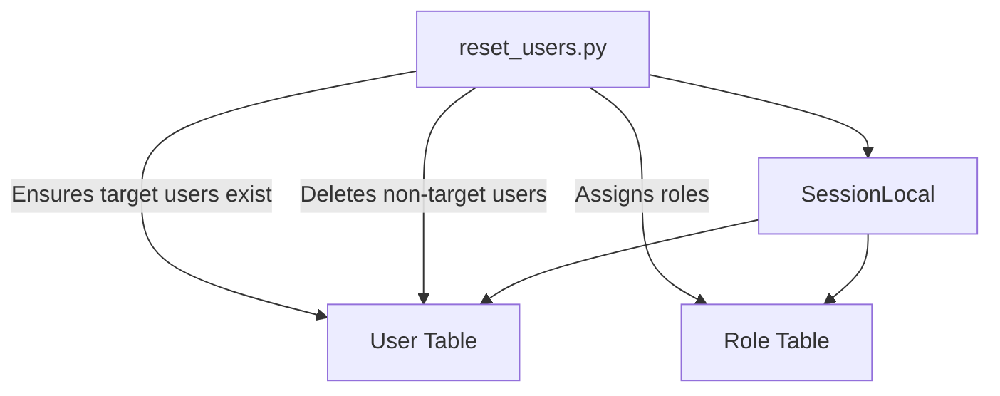
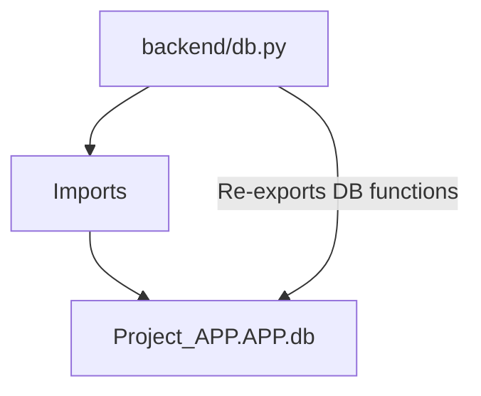

# Architecture Overview

This document provides a high-level architectural overview of the main application components. Each section includes a mermaid diagram and a fresh explanation of the component's role and structure.

---

## main.py



**Explanation:**  
`main.py` is the application's entry point, responsible for initializing the backend (including file management and Git integration), setting up the Qt application and QML engine, and exposing Python backend objects to the QML frontend. It manages the connection between the UI and backend logic, ensuring that user actions in the interface are handled by the appropriate Python classes.

---

## Main.qml

```mermaid
flowchart TD
    A[ApplicationWindow] --> B[Login Page]
    A --> C[Dashboard Page]
    A --> D[Project Details Page]
    A --> E[Event Log Page]
    A --> F[Settings Page]
    C --> G[Sidebar (Projects)]
    C --> H[Main Content (Tasks, Quadrants)]
    D --> I[Tabs: Tasks, Gantt, Calendar, Team]
    D --> J[Right Sidebar (Tab Bar)]
    D --> K[Dialogs (Delete, Remove Member)]
    A --> L[Backend Context Properties]
```

**Explanation:**  
`Main.qml` defines the main user interface using QML. It structures the application window, navigation, and all major pages (login, dashboard, project details, event log, settings). The UI is dynamic, responding to backend signals and exposing user actions to Python logic via context properties. The dashboard and project details pages are modular, supporting tabbed navigation and dialogs for project and team management.

---

## reset_users.py



**Explanation:**  
`reset_users.py` is a utility script for database maintenance. It resets the user table to a predefined set of users, updating passwords and roles as needed. This ensures a consistent user base for development or testing, removing any extraneous users and enforcing correct role assignments.

---

## print_users.py

```mermaid
flowchart TD
    A[print_users.py] --> B[get_all_users()]
    B --> C[User Table]
    A -->|Prints| D[User IDs and Usernames]
```

**Explanation:**  
`print_users.py` is a simple script that queries all users from the database and prints their IDs and usernames. It is primarily used for debugging or verifying the current state of the user table.

---

## backend/db.py



**Explanation:**  
`backend/db.py` acts as a bridge, re-exporting database functions and models from the main application database module. This allows backend logic to be organized and accessed consistently, supporting modularity and maintainability.
