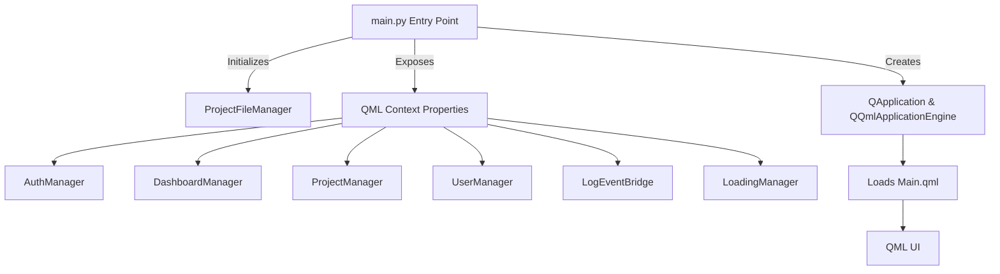
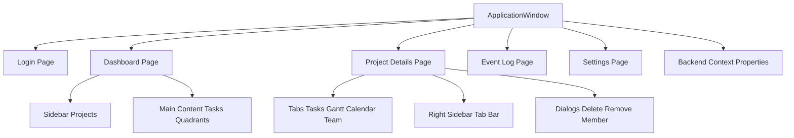
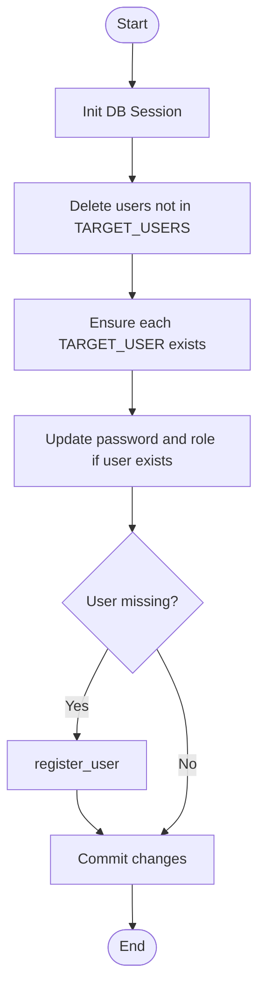

# Main Py Architecture



# Main Qml Architecture



# Reset Users Flow



# Print Users Flow

```mermaid
flowchart TD
    Start([Start]) --> GetUsers["get_all_users"]
    GetUsers --> PrintHeader["Print 'Users in database:'"]
    PrintHeader --> ForEachUser{For each user}
    ForEachUser --> PrintUser["Print user ID and Username"]
    PrintUser --> End([End])