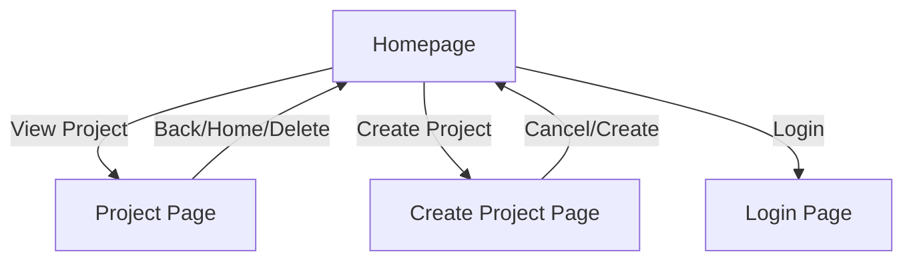

# UoR_APP

## Project Overview

UoR_APP is an LLM-powered, offline-first agile project management platform. It features a React client and Node.js/Express backend, designed for secure, modular, and extensible project/task management. The system supports advanced workflows, role-based access, and is built for both local and enterprise deployment.

---

## High-Level Features

- Modular LLM/ML-powered workflows (planned)
- Secure authentication (username, password, 2FA)
- Project, task, and subtask management
- Team member management and permissions
- Sprint planning, prioritization, and daily planning
- Embedded tools (LibreOffice, VSCode integration) (planned)
- Version control and analytics (planned)
- Offline-first, no external API dependencies
- Dockerized deployment

For the full featureset, advanced/optional features, and architecture diagrams, see [`documentation/FEATURES.md`](documentation/FEATURES.md:1).

---

## Getting Started

### Local Demo

1. **Clone the repository:**
   ```sh
   git clone https://github.com/your-org/UoR_APP.git
   cd UoR_APP
   ```
2. **Install dependencies:**
   ```sh
   cd backend && npm install
   cd ../frontend && npm install
   ```
3. **Start the backend:**
   ```sh
   cd backend
   npm start
   ```
4. **Start the frontend:**
   ```sh
   cd ../frontend
   npm start
   ```
5. **Access the app:**
   Open [http://localhost:3002](http://localhost:3002) in your browser.

### Docker Compose

- To run both frontend and backend in containers:
  ```sh
  docker-compose up --build
  ```

---

## Documentation

- **Full Featureset & Architecture:** [`documentation/FEATURES.md`](documentation/FEATURES.md:1)
- **Project Brief:** [`documentation/PROJECT_BRIEF.md`](documentation/PROJECT_BRIEF.md:1)

---

## Tech Stack

- React (frontend)
- Node.js/Express (backend)
- Docker (deployment)
- Local-first storage


## Contributing

Contributions are welcome! Please see [`documentation/FEATURES.md`](documentation/FEATURES.md:1) for the roadmap and open issues.

## Backend API Documentation

### Projects

- `GET /api/projects`  
  List all projects.

- `POST /api/projects`  
  Create a new project.  
  **Body:**  
  ```json
  { "name": "Project Name", "deadline": "YYYY-MM-DD", "team": [...], "tasks": [...] }
  ```

- `GET /api/projects/:id`  
  Get project details.

- `PUT /api/projects/:id`  
  Update project details.

- `DELETE /api/projects/:id`  
  Delete a project.

### Tasks

- `GET /api/projects/:projectId/tasks`  
  List all tasks for a project.

- `POST /api/projects/:projectId/tasks`  
  Add a new task.

- `PUT /api/projects/:projectId/tasks/:taskId`  
  Update a task.

- `DELETE /api/projects/:projectId/tasks/:taskId`  
  Delete a task.

### Team Members

- `GET /api/projects/:projectId/team`  
  List team members.

- `POST /api/projects/:projectId/team`  
  Add a team member.

- `DELETE /api/projects/:projectId/team/:memberId`  
  Remove a team member.

**All endpoints return JSON.**  
**Error Handling:** Standard HTTP status codes with error messages.

---

## Advanced Usage

- **Local-first Storage:** All data is stored on the user's machine for privacy and speed.
- **Docker Deployment:** Use Dockerfiles and `docker-compose.yml` for easy multi-container setup.
- **Version Control Integration:** Automatic commit summaries and documentation checkpoints.
- **Customizing:** Extend backend endpoints or frontend UI as needed.

---

## Troubleshooting

- **npm install errors:** Ensure Node.js and npm are installed and up to date.
- **Port conflicts:** Default frontend port is 3002; backend is configurable.
- **Docker issues:** Check Docker daemon is running; use `docker-compose up --build`.
- **Data not saving:** Verify local storage permissions and browser settings.
- **API errors:** Check backend logs for stack traces.
- **ERR_OSSL_EVP_UNSUPPORTED error:**
  This error occurs with Node.js v17+ and Webpack/react-scripts due to OpenSSL changes.
  **Solutions:**
  - Use Node.js v16 (LTS) for best compatibility.
  - Or set the environment variable before running:
    - On Windows: `set NODE_OPTIONS=--openssl-legacy-provider`
    - On macOS/Linux: `export NODE_OPTIONS=--openssl-legacy-provider`
  - Consider upgrading Webpack and react-scripts if possible.
---

## Screenshots & UI Wireframes

> _Add screenshots of the homepage, project page, and login page here._



---
