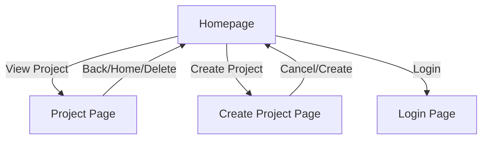
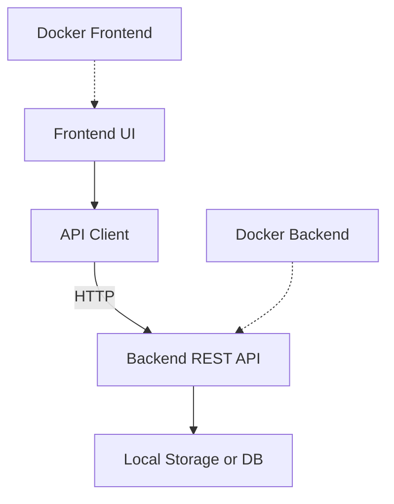
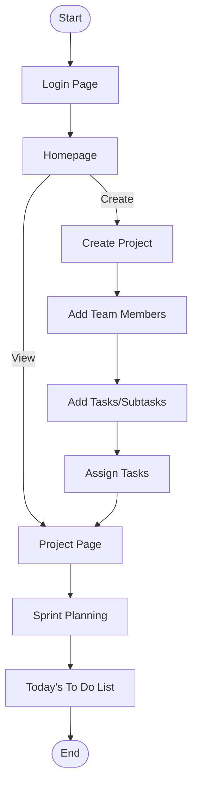

# UoR_APP

## Project Overview

UoR_APP is an AI-assisted, local-first project and task management tool designed to streamline pre-brief planning and scope definition for projects. It supports project managers and team leaders in defining team roles, deadlines, task structures, and business value calculations, leveraging historical data and intelligent suggestions for adaptive scheduling.

---

## Table of Contents

- [Project Overview](#project-overview)
- [Features](#features)
- [Backend API Documentation](#backend-api-documentation)
- [Advanced Usage](#advanced-usage)
- [Troubleshooting](#troubleshooting)
- [Screenshots & UI Wireframes](#screenshots--ui-wireframes)
- [Setup & Deployment](#setup--deployment)
- [Software Architecture](#software-architecture)
- [User Flow](#user-flow)
- [Tech Stack](#tech-stack)

---

## Features

- **Homepage:** Two-column layout with Projects and "Today's To Do List".
- **Project Creation:** Inline project, team, task, and subtask creation/editing.
- **Project Page:** Edit project details, manage team and tasks, assign/reassign, delete project.
- **Task & Subtask Management:** Assign to team members or leave unassigned, all visible in To Do List.
- **Team Member Management:** Add/remove/assign team members during project creation or from project page.
- **Login Page:** Simple login form (email/password, no backend auth yet).
- **Local-first:** Data stored locally by default.
- **Docker Support:** Containerized deployment for frontend and backend.
- **Version Control:** Built-in VCS powered by LLM for commit summaries and documentation.

---

## Backend API Documentation

### Projects

- `GET /api/projects`  
  List all projects.

- `POST /api/projects`  
  Create a new project.  
  **Body:**  
  ```json
  { "name": "Project Name", "deadline": "YYYY-MM-DD", "team": [...], "tasks": [...] }
  ```

- `GET /api/projects/:id`  
  Get project details.

- `PUT /api/projects/:id`  
  Update project details.

- `DELETE /api/projects/:id`  
  Delete a project.

### Tasks

- `GET /api/projects/:projectId/tasks`  
  List all tasks for a project.

- `POST /api/projects/:projectId/tasks`  
  Add a new task.

- `PUT /api/projects/:projectId/tasks/:taskId`  
  Update a task.

- `DELETE /api/projects/:projectId/tasks/:taskId`  
  Delete a task.

### Team Members

- `GET /api/projects/:projectId/team`  
  List team members.

- `POST /api/projects/:projectId/team`  
  Add a team member.

- `DELETE /api/projects/:projectId/team/:memberId`  
  Remove a team member.

**All endpoints return JSON.**  
**Error Handling:** Standard HTTP status codes with error messages.

---

## Advanced Usage

- **Local-first Storage:** All data is stored on the user's machine for privacy and speed.
- **Docker Deployment:** Use Dockerfiles and `docker-compose.yml` for easy multi-container setup.
- **Version Control Integration:** Automatic commit summaries and documentation checkpoints.
- **Customizing:** Extend backend endpoints or frontend UI as needed.

---

## Troubleshooting

- **npm install errors:** Ensure Node.js and npm are installed and up to date.
- **Port conflicts:** Default frontend port is 3002; backend is configurable.
- **Docker issues:** Check Docker daemon is running; use `docker-compose up --build`.
- **Data not saving:** Verify local storage permissions and browser settings.
- **API errors:** Check backend logs for stack traces.

---

## Screenshots & UI Wireframes

> _Add screenshots of the homepage, project page, and login page here._



---

## Setup & Deployment

### Running Locally

1. **Install dependencies:**
    - Frontend: `cd frontend && npm install`
    - Backend: `cd backend && npm install`
2. **Start backend:**  
    `cd backend && npm start`
3. **Start frontend:**  
    `cd frontend && npm start` (default port: 3002)
4. **Access app:**  
    [http://localhost:3002](http://localhost:3002)

### Docker Deployment

- Both frontend and backend have Dockerfiles.
- Use `docker-compose.yml` for multi-container setup.
- Default ports: Frontend 3002, backend configurable.

---

## Software Architecture



- **Frontend:** React app for UI, communicates with backend via REST API.
- **Backend:** Node.js server, handles business logic and data storage.
- **Local-first:** Data stored locally, with potential for future remote sync.
- **Deployment:** Both frontend and backend can be containerized with Docker.

---

## User Flow



- **Typical flow:** User logs in, creates a project, adds team members and tasks, assigns work, plans sprints, and tracks tasks via the To Do List.

---

## Tech Stack

- React (frontend)
- Node.js (backend)
- Docker (deployment)
- Local-first storage