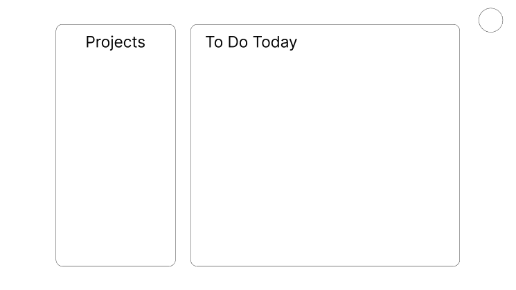
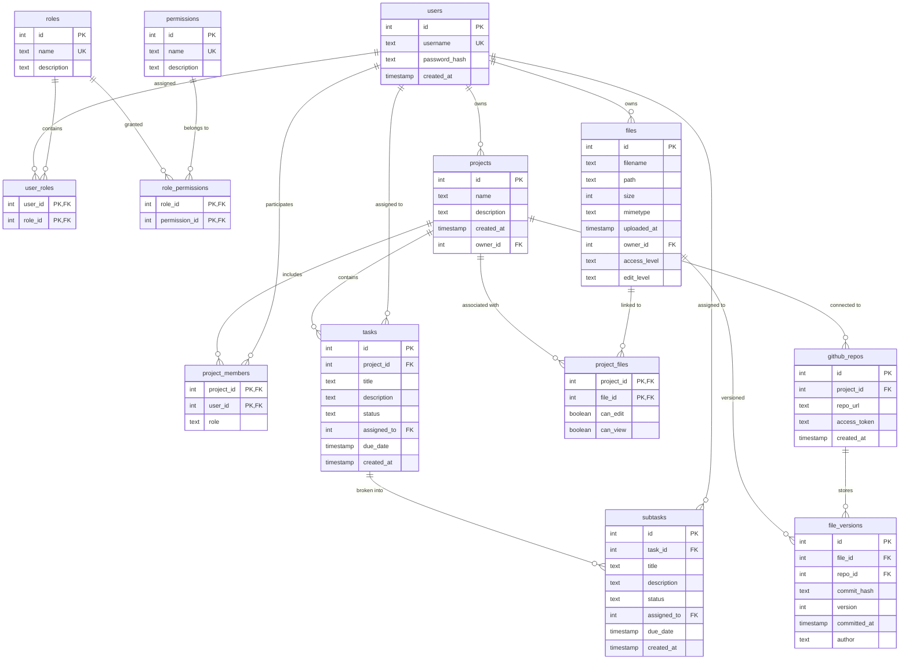

# Report Information

## Methodology and Requirements Gathering

The requirements were gathered through stakeholder interviews, analysis of existing project management workflows, and review of similar platforms. User personas were defined (Administrator, Project Manager, Team Member, New Employee), and epic-level user stories were created to cover authentication, project/task management, team collaboration, file management, and analytics. Functional and non-functional requirements were documented, including security, usability, scalability, and compliance needs.

## Design Methodology

An iterative, user-centered design approach was adopted. Agile principles guided development, with regular feedback loops from stakeholders and end-users. The design prioritized offline-first operation, local data privacy, and modularity, allowing for future enhancements and scalability.

## Data Sources and Preprocessing

- **Primary Data Sources:** Local SQLite databases (`auth.db`, `app.db`), user input, and local files (LibreOffice documents).
- **Preprocessing:** Data validation (input sanitization, type checks), normalization (consistent date formats, status values), and transformation (user roles, permissions). File metadata is extracted and stored; document versions are tracked using GitPython and ODFDiff for semantic diffs.

## LLM Selection and Integration Strategy

- **LLM Selection:** TinyLlama was chosen for its local deployment capability, low resource requirements, and suitability for offline use. Selection criteria included accuracy, latency, cost, and privacy.
- **Integration:** The LLM is integrated via a local HTTP API (`http://localhost:8000/suggest`). The backend gathers recent event logs as context and sends them to the LLM for Eisenhower Matrix category suggestions. All LLM interactions are local, ensuring no data leaves the user's machine.

## System Architecture Overview

The platform is a fully local, offline PyQt (PySide6/QML) desktop application. All data, authentication, and document versioning are handled locally. The architecture consists of:

- **QML UI:** User interface for login, dashboard, project details, event log, and calendar.
- **Backend Managers:** AuthManager, DashboardManager, ProjectManager, UserManager, LogEventBridge.
- **Database Layer:** SQLAlchemy ORM with local SQLite databases.
- **File Versioning:** GitPython and ODFDiff for document versioning.
- **Event Logging:** Local append-only event log.
- **LLM Integration:** Local TinyLlama API for task categorization.

**System Architecture Diagram:**
```mermaid
flowchart TD
    QML[QML UI (Main.qml)]
    MainPy[main.py (PySide6 entry point)]
    Managers[Backend Managers<br/>(AuthManager, DashboardManager,<br/>ProjectManager, UserManager, LogEventBridge)]
    DB[db.py (SQLAlchemy ORM,<br/>roles, events, files, encryption)]
    Files[Local Filesystem<br/>(LibreOffice docs, event_log.txt)]
    Git[Local Git Repos<br/>(per file/project)]
    EventLog[event_log.txt]
    Images[UI Images & Diagrams]

    QML -- "Signals/Slots, Properties" --> MainPy
    MainPy -- "Exposes Managers to QML" --> Managers
    Managers -- "DB/API Calls" --> DB
    Managers -- "File Ops, Logging" --> Files
    DB -- "ORM, Encryption, Versioning" --> Files
    DB -- "Versioning Metadata" --> Git
    Managers -- "Event Logging" --> EventLog
    QML -- "Displays" --> Images
```
*Figure 1: High-level system architecture showing major components and their interactions.*


*Figure 2: Dashboard UI wireframe.*

### System Flow Diagram

```mermaid
flowchart TD
    Start([Start])
    Login[User Login (QML UI)]
    Auth[Authentication (AuthManager)]
    Dashboard[DashboardManager Loads Data]
    ProjectSel[User Selects Project/Task]
    CRUD[CRUD Operations (ProjectManager, UserManager)]
    FileOps[File Operations (Local FS, GitPython)]
    LLM[LLM Suggestion (TinyLlama API)]
    EventLog[Event Logging]
    End([End])

    Start --> Login
    Login --> Auth
    Auth --> Dashboard
    Dashboard --> ProjectSel
    ProjectSel --> CRUD
    CRUD --> FileOps
    CRUD --> LLM
    FileOps --> EventLog
    LLM --> EventLog
    EventLog --> End
```
*Figure 3: System flow from user login to project/task management, file operations, LLM integration, and event logging.*

## Database Schema


*Figure 4: Entity-relationship diagram of the database schema, showing tables and relationships.*

## System Design and Implementation

### System Architecture

- **Entry Point:** `main.py` initializes the PySide6 app and loads QML UI.
- **Managers:** Expose backend logic to QML via properties and slots.
- **Database:** Handles users, roles, projects, tasks, files, events, and versioning.
- **File Storage:** Local filesystem with Git-based versioning per document.
- **Security:** All operations are local; sensitive files are encrypted.

### Frontend and Backend Design

- **Frontend:** QML UI defines all pages and interacts with backend via signals/slots.
- **Backend:** Python managers handle authentication, CRUD operations, event logging, and LLM integration.
- **API:** Flask API (planned) for future extensibility.

### Key Features and Functionalities

- Role-based authentication and access control.
- Project and task management with Eisenhower Matrix prioritization.
- Team collaboration and user management.
- File versioning and audit logging.
- LLM-powered task categorization.
- Offline-first, privacy-focused operation.

### LLM Integration and Prompt Engineering

- **Integration:** QML UI triggers backend methods for LLM suggestions.
- **Prompt Engineering:** Recent event logs and task context are sent as prompt to TinyLlama. The LLM returns category and reasoning, which are logged and applied if accepted.
- **Auditability:** All LLM interactions are logged for transparency.

### Security and Ethical Considerations

- **Data Privacy:** All data and files remain local; no external transmission.
- **Authentication:** bcrypt password hashing, role-based access, and input validation.
- **Encryption:** Sensitive files encrypted with Fernet.
- **Ethics:** LLM is used only for task categorization, with full audit trails and user override capability.

## Evaluation and Testing

### Evaluation Criteria

- Functional completeness (all user stories and requirements met).
- Security (password hashing, access control, data privacy).
- Usability (intuitive UI, accessibility, responsive design).
- Performance (fast load times, efficient data handling).
- LLM accuracy and relevance.

### Functional Testing

- Unit and integration tests for backend logic.
- Manual UI testing for all workflows (login, project/task management, file versioning).
- Automated tests for database operations and event logging.

### LLM Response Evaluation

- LLM suggestions are compared against user decisions and logged for review.
- Accuracy and relevance are periodically assessed using real user data and feedback.

### User Testing and Feedback

- Stakeholder and end-user testing sessions.
- Feedback collected on usability, feature gaps, and LLM suggestions.
- Iterative improvements based on user input.

### Limitations in Testing

- Some advanced features (real-time collaboration, external integrations) are planned but not yet implemented.
- LLM evaluation is limited to local context and may not generalize to all task types.
- Automated UI testing coverage is partial; manual testing supplements gaps.

---

*This report synthesizes the current state of the Draft_2 Project Management Platform, referencing [`ARCHITECTURE.md`](Draft_2/ARCHITECTURE.md), [`DATABASE_SCHEMA.md`](Draft_2/DATABASE_SCHEMA.md), [`FEATURES.md`](Draft_2/FEATURES.md), and [`USER_STORIES.md`](Draft_2/USER_STORIES.md).*