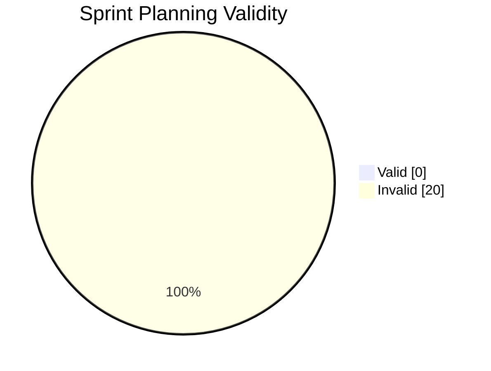

# LLM Benchmark Report

**Source file:** `benchmark_results_2025-08-30.csv`

## Summary Metrics

- **Commit Summary Similarity (avg):** 0.17
- **Eisenhower Accuracy (avg):** 0.0
- **Valid Sprint Plans (%):** 0.0%

## Performance Visualisation

### Commit Summaries
```mermaid
bar
  title Commit Summary Similarities
  x-axis Similarity
  y-axis Test Case
  "Case 1" : 0.176
  "Case 2" : 0.209
  "Case 3" : 0.218
  "Case 4" : 0.151
  "Case 5" : 0.106
  "Case 6" : 0.145
  "Case 7" : 0.137
  "Case 8" : 0.247
  "Case 9" : 0.151
  "Case 10" : 0.171
  "Case 11" : 0.151
  "Case 12" : 0.192
  "Case 13" : 0.169
  "Case 14" : 0.169
  "Case 15" : 0.167
  "Case 16" : 0.141
  "Case 17" : 0.136
  "Case 18" : 0.151
  "Case 19" : 0.148
  "Case 20" : 0.169
  "Case 21" : 0.218
  "Case 22" : 0.168
  "Case 23" : 0.192
  "Case 24" : 0.162
  "Case 25" : 0.169
  "Case 26" : 0.18
  "Case 27" : 0.181
  "Case 28" : 0.212
  "Case 29" : 0.141
  "Case 30" : 0.181
```

### Eisenhower Matrix
```mermaid
bar
  title Eisenhower Accuracy
  x-axis Accuracy
  y-axis Test Case
  "Case 1" : 0.0
  "Case 2" : 0.0
  "Case 3" : 0.0
  "Case 4" : 0.0
  "Case 5" : 0.0
  "Case 6" : 0.0
  "Case 7" : 0.0
  "Case 8" : 0.0
  "Case 9" : 0.0
  "Case 10" : 0.0
  "Case 11" : 0.0
  "Case 12" : 0.0
  "Case 13" : 0.0
  "Case 14" : 0.0
  "Case 15" : 0.0
  "Case 16" : 0.0
  "Case 17" : 0.0
  "Case 18" : 0.0
  "Case 19" : 0.0
  "Case 20" : 0.0
```

### Sprint Planning


## Example Outputs

### Commit Summary Example
- **Input diff:** `--- a/file.py
+++ b/file.py
- logger.debug(x)
+ logger.info(...`
- **Expected:** docs: change logging level
- **Output:** [LLM STUB RESPONSE] Summarize the following code changes as a git commit message:
--- a/file.py
+++ b/file.py
- logger.debug(x)
+ logger.info(x)
- **Similarity:** 0.176

### Eisenhower Example
- **Input tasks:** [{"id": 1, "name": "Task 1", "importance": 2, "urgency": 2}, {"id": 2, "name": "Task 2", "importance": 3, "urgency": 2}, {"id": 3, "name": "Task 3", "importance": 4, "urgency": 4}, {"id": 4, "name": "Task 4", "importance": 5, "urgency": 5}, {"id": 5, "name": "Task 5", "importance": 5, "urgency": 2}]
- **Expected:** {"Do First": [3, 4], "Schedule": [5], "Delegate": [], "Eliminate": [1, 2]}
- **Output:** [LLM STUB RESPONSE] Sort these tasks into an Eisenhower matrix (Do First, Schedule, Delegate, Eliminate) in JSON format: [{"id": 1, "name": "Task 1", "importance": 2, "urgency": 2}, {"id": 2, "name": "Task 2", "importance": 3, "urgency": 2}, {"id": 3, "name": "Task 3", "importance": 4, "urgency": 4}, {"id": 4, "name": "Task 4", "importance": 5, "urgency": 5}, {"id": 5, "name": "Task 5", "importance": 5, "urgency": 2}]
- **Accuracy:** 0

### Sprint Planning Example
- **Input:** team={"Member1": {"available_hours": 19}, "Member2": {"available_hours": 21}}, t...
- **Output:** [LLM STUB RESPONSE] 
Plan a 2-week agile sprint for the following team and tasks. 
Constraints:
- Respect task dependencies
- Do not assign more hours than available
- Output JSON with format: {'sprint_backlog': [{'task_id': int, 'assignee': str, 'week': int}]}
Team: {"Member1": {"available_hours": 19}, "Member2": {"available_hours": 21}}
Tasks: [{"id": 1, "name": "Task 1", "estimate": 10, "dependencies": []}, {"id": 2, "name": "Task 2", "estimate": 8, "dependencies": [1]}, {"id": 3, "name": "Task 3", "estimate": 3, "dependencies": []}, {"id": 4, "name": "Task 4", "estimate": 9, "dependencies": []}]

- **Valid Plan:** 0

