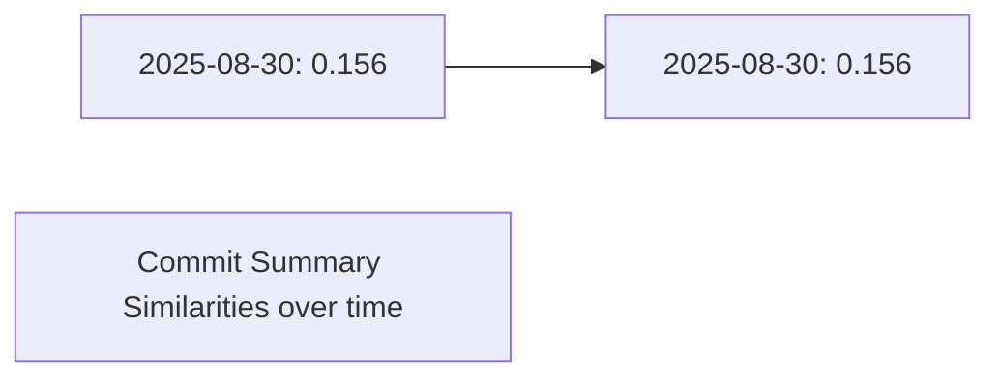
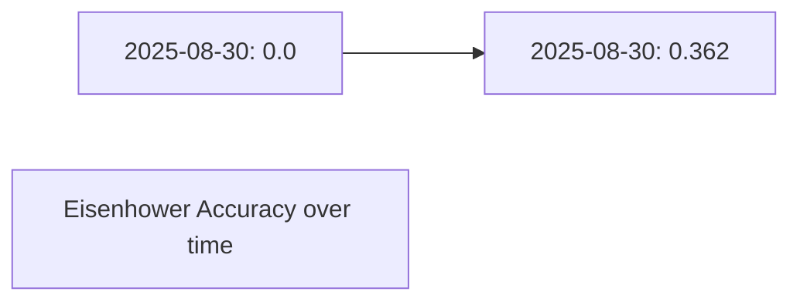
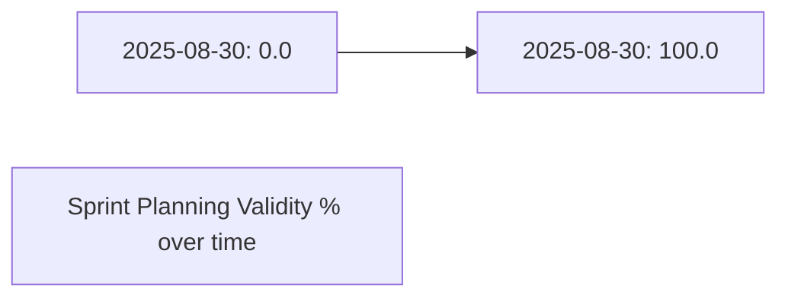

# LLM Benchmark Report

Latest source file: `benchmark_results_2025-08-30_debug.csv`

## Benchmark Runs Summary

| Date | Commit Avg | Eisenhower Avg | Sprint Valid % |
|------|------------|----------------|----------------|
| 2025-08-30 | 0.156 | 0.0 | 0.0 |
| 2025-08-30 | 0.156 | 0.362 | 100.0 |

## Latest Metrics

- **Commit Summary Similarity (avg):** 0.156
- **Eisenhower Accuracy (avg):** 0.362
- **Valid Sprint Plans (%):** 100.0%

## Performance Trends Over Time

### Commit Summaries

### Eisenhower Matrix

### Sprint Planning

## Latest LLM Outputs

### Commit Summary Examples
- **Input Diff:** `--- a/file.py
+++ b/file.py
- pwd == db[user]
+ hash(pwd) == db[user]...`
  
  **Expected:** `perf: secure password check...`
  
  **LLM Output:** `[LLM STUB RESPONSE] Summarize the following code changes as a git commit message:
--- a/file.py
+++ b/file.py
- pwd == db[user]
+ hash(pwd) == db[user]...`
  
  **Similarity:** 0.169

- **Input Diff:** `--- a/file.py
+++ b/file.py
- logger.debug(x)
+ logger.info(x)...`
  
  **Expected:** `fix: change logging level...`
  
  **LLM Output:** `[LLM STUB RESPONSE] Summarize the following code changes as a git commit message:
--- a/file.py
+++ b/file.py
- logger.debug(x)
+ logger.info(x)...`
  
  **Similarity:** 0.189

- **Input Diff:** `--- a/file.py
+++ b/file.py
- debug: true
+ debug: false...`
  
  **Expected:** `docs: disable debug mode...`
  
  **LLM Output:** `[LLM STUB RESPONSE] Summarize the following code changes as a git commit message:
--- a/file.py
+++ b/file.py
- debug: true
+ debug: false...`
  
  **Similarity:** 0.198

- **Input Diff:** `--- a/file.py
+++ b/file.py
- data = fetch()
+ data = clean(fetch())...`
  
  **Expected:** `style: clean data before returning...`
  
  **LLM Output:** `[LLM STUB RESPONSE] Summarize the following code changes as a git commit message:
--- a/file.py
+++ b/file.py
- data = fetch()
+ data = clean(fetch())...`
  
  **Similarity:** 0.141

- **Input Diff:** `--- a/file.py
+++ b/file.py
- data = fetch()
+ data = clean(fetch())...`
  
  **Expected:** `test: clean data before returning...`
  
  **LLM Output:** `[LLM STUB RESPONSE] Summarize the following code changes as a git commit message:
--- a/file.py
+++ b/file.py
- data = fetch()
+ data = clean(fetch())...`
  
  **Similarity:** 0.153

- **Input Diff:** `--- a/file.py
+++ b/file.py
- print('hello')
+ print('hello world')...`
  
  **Expected:** `perf: update greeting...`
  
  **LLM Output:** `[LLM STUB RESPONSE] Summarize the following code changes as a git commit message:
--- a/file.py
+++ b/file.py
- print('hello')
+ print('hello world')...`
  
  **Similarity:** 0.106

- **Input Diff:** `--- a/file.py
+++ b/file.py
- pwd == db[user]
+ hash(pwd) == db[user]...`
  
  **Expected:** `refactor: secure password check...`
  
  **LLM Output:** `[LLM STUB RESPONSE] Summarize the following code changes as a git commit message:
--- a/file.py
+++ b/file.py
- pwd == db[user]
+ hash(pwd) == db[user]...`
  
  **Similarity:** 0.187

- **Input Diff:** `--- a/file.py
+++ b/file.py
- return a+b
+ return a + b...`
  
  **Expected:** `perf: improve formatting...`
  
  **LLM Output:** `[LLM STUB RESPONSE] Summarize the following code changes as a git commit message:
--- a/file.py
+++ b/file.py
- return a+b
+ return a + b...`
  
  **Similarity:** 0.137

- **Input Diff:** `--- a/file.py
+++ b/file.py
- result = []
+ result = {}...`
  
  **Expected:** `style: switch result container...`
  
  **LLM Output:** `[LLM STUB RESPONSE] Summarize the following code changes as a git commit message:
--- a/file.py
+++ b/file.py
- result = []
+ result = {}...`
  
  **Similarity:** 0.18

- **Input Diff:** `--- a/file.py
+++ b/file.py
- print('hello')
+ print('hello world')...`
  
  **Expected:** `fix: update greeting...`
  
  **LLM Output:** `[LLM STUB RESPONSE] Summarize the following code changes as a git commit message:
--- a/file.py
+++ b/file.py
- print('hello')
+ print('hello world')...`
  
  **Similarity:** 0.083

- **Input Diff:** `--- a/file.py
+++ b/file.py
- data = fetch()
+ data = clean(fetch())...`
  
  **Expected:** `docs: clean data before returning...`
  
  **LLM Output:** `[LLM STUB RESPONSE] Summarize the following code changes as a git commit message:
--- a/file.py
+++ b/file.py
- data = fetch()
+ data = clean(fetch())...`
  
  **Similarity:** 0.131

- **Input Diff:** `--- a/file.py
+++ b/file.py
- result = []
+ result = {}...`
  
  **Expected:** `style: switch result container...`
  
  **LLM Output:** `[LLM STUB RESPONSE] Summarize the following code changes as a git commit message:
--- a/file.py
+++ b/file.py
- result = []
+ result = {}...`
  
  **Similarity:** 0.18

- **Input Diff:** `--- a/file.py
+++ b/file.py
- pwd == db[user]
+ hash(pwd) == db[user]...`
  
  **Expected:** `perf: secure password check...`
  
  **LLM Output:** `[LLM STUB RESPONSE] Summarize the following code changes as a git commit message:
--- a/file.py
+++ b/file.py
- pwd == db[user]
+ hash(pwd) == db[user]...`
  
  **Similarity:** 0.169

- **Input Diff:** `--- a/file.py
+++ b/file.py
- print('hello')
+ print('hello world')...`
  
  **Expected:** `fix: update greeting...`
  
  **LLM Output:** `[LLM STUB RESPONSE] Summarize the following code changes as a git commit message:
--- a/file.py
+++ b/file.py
- print('hello')
+ print('hello world')...`
  
  **Similarity:** 0.083

- **Input Diff:** `--- a/file.py
+++ b/file.py
- return a+b
+ return a + b...`
  
  **Expected:** `perf: improve formatting...`
  
  **LLM Output:** `[LLM STUB RESPONSE] Summarize the following code changes as a git commit message:
--- a/file.py
+++ b/file.py
- return a+b
+ return a + b...`
  
  **Similarity:** 0.137

- **Input Diff:** `--- a/file.py
+++ b/file.py
- data = fetch()
+ data = clean(fetch())...`
  
  **Expected:** `refactor: clean data before returning...`
  
  **LLM Output:** `[LLM STUB RESPONSE] Summarize the following code changes as a git commit message:
--- a/file.py
+++ b/file.py
- data = fetch()
+ data = clean(fetch())...`
  
  **Similarity:** 0.171

- **Input Diff:** `--- a/file.py
+++ b/file.py
- return a+b
+ return a + b...`
  
  **Expected:** `refactor: improve formatting...`
  
  **LLM Output:** `[LLM STUB RESPONSE] Summarize the following code changes as a git commit message:
--- a/file.py
+++ b/file.py
- return a+b
+ return a + b...`
  
  **Similarity:** 0.133

- **Input Diff:** `--- a/file.py
+++ b/file.py
- debug: true
+ debug: false...`
  
  **Expected:** `fix: disable debug mode...`
  
  **LLM Output:** `[LLM STUB RESPONSE] Summarize the following code changes as a git commit message:
--- a/file.py
+++ b/file.py
- debug: true
+ debug: false...`
  
  **Similarity:** 0.161

- **Input Diff:** `--- a/file.py
+++ b/file.py
- list()
+ set()...`
  
  **Expected:** `style: optimize data structure...`
  
  **LLM Output:** `[LLM STUB RESPONSE] Summarize the following code changes as a git commit message:
--- a/file.py
+++ b/file.py
- list()
+ set()...`
  
  **Similarity:** 0.205

- **Input Diff:** `--- a/file.py
+++ b/file.py
- print('hello')
+ print('hello world')...`
  
  **Expected:** `style: update greeting...`
  
  **LLM Output:** `[LLM STUB RESPONSE] Summarize the following code changes as a git commit message:
--- a/file.py
+++ b/file.py
- print('hello')
+ print('hello world')...`
  
  **Similarity:** 0.14

- **Input Diff:** `--- a/file.py
+++ b/file.py
- result = []
+ result = {}...`
  
  **Expected:** `refactor: switch result container...`
  
  **LLM Output:** `[LLM STUB RESPONSE] Summarize the following code changes as a git commit message:
--- a/file.py
+++ b/file.py
- result = []
+ result = {}...`
  
  **Similarity:** 0.212

- **Input Diff:** `--- a/file.py
+++ b/file.py
- return {}
+ return {"status": "ok"}...`
  
  **Expected:** `docs: add status response...`
  
  **LLM Output:** `[LLM STUB RESPONSE] Summarize the following code changes as a git commit message:
--- a/file.py
+++ b/file.py
- return {}
+ return {"status": "ok"}...`
  
  **Similarity:** 0.151

- **Input Diff:** `--- a/file.py
+++ b/file.py
- list()
+ set()...`
  
  **Expected:** `perf: optimize data structure...`
  
  **LLM Output:** `[LLM STUB RESPONSE] Summarize the following code changes as a git commit message:
--- a/file.py
+++ b/file.py
- list()
+ set()...`
  
  **Similarity:** 0.181

- **Input Diff:** `--- a/file.py
+++ b/file.py
- list()
+ set()...`
  
  **Expected:** `refactor: optimize data structure...`
  
  **LLM Output:** `[LLM STUB RESPONSE] Summarize the following code changes as a git commit message:
--- a/file.py
+++ b/file.py
- list()
+ set()...`
  
  **Similarity:** 0.189

- **Input Diff:** `--- a/file.py
+++ b/file.py
- return {}
+ return {"status": "ok"}...`
  
  **Expected:** `docs: add status response...`
  
  **LLM Output:** `[LLM STUB RESPONSE] Summarize the following code changes as a git commit message:
--- a/file.py
+++ b/file.py
- return {}
+ return {"status": "ok"}...`
  
  **Similarity:** 0.151

- **Input Diff:** `--- a/file.py
+++ b/file.py
- return {}
+ return {"status": "ok"}...`
  
  **Expected:** `style: add status response...`
  
  **LLM Output:** `[LLM STUB RESPONSE] Summarize the following code changes as a git commit message:
--- a/file.py
+++ b/file.py
- return {}
+ return {"status": "ok"}...`
  
  **Similarity:** 0.162

- **Input Diff:** `--- a/file.py
+++ b/file.py
- return {}
+ return {"status": "ok"}...`
  
  **Expected:** `refactor: add status response...`
  
  **LLM Output:** `[LLM STUB RESPONSE] Summarize the following code changes as a git commit message:
--- a/file.py
+++ b/file.py
- return {}
+ return {"status": "ok"}...`
  
  **Similarity:** 0.148

- **Input Diff:** `--- a/file.py
+++ b/file.py
- print('hello')
+ print('hello world')...`
  
  **Expected:** `refactor: update greeting...`
  
  **LLM Output:** `[LLM STUB RESPONSE] Summarize the following code changes as a git commit message:
--- a/file.py
+++ b/file.py
- print('hello')
+ print('hello world')...`
  
  **Similarity:** 0.115

- **Input Diff:** `--- a/file.py
+++ b/file.py
- data = fetch()
+ data = clean(fetch())...`
  
  **Expected:** `refactor: clean data before returning...`
  
  **LLM Output:** `[LLM STUB RESPONSE] Summarize the following code changes as a git commit message:
--- a/file.py
+++ b/file.py
- data = fetch()
+ data = clean(fetch())...`
  
  **Similarity:** 0.171

- **Input Diff:** `--- a/file.py
+++ b/file.py
- return {}
+ return {"status": "ok"}...`
  
  **Expected:** `chore: add status response...`
  
  **LLM Output:** `[LLM STUB RESPONSE] Summarize the following code changes as a git commit message:
--- a/file.py
+++ b/file.py
- return {}
+ return {"status": "ok"}...`
  
  **Similarity:** 0.15

### Eisenhower Matrix Examples
- **Input Tasks:** `[{"id": 1, "name": "Task 1", "importance": 1, "urgency": 1}, {"id": 2, "name": "Task 2", "importance": 1, "urgency": 2}, {"id": 3, "name": "Task 3", "importance": 3, "urgency": 5}, {"id": 4, "name": "...`
  
  **Expected:** `{"Do First": [], "Schedule": [], "Delegate": [3, 4], "Eliminate": [1, 2, 5]}...`
  
  **LLM Output:** `[LLM STUB RESPONSE] Sort these tasks into an Eisenhower matrix (Do First, Schedule, Delegate, Eliminate) in JSON format:
[{"id": 1, "name": "Task 1", "importance": 1, "urgency": 1}, {"id": 2, "name": "Task 2", "importance": 1, "urgency": 2}, {"id": 3, "name": "Task 3", "importance": 3, "urgency": 5}...`
  
  **Accuracy:** 0.5

- **Input Tasks:** `[{"id": 1, "name": "Task 1", "importance": 5, "urgency": 1}, {"id": 2, "name": "Task 2", "importance": 1, "urgency": 4}, {"id": 3, "name": "Task 3", "importance": 1, "urgency": 5}]...`
  
  **Expected:** `{"Do First": [], "Schedule": [1], "Delegate": [2, 3], "Eliminate": []}...`
  
  **LLM Output:** `[LLM STUB RESPONSE] Sort these tasks into an Eisenhower matrix (Do First, Schedule, Delegate, Eliminate) in JSON format:
[{"id": 1, "name": "Task 1", "importance": 5, "urgency": 1}, {"id": 2, "name": "Task 2", "importance": 1, "urgency": 4}, {"id": 3, "name": "Task 3", "importance": 1, "urgency": 5}...`
  
  **Accuracy:** 0.5

- **Input Tasks:** `[{"id": 1, "name": "Task 1", "importance": 5, "urgency": 5}, {"id": 2, "name": "Task 2", "importance": 5, "urgency": 1}, {"id": 3, "name": "Task 3", "importance": 2, "urgency": 4}, {"id": 4, "name": "...`
  
  **Expected:** `{"Do First": [1], "Schedule": [2], "Delegate": [3, 5], "Eliminate": [4]}...`
  
  **LLM Output:** `[LLM STUB RESPONSE] Sort these tasks into an Eisenhower matrix (Do First, Schedule, Delegate, Eliminate) in JSON format:
[{"id": 1, "name": "Task 1", "importance": 5, "urgency": 5}, {"id": 2, "name": "Task 2", "importance": 5, "urgency": 1}, {"id": 3, "name": "Task 3", "importance": 2, "urgency": 4}...`
  
  **Accuracy:** 0.0

- **Input Tasks:** `[{"id": 1, "name": "Task 1", "importance": 5, "urgency": 4}, {"id": 2, "name": "Task 2", "importance": 1, "urgency": 1}, {"id": 3, "name": "Task 3", "importance": 5, "urgency": 4}]...`
  
  **Expected:** `{"Do First": [1, 3], "Schedule": [], "Delegate": [], "Eliminate": [2]}...`
  
  **LLM Output:** `[LLM STUB RESPONSE] Sort these tasks into an Eisenhower matrix (Do First, Schedule, Delegate, Eliminate) in JSON format:
[{"id": 1, "name": "Task 1", "importance": 5, "urgency": 4}, {"id": 2, "name": "Task 2", "importance": 1, "urgency": 1}, {"id": 3, "name": "Task 3", "importance": 5, "urgency": 4}...`
  
  **Accuracy:** 0.5

- **Input Tasks:** `[{"id": 1, "name": "Task 1", "importance": 2, "urgency": 4}, {"id": 2, "name": "Task 2", "importance": 2, "urgency": 2}, {"id": 3, "name": "Task 3", "importance": 5, "urgency": 3}, {"id": 4, "name": "...`
  
  **Expected:** `{"Do First": [], "Schedule": [3, 5], "Delegate": [1, 4], "Eliminate": [2]}...`
  
  **LLM Output:** `[LLM STUB RESPONSE] Sort these tasks into an Eisenhower matrix (Do First, Schedule, Delegate, Eliminate) in JSON format:
[{"id": 1, "name": "Task 1", "importance": 2, "urgency": 4}, {"id": 2, "name": "Task 2", "importance": 2, "urgency": 2}, {"id": 3, "name": "Task 3", "importance": 5, "urgency": 3}...`
  
  **Accuracy:** 0.25

- **Input Tasks:** `[{"id": 1, "name": "Task 1", "importance": 5, "urgency": 3}, {"id": 2, "name": "Task 2", "importance": 4, "urgency": 4}, {"id": 3, "name": "Task 3", "importance": 1, "urgency": 5}, {"id": 4, "name": "...`
  
  **Expected:** `{"Do First": [2], "Schedule": [1], "Delegate": [3], "Eliminate": [4]}...`
  
  **LLM Output:** `[LLM STUB RESPONSE] Sort these tasks into an Eisenhower matrix (Do First, Schedule, Delegate, Eliminate) in JSON format:
[{"id": 1, "name": "Task 1", "importance": 5, "urgency": 3}, {"id": 2, "name": "Task 2", "importance": 4, "urgency": 4}, {"id": 3, "name": "Task 3", "importance": 1, "urgency": 5}...`
  
  **Accuracy:** 0.0

- **Input Tasks:** `[{"id": 1, "name": "Task 1", "importance": 5, "urgency": 5}, {"id": 2, "name": "Task 2", "importance": 3, "urgency": 2}, {"id": 3, "name": "Task 3", "importance": 3, "urgency": 5}, {"id": 4, "name": "...`
  
  **Expected:** `{"Do First": [1], "Schedule": [], "Delegate": [3], "Eliminate": [2, 4]}...`
  
  **LLM Output:** `[LLM STUB RESPONSE] Sort these tasks into an Eisenhower matrix (Do First, Schedule, Delegate, Eliminate) in JSON format:
[{"id": 1, "name": "Task 1", "importance": 5, "urgency": 5}, {"id": 2, "name": "Task 2", "importance": 3, "urgency": 2}, {"id": 3, "name": "Task 3", "importance": 3, "urgency": 5}...`
  
  **Accuracy:** 0.25

- **Input Tasks:** `[{"id": 1, "name": "Task 1", "importance": 3, "urgency": 2}, {"id": 2, "name": "Task 2", "importance": 3, "urgency": 5}, {"id": 3, "name": "Task 3", "importance": 3, "urgency": 1}]...`
  
  **Expected:** `{"Do First": [], "Schedule": [], "Delegate": [2], "Eliminate": [1, 3]}...`
  
  **LLM Output:** `[LLM STUB RESPONSE] Sort these tasks into an Eisenhower matrix (Do First, Schedule, Delegate, Eliminate) in JSON format:
[{"id": 1, "name": "Task 1", "importance": 3, "urgency": 2}, {"id": 2, "name": "Task 2", "importance": 3, "urgency": 5}, {"id": 3, "name": "Task 3", "importance": 3, "urgency": 1}...`
  
  **Accuracy:** 0.5

- **Input Tasks:** `[{"id": 1, "name": "Task 1", "importance": 3, "urgency": 4}, {"id": 2, "name": "Task 2", "importance": 4, "urgency": 5}, {"id": 3, "name": "Task 3", "importance": 4, "urgency": 3}]...`
  
  **Expected:** `{"Do First": [2], "Schedule": [3], "Delegate": [1], "Eliminate": []}...`
  
  **LLM Output:** `[LLM STUB RESPONSE] Sort these tasks into an Eisenhower matrix (Do First, Schedule, Delegate, Eliminate) in JSON format:
[{"id": 1, "name": "Task 1", "importance": 3, "urgency": 4}, {"id": 2, "name": "Task 2", "importance": 4, "urgency": 5}, {"id": 3, "name": "Task 3", "importance": 4, "urgency": 3}...`
  
  **Accuracy:** 0.25

- **Input Tasks:** `[{"id": 1, "name": "Task 1", "importance": 5, "urgency": 4}, {"id": 2, "name": "Task 2", "importance": 5, "urgency": 3}, {"id": 3, "name": "Task 3", "importance": 5, "urgency": 1}]...`
  
  **Expected:** `{"Do First": [1], "Schedule": [2, 3], "Delegate": [], "Eliminate": []}...`
  
  **LLM Output:** `[LLM STUB RESPONSE] Sort these tasks into an Eisenhower matrix (Do First, Schedule, Delegate, Eliminate) in JSON format:
[{"id": 1, "name": "Task 1", "importance": 5, "urgency": 4}, {"id": 2, "name": "Task 2", "importance": 5, "urgency": 3}, {"id": 3, "name": "Task 3", "importance": 5, "urgency": 1}...`
  
  **Accuracy:** 0.5

- **Input Tasks:** `[{"id": 1, "name": "Task 1", "importance": 2, "urgency": 3}, {"id": 2, "name": "Task 2", "importance": 1, "urgency": 4}, {"id": 3, "name": "Task 3", "importance": 2, "urgency": 5}, {"id": 4, "name": "...`
  
  **Expected:** `{"Do First": [5], "Schedule": [], "Delegate": [2, 3], "Eliminate": [1, 4]}...`
  
  **LLM Output:** `[LLM STUB RESPONSE] Sort these tasks into an Eisenhower matrix (Do First, Schedule, Delegate, Eliminate) in JSON format:
[{"id": 1, "name": "Task 1", "importance": 2, "urgency": 3}, {"id": 2, "name": "Task 2", "importance": 1, "urgency": 4}, {"id": 3, "name": "Task 3", "importance": 2, "urgency": 5}...`
  
  **Accuracy:** 0.25

- **Input Tasks:** `[{"id": 1, "name": "Task 1", "importance": 3, "urgency": 4}, {"id": 2, "name": "Task 2", "importance": 4, "urgency": 4}, {"id": 3, "name": "Task 3", "importance": 3, "urgency": 4}]...`
  
  **Expected:** `{"Do First": [2], "Schedule": [], "Delegate": [1, 3], "Eliminate": []}...`
  
  **LLM Output:** `[LLM STUB RESPONSE] Sort these tasks into an Eisenhower matrix (Do First, Schedule, Delegate, Eliminate) in JSON format:
[{"id": 1, "name": "Task 1", "importance": 3, "urgency": 4}, {"id": 2, "name": "Task 2", "importance": 4, "urgency": 4}, {"id": 3, "name": "Task 3", "importance": 3, "urgency": 4}...`
  
  **Accuracy:** 0.5

- **Input Tasks:** `[{"id": 1, "name": "Task 1", "importance": 2, "urgency": 4}, {"id": 2, "name": "Task 2", "importance": 2, "urgency": 1}, {"id": 3, "name": "Task 3", "importance": 3, "urgency": 2}, {"id": 4, "name": "...`
  
  **Expected:** `{"Do First": [], "Schedule": [4, 5], "Delegate": [1], "Eliminate": [2, 3]}...`
  
  **LLM Output:** `[LLM STUB RESPONSE] Sort these tasks into an Eisenhower matrix (Do First, Schedule, Delegate, Eliminate) in JSON format:
[{"id": 1, "name": "Task 1", "importance": 2, "urgency": 4}, {"id": 2, "name": "Task 2", "importance": 2, "urgency": 1}, {"id": 3, "name": "Task 3", "importance": 3, "urgency": 2}...`
  
  **Accuracy:** 0.25

- **Input Tasks:** `[{"id": 1, "name": "Task 1", "importance": 1, "urgency": 5}, {"id": 2, "name": "Task 2", "importance": 3, "urgency": 2}, {"id": 3, "name": "Task 3", "importance": 2, "urgency": 3}, {"id": 4, "name": "...`
  
  **Expected:** `{"Do First": [], "Schedule": [], "Delegate": [1, 4], "Eliminate": [2, 3]}...`
  
  **LLM Output:** `[LLM STUB RESPONSE] Sort these tasks into an Eisenhower matrix (Do First, Schedule, Delegate, Eliminate) in JSON format:
[{"id": 1, "name": "Task 1", "importance": 1, "urgency": 5}, {"id": 2, "name": "Task 2", "importance": 3, "urgency": 2}, {"id": 3, "name": "Task 3", "importance": 2, "urgency": 3}...`
  
  **Accuracy:** 0.5

- **Input Tasks:** `[{"id": 1, "name": "Task 1", "importance": 5, "urgency": 2}, {"id": 2, "name": "Task 2", "importance": 1, "urgency": 1}, {"id": 3, "name": "Task 3", "importance": 1, "urgency": 5}]...`
  
  **Expected:** `{"Do First": [], "Schedule": [1], "Delegate": [3], "Eliminate": [2]}...`
  
  **LLM Output:** `[LLM STUB RESPONSE] Sort these tasks into an Eisenhower matrix (Do First, Schedule, Delegate, Eliminate) in JSON format:
[{"id": 1, "name": "Task 1", "importance": 5, "urgency": 2}, {"id": 2, "name": "Task 2", "importance": 1, "urgency": 1}, {"id": 3, "name": "Task 3", "importance": 1, "urgency": 5}...`
  
  **Accuracy:** 0.25

- **Input Tasks:** `[{"id": 1, "name": "Task 1", "importance": 2, "urgency": 5}, {"id": 2, "name": "Task 2", "importance": 2, "urgency": 4}, {"id": 3, "name": "Task 3", "importance": 3, "urgency": 5}]...`
  
  **Expected:** `{"Do First": [], "Schedule": [], "Delegate": [1, 2, 3], "Eliminate": []}...`
  
  **LLM Output:** `[LLM STUB RESPONSE] Sort these tasks into an Eisenhower matrix (Do First, Schedule, Delegate, Eliminate) in JSON format:
[{"id": 1, "name": "Task 1", "importance": 2, "urgency": 5}, {"id": 2, "name": "Task 2", "importance": 2, "urgency": 4}, {"id": 3, "name": "Task 3", "importance": 3, "urgency": 5}...`
  
  **Accuracy:** 0.75

- **Input Tasks:** `[{"id": 1, "name": "Task 1", "importance": 2, "urgency": 4}, {"id": 2, "name": "Task 2", "importance": 5, "urgency": 3}, {"id": 3, "name": "Task 3", "importance": 4, "urgency": 2}, {"id": 4, "name": "...`
  
  **Expected:** `{"Do First": [], "Schedule": [2, 3], "Delegate": [1], "Eliminate": [4]}...`
  
  **LLM Output:** `[LLM STUB RESPONSE] Sort these tasks into an Eisenhower matrix (Do First, Schedule, Delegate, Eliminate) in JSON format:
[{"id": 1, "name": "Task 1", "importance": 2, "urgency": 4}, {"id": 2, "name": "Task 2", "importance": 5, "urgency": 3}, {"id": 3, "name": "Task 3", "importance": 4, "urgency": 2}...`
  
  **Accuracy:** 0.25

- **Input Tasks:** `[{"id": 1, "name": "Task 1", "importance": 1, "urgency": 2}, {"id": 2, "name": "Task 2", "importance": 3, "urgency": 2}, {"id": 3, "name": "Task 3", "importance": 3, "urgency": 3}]...`
  
  **Expected:** `{"Do First": [], "Schedule": [], "Delegate": [], "Eliminate": [1, 2, 3]}...`
  
  **LLM Output:** `[LLM STUB RESPONSE] Sort these tasks into an Eisenhower matrix (Do First, Schedule, Delegate, Eliminate) in JSON format:
[{"id": 1, "name": "Task 1", "importance": 1, "urgency": 2}, {"id": 2, "name": "Task 2", "importance": 3, "urgency": 2}, {"id": 3, "name": "Task 3", "importance": 3, "urgency": 3}...`
  
  **Accuracy:** 0.75

- **Input Tasks:** `[{"id": 1, "name": "Task 1", "importance": 5, "urgency": 2}, {"id": 2, "name": "Task 2", "importance": 1, "urgency": 3}, {"id": 3, "name": "Task 3", "importance": 5, "urgency": 2}, {"id": 4, "name": "...`
  
  **Expected:** `{"Do First": [4], "Schedule": [1, 3], "Delegate": [], "Eliminate": [2]}...`
  
  **LLM Output:** `[LLM STUB RESPONSE] Sort these tasks into an Eisenhower matrix (Do First, Schedule, Delegate, Eliminate) in JSON format:
[{"id": 1, "name": "Task 1", "importance": 5, "urgency": 2}, {"id": 2, "name": "Task 2", "importance": 1, "urgency": 3}, {"id": 3, "name": "Task 3", "importance": 5, "urgency": 2}...`
  
  **Accuracy:** 0.25

- **Input Tasks:** `[{"id": 1, "name": "Task 1", "importance": 5, "urgency": 2}, {"id": 2, "name": "Task 2", "importance": 2, "urgency": 3}, {"id": 3, "name": "Task 3", "importance": 1, "urgency": 2}, {"id": 4, "name": "...`
  
  **Expected:** `{"Do First": [], "Schedule": [1], "Delegate": [4], "Eliminate": [2, 3]}...`
  
  **LLM Output:** `[LLM STUB RESPONSE] Sort these tasks into an Eisenhower matrix (Do First, Schedule, Delegate, Eliminate) in JSON format:
[{"id": 1, "name": "Task 1", "importance": 5, "urgency": 2}, {"id": 2, "name": "Task 2", "importance": 2, "urgency": 3}, {"id": 3, "name": "Task 3", "importance": 1, "urgency": 2}...`
  
  **Accuracy:** 0.25

### Sprint Planning Examples
- **Input:** `team={"Member1": {"available_hours": 23}, "Member2": {"available_hours": 22}, "Member3": {"available_hours": 18}, "Member4": {"available_hours": 19}}, tasks=[{"id": 1, "name": "Task 1", "estimate": 5,...`
  
  **Expected:** `Valid sprint plan respecting constraints`
  
  **LLM Output:** `[LLM STUB RESPONSE] 
Plan a 2-week agile sprint for the following team and tasks. 
Constraints:
- Respect task dependencies
- Do not assign more hours than available
- Output JSON with format: {'sprint_backlog': [{'task_id': int, 'assignee': str, 'week': int}]}
Team: {"Member1": {"available_hours": ...`
  
  **Valid Plan:** 1

- **Input:** `team={"Member1": {"available_hours": 17}, "Member2": {"available_hours": 15}, "Member3": {"available_hours": 20}, "Member4": {"available_hours": 18}}, tasks=[{"id": 1, "name": "Task 1", "estimate": 5,...`
  
  **Expected:** `Valid sprint plan respecting constraints`
  
  **LLM Output:** `[LLM STUB RESPONSE] 
Plan a 2-week agile sprint for the following team and tasks. 
Constraints:
- Respect task dependencies
- Do not assign more hours than available
- Output JSON with format: {'sprint_backlog': [{'task_id': int, 'assignee': str, 'week': int}]}
Team: {"Member1": {"available_hours": ...`
  
  **Valid Plan:** 1

- **Input:** `team={"Member1": {"available_hours": 19}, "Member2": {"available_hours": 20}, "Member3": {"available_hours": 21}, "Member4": {"available_hours": 21}}, tasks=[{"id": 1, "name": "Task 1", "estimate": 10...`
  
  **Expected:** `Valid sprint plan respecting constraints`
  
  **LLM Output:** `[LLM STUB RESPONSE] 
Plan a 2-week agile sprint for the following team and tasks. 
Constraints:
- Respect task dependencies
- Do not assign more hours than available
- Output JSON with format: {'sprint_backlog': [{'task_id': int, 'assignee': str, 'week': int}]}
Team: {"Member1": {"available_hours": ...`
  
  **Valid Plan:** 1

- **Input:** `team={"Member1": {"available_hours": 14}, "Member2": {"available_hours": 20}, "Member3": {"available_hours": 21}, "Member4": {"available_hours": 10}}, tasks=[{"id": 1, "name": "Task 1", "estimate": 3,...`
  
  **Expected:** `Valid sprint plan respecting constraints`
  
  **LLM Output:** `[LLM STUB RESPONSE] 
Plan a 2-week agile sprint for the following team and tasks. 
Constraints:
- Respect task dependencies
- Do not assign more hours than available
- Output JSON with format: {'sprint_backlog': [{'task_id': int, 'assignee': str, 'week': int}]}
Team: {"Member1": {"available_hours": ...`
  
  **Valid Plan:** 1

- **Input:** `team={"Member1": {"available_hours": 25}, "Member2": {"available_hours": 23}, "Member3": {"available_hours": 20}}, tasks=[{"id": 1, "name": "Task 1", "estimate": 5, "dependencies": []}, {"id": 2, "nam...`
  
  **Expected:** `Valid sprint plan respecting constraints`
  
  **LLM Output:** `[LLM STUB RESPONSE] 
Plan a 2-week agile sprint for the following team and tasks. 
Constraints:
- Respect task dependencies
- Do not assign more hours than available
- Output JSON with format: {'sprint_backlog': [{'task_id': int, 'assignee': str, 'week': int}]}
Team: {"Member1": {"available_hours": ...`
  
  **Valid Plan:** 1

- **Input:** `team={"Member1": {"available_hours": 19}, "Member2": {"available_hours": 20}}, tasks=[{"id": 1, "name": "Task 1", "estimate": 9, "dependencies": []}, {"id": 2, "name": "Task 2", "estimate": 6, "depend...`
  
  **Expected:** `Valid sprint plan respecting constraints`
  
  **LLM Output:** `[LLM STUB RESPONSE] 
Plan a 2-week agile sprint for the following team and tasks. 
Constraints:
- Respect task dependencies
- Do not assign more hours than available
- Output JSON with format: {'sprint_backlog': [{'task_id': int, 'assignee': str, 'week': int}]}
Team: {"Member1": {"available_hours": ...`
  
  **Valid Plan:** 1

- **Input:** `team={"Member1": {"available_hours": 19}, "Member2": {"available_hours": 24}, "Member3": {"available_hours": 25}, "Member4": {"available_hours": 22}}, tasks=[{"id": 1, "name": "Task 1", "estimate": 8,...`
  
  **Expected:** `Valid sprint plan respecting constraints`
  
  **LLM Output:** `[LLM STUB RESPONSE] 
Plan a 2-week agile sprint for the following team and tasks. 
Constraints:
- Respect task dependencies
- Do not assign more hours than available
- Output JSON with format: {'sprint_backlog': [{'task_id': int, 'assignee': str, 'week': int}]}
Team: {"Member1": {"available_hours": ...`
  
  **Valid Plan:** 1

- **Input:** `team={"Member1": {"available_hours": 14}, "Member2": {"available_hours": 17}, "Member3": {"available_hours": 20}, "Member4": {"available_hours": 24}}, tasks=[{"id": 1, "name": "Task 1", "estimate": 8,...`
  
  **Expected:** `Valid sprint plan respecting constraints`
  
  **LLM Output:** `[LLM STUB RESPONSE] 
Plan a 2-week agile sprint for the following team and tasks. 
Constraints:
- Respect task dependencies
- Do not assign more hours than available
- Output JSON with format: {'sprint_backlog': [{'task_id': int, 'assignee': str, 'week': int}]}
Team: {"Member1": {"available_hours": ...`
  
  **Valid Plan:** 1

- **Input:** `team={"Member1": {"available_hours": 10}, "Member2": {"available_hours": 11}, "Member3": {"available_hours": 12}}, tasks=[{"id": 1, "name": "Task 1", "estimate": 8, "dependencies": []}, {"id": 2, "nam...`
  
  **Expected:** `Valid sprint plan respecting constraints`
  
  **LLM Output:** `[LLM STUB RESPONSE] 
Plan a 2-week agile sprint for the following team and tasks. 
Constraints:
- Respect task dependencies
- Do not assign more hours than available
- Output JSON with format: {'sprint_backlog': [{'task_id': int, 'assignee': str, 'week': int}]}
Team: {"Member1": {"available_hours": ...`
  
  **Valid Plan:** 1

- **Input:** `team={"Member1": {"available_hours": 19}, "Member2": {"available_hours": 14}}, tasks=[{"id": 1, "name": "Task 1", "estimate": 8, "dependencies": []}, {"id": 2, "name": "Task 2", "estimate": 3, "depend...`
  
  **Expected:** `Valid sprint plan respecting constraints`
  
  **LLM Output:** `[LLM STUB RESPONSE] 
Plan a 2-week agile sprint for the following team and tasks. 
Constraints:
- Respect task dependencies
- Do not assign more hours than available
- Output JSON with format: {'sprint_backlog': [{'task_id': int, 'assignee': str, 'week': int}]}
Team: {"Member1": {"available_hours": ...`
  
  **Valid Plan:** 1

- **Input:** `team={"Member1": {"available_hours": 20}, "Member2": {"available_hours": 24}, "Member3": {"available_hours": 18}, "Member4": {"available_hours": 25}}, tasks=[{"id": 1, "name": "Task 1", "estimate": 3,...`
  
  **Expected:** `Valid sprint plan respecting constraints`
  
  **LLM Output:** `[LLM STUB RESPONSE] 
Plan a 2-week agile sprint for the following team and tasks. 
Constraints:
- Respect task dependencies
- Do not assign more hours than available
- Output JSON with format: {'sprint_backlog': [{'task_id': int, 'assignee': str, 'week': int}]}
Team: {"Member1": {"available_hours": ...`
  
  **Valid Plan:** 1

- **Input:** `team={"Member1": {"available_hours": 19}, "Member2": {"available_hours": 14}}, tasks=[{"id": 1, "name": "Task 1", "estimate": 3, "dependencies": []}, {"id": 2, "name": "Task 2", "estimate": 8, "depend...`
  
  **Expected:** `Valid sprint plan respecting constraints`
  
  **LLM Output:** `[LLM STUB RESPONSE] 
Plan a 2-week agile sprint for the following team and tasks. 
Constraints:
- Respect task dependencies
- Do not assign more hours than available
- Output JSON with format: {'sprint_backlog': [{'task_id': int, 'assignee': str, 'week': int}]}
Team: {"Member1": {"available_hours": ...`
  
  **Valid Plan:** 1

- **Input:** `team={"Member1": {"available_hours": 17}, "Member2": {"available_hours": 21}}, tasks=[{"id": 1, "name": "Task 1", "estimate": 6, "dependencies": []}, {"id": 2, "name": "Task 2", "estimate": 8, "depend...`
  
  **Expected:** `Valid sprint plan respecting constraints`
  
  **LLM Output:** `[LLM STUB RESPONSE] 
Plan a 2-week agile sprint for the following team and tasks. 
Constraints:
- Respect task dependencies
- Do not assign more hours than available
- Output JSON with format: {'sprint_backlog': [{'task_id': int, 'assignee': str, 'week': int}]}
Team: {"Member1": {"available_hours": ...`
  
  **Valid Plan:** 1

- **Input:** `team={"Member1": {"available_hours": 11}, "Member2": {"available_hours": 18}}, tasks=[{"id": 1, "name": "Task 1", "estimate": 4, "dependencies": []}, {"id": 2, "name": "Task 2", "estimate": 9, "depend...`
  
  **Expected:** `Valid sprint plan respecting constraints`
  
  **LLM Output:** `[LLM STUB RESPONSE] 
Plan a 2-week agile sprint for the following team and tasks. 
Constraints:
- Respect task dependencies
- Do not assign more hours than available
- Output JSON with format: {'sprint_backlog': [{'task_id': int, 'assignee': str, 'week': int}]}
Team: {"Member1": {"available_hours": ...`
  
  **Valid Plan:** 1

- **Input:** `team={"Member1": {"available_hours": 12}, "Member2": {"available_hours": 12}, "Member3": {"available_hours": 17}}, tasks=[{"id": 1, "name": "Task 1", "estimate": 3, "dependencies": []}, {"id": 2, "nam...`
  
  **Expected:** `Valid sprint plan respecting constraints`
  
  **LLM Output:** `[LLM STUB RESPONSE] 
Plan a 2-week agile sprint for the following team and tasks. 
Constraints:
- Respect task dependencies
- Do not assign more hours than available
- Output JSON with format: {'sprint_backlog': [{'task_id': int, 'assignee': str, 'week': int}]}
Team: {"Member1": {"available_hours": ...`
  
  **Valid Plan:** 1

- **Input:** `team={"Member1": {"available_hours": 15}, "Member2": {"available_hours": 17}, "Member3": {"available_hours": 22}, "Member4": {"available_hours": 18}}, tasks=[{"id": 1, "name": "Task 1", "estimate": 4,...`
  
  **Expected:** `Valid sprint plan respecting constraints`
  
  **LLM Output:** `[LLM STUB RESPONSE] 
Plan a 2-week agile sprint for the following team and tasks. 
Constraints:
- Respect task dependencies
- Do not assign more hours than available
- Output JSON with format: {'sprint_backlog': [{'task_id': int, 'assignee': str, 'week': int}]}
Team: {"Member1": {"available_hours": ...`
  
  **Valid Plan:** 1

- **Input:** `team={"Member1": {"available_hours": 13}, "Member2": {"available_hours": 21}, "Member3": {"available_hours": 20}, "Member4": {"available_hours": 16}}, tasks=[{"id": 1, "name": "Task 1", "estimate": 3,...`
  
  **Expected:** `Valid sprint plan respecting constraints`
  
  **LLM Output:** `[LLM STUB RESPONSE] 
Plan a 2-week agile sprint for the following team and tasks. 
Constraints:
- Respect task dependencies
- Do not assign more hours than available
- Output JSON with format: {'sprint_backlog': [{'task_id': int, 'assignee': str, 'week': int}]}
Team: {"Member1": {"available_hours": ...`
  
  **Valid Plan:** 1

- **Input:** `team={"Member1": {"available_hours": 24}, "Member2": {"available_hours": 15}, "Member3": {"available_hours": 15}}, tasks=[{"id": 1, "name": "Task 1", "estimate": 4, "dependencies": []}, {"id": 2, "nam...`
  
  **Expected:** `Valid sprint plan respecting constraints`
  
  **LLM Output:** `[LLM STUB RESPONSE] 
Plan a 2-week agile sprint for the following team and tasks. 
Constraints:
- Respect task dependencies
- Do not assign more hours than available
- Output JSON with format: {'sprint_backlog': [{'task_id': int, 'assignee': str, 'week': int}]}
Team: {"Member1": {"available_hours": ...`
  
  **Valid Plan:** 1

- **Input:** `team={"Member1": {"available_hours": 19}, "Member2": {"available_hours": 10}}, tasks=[{"id": 1, "name": "Task 1", "estimate": 9, "dependencies": []}, {"id": 2, "name": "Task 2", "estimate": 7, "depend...`
  
  **Expected:** `Valid sprint plan respecting constraints`
  
  **LLM Output:** `[LLM STUB RESPONSE] 
Plan a 2-week agile sprint for the following team and tasks. 
Constraints:
- Respect task dependencies
- Do not assign more hours than available
- Output JSON with format: {'sprint_backlog': [{'task_id': int, 'assignee': str, 'week': int}]}
Team: {"Member1": {"available_hours": ...`
  
  **Valid Plan:** 1

- **Input:** `team={"Member1": {"available_hours": 23}, "Member2": {"available_hours": 19}, "Member3": {"available_hours": 14}, "Member4": {"available_hours": 14}}, tasks=[{"id": 1, "name": "Task 1", "estimate": 10...`
  
  **Expected:** `Valid sprint plan respecting constraints`
  
  **LLM Output:** `[LLM STUB RESPONSE] 
Plan a 2-week agile sprint for the following team and tasks. 
Constraints:
- Respect task dependencies
- Do not assign more hours than available
- Output JSON with format: {'sprint_backlog': [{'task_id': int, 'assignee': str, 'week': int}]}
Team: {"Member1": {"available_hours": ...`
  
  **Valid Plan:** 1

