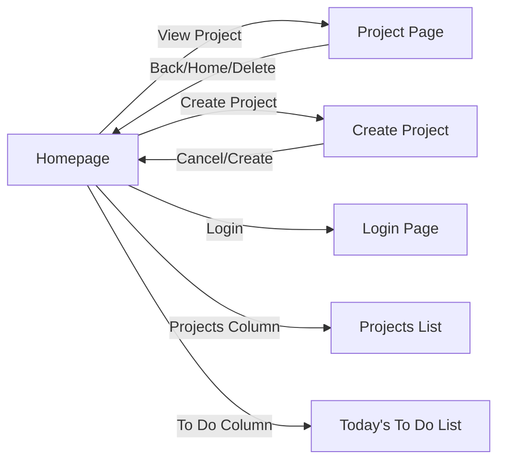
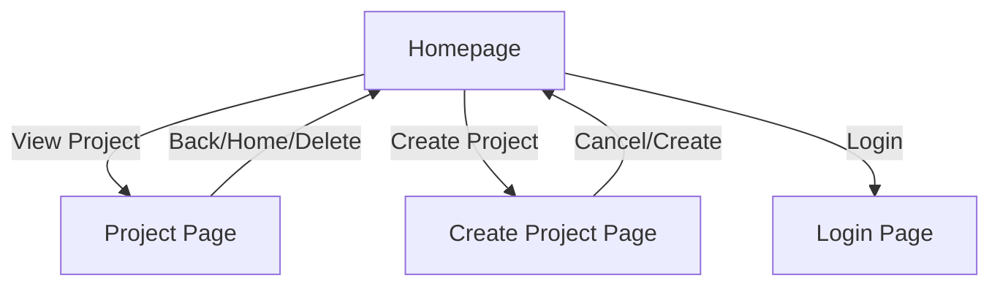

# Project Management App Documentation

## Overview

This application is a local-first project and task management tool with a React-based UI. It supports project creation, team management, task assignment, and a two-column homepage for projects and "Today's To Do List".

---

## Main Features

### 1. Homepage

- **Two-column layout**:
  - **Projects**: List of all projects, each clickable to view details.
  - **Today's To Do List**: Aggregated list of all tasks from all projects.
- **Navigation**: Buttons for login, system settings, and other features.

---

### 2. Project Creation

- Inline form for project name, deadline, team members, and tasks.
- Add team members and tasks without browser dialogs.
- Cancel button to return to homepage.

---

### 3. Project Page

- View and edit project details.
- Rename project inline.
- Add/remove team members and tasks with inline forms.
- Assign/reassign tasks to team members.
- Delete project button (removes project and returns home).
- Navigation: Back to projects, Home.

---

### 4. Task Management

- Tasks can be created with or without an assignee.
- Tasks default to first team member if present.
- All tasks are visible in the "Today's To Do List" column on the homepage.

---

### 5. Team Member Management

- Add team members via inline form during project creation and in project page.
- Team members are available for task assignment.

---

### 6. Login Page

- Simple login form (email and password, no backend auth yet).
- Navigation back to homepage after login.

---

## UI Structure

---

## Future Documentation Updates

- Add backend API documentation.
- Add screenshots or UI wireframes.
- Add advanced usage and troubleshooting.