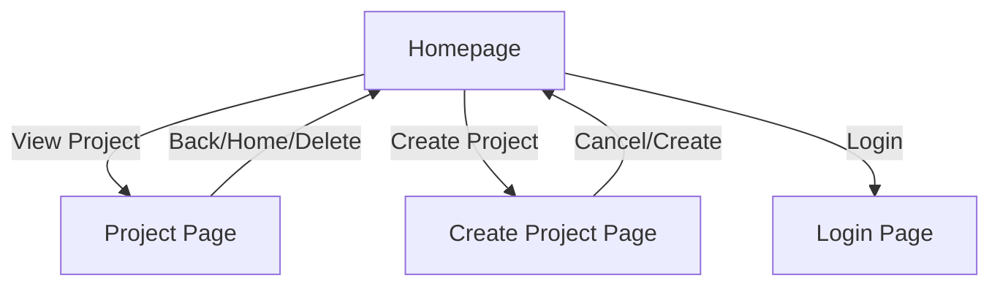
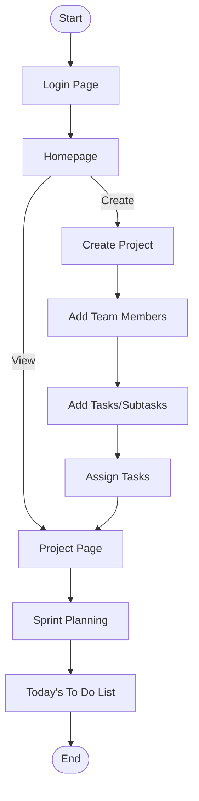

# Project Management App Documentation

## Overview

This project consists of two separate apps:

- **Node App**: The main project and task management tool (React-based UI, previously called "frontend").
- **Server App**: The admin/server UI and API backend (Node.js/Express with its own React-based admin UI).

Both apps interact via REST API endpoints, with authentication and user management handled by the Server App.

---

---

## Main Features

### Node App (Project/Task Manager)

- Authentication required (login/register via Server App).
- Project creation, editing, and deletion.
- Team member management (add/remove/assign).
- Task and subtask management (add/edit/remove, assign, dependencies).
- Drag-and-drop reordering for tasks and subtasks.
- Gantt chart visualization for tasks/subtasks.
- Today's To Do List aggregation.
- Inline editing for deadlines, dependencies, and assignments.
- All features accessible after login.

### Server App (Admin/Server UI)

- Authentication required (login/register, username/password).
- REST API for user management, members, projects, logs, and nodes.
- Admin UI with three columns: members, projects, event log.
- Event log of all API and user actions.
- User registration and login endpoints (`/auth/register`, `/auth/login`).
- File-based storage for users and node data.
- Serves static React admin UI.

### Shared/Integration Features

- Both apps communicate via REST API (JSON).
- Authentication token required for all API endpoints except `/auth/*`.
- User session stored in localStorage and sent as Bearer token.
- Both apps can be run in development mode or bundled for production.
- All features work cross-app after login.

---

---

## UI Structure



---

## Future Documentation Updates

- Add backend API documentation.
- Add screenshots or UI wireframes.
- Add advanced usage and troubleshooting.
---

## Backend & API Overview

- **Backend:** Node.js server (see [`backend/index.js`](../backend/index.js:1)), manages project, team, and task data.
- **API:** RESTful endpoints for CRUD operations on projects, tasks, and team members.
- **Local-first:** Data is stored locally by default; future updates may add remote sync.

---

## Running the Application Locally

1. **Install dependencies:**
   - Frontend: `cd frontend && npm install`
   - Backend: `cd backend && npm install`
2. **Start backend:** `npm start` (from `backend` directory)
3. **Start frontend:** `npm start` (from `frontend` directory, default port: 3002)
4. **Access app:** [http://localhost:3002](http://localhost:3002)

---

## Deployment

- **Docker:** Both frontend and backend have Dockerfiles for containerized deployment.
- **docker-compose:** Use `docker-compose.yml` for multi-container setup.
- **Ports:** Frontend runs on 3002 by default; backend port can be configured.

---

## Tech Stack

- React (frontend)
- Node.js (backend)
- Docker (deployment)
- Local-first storage

---
---

## Software Architecture Diagram

```mermaid
graph TD
  NodeApp[Node App (Project/Task Manager)]
  ServerApp[Server App (Admin/API Server)]
  NodeUI[Node App UI]
  ServerUI[Server Admin UI]
  NodeAPI[Node App API Client]
  ServerAPI[Server REST API]
  UsersFile[Users File]
  NodesFile[Nodes File]

  NodeUI -->|API (auth, projects, tasks, members)| ServerAPI
  ServerUI -->|API (auth, members, projects, logs, nodes)| ServerAPI
  ServerAPI --> UsersFile
  ServerAPI --> NodesFile
  NodeApp -.-> NodeUI
  ServerApp -.-> ServerUI
```

- **Node App:** React app for project/task management, communicates with Server App via REST API.
- **Server App:** Node.js/Express backend, provides authentication, user management, and admin UI.
- **Authentication:** All API endpoints require a valid token except `/auth/*`.
- **Data Storage:** Users and nodes stored in local JSON files.
- **Deployment:** Both apps can be run independently or containerized.

---

## User Flow Diagram



- **Typical flow:** User logs in, creates a project, adds team members and tasks, assigns work, plans sprints, and tracks tasks via the To Do List.

---