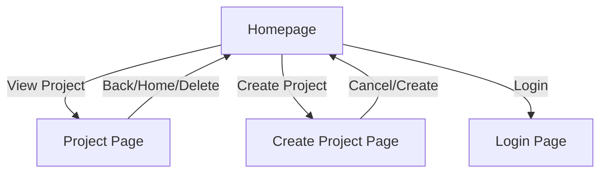

# Project Management App Documentation

## Overview

This application is a local-first project and task management tool with a React-based UI. It supports project creation, team management, task assignment, and a two-column homepage for projects and "Today's To Do List".

---

## Main Features

### 1. Homepage

- **Two-column layout**:
  - **Projects**: List of all projects, each clickable to view details.
  - **Today's To Do List**: Aggregated list of all tasks from all projects.
- **Navigation**: Buttons for login, system settings, and other features.

### 2. Project Creation

- The "Create Project" button on the homepage navigates to a dedicated project creation page.
- The project creation page includes:
  - **Project Name** (required)
  - **Deadline** (optional, date picker)
  - **Team Members**: Add multiple members with name and role fields, inline (no dialogs)
  - **Tasks**: Add multiple tasks with name, status, assignee (from team members), and optional deadline, inline (no dialogs)
- All additions and edits are performed inline on the form.
- "Create" saves the project and returns to the homepage; "Cancel" discards changes.
- All features are accessible without browser dialogs or prompts.

### 3. Project Page

- View and edit project details, including renaming and deadline.
- Add/remove team members and tasks inline.
- Assign/reassign tasks to team members.
- Delete project returns to homepage.
- Navigation: "Back to Home" and "Delete Project".

### 4. Task Management

- Tasks can be created with or without an assignee.
- Tasks default to first team member if present.
- All tasks are visible in the "Today's To Do List" column on the homepage.

### 5. Team Member Management

- Team members and tasks can be added during project creation and from the project page.
- Tasks can be assigned to any team member or left unassigned.
- All tasks appear in the "Today's To Do List" column on the homepage.

### 6. Login Page

- Simple login form (email and password, no backend auth yet).
- Navigation back to homepage after login.

---

## UI Structure

---

## Future Documentation Updates

- Add backend API documentation.
- Add screenshots or UI wireframes.
- Add advanced usage and troubleshooting.