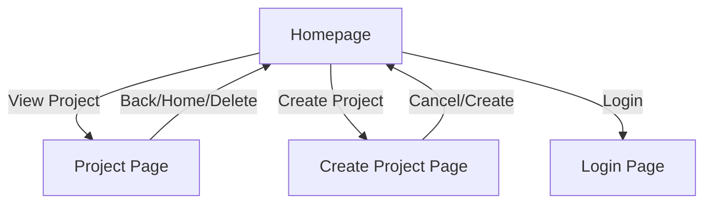
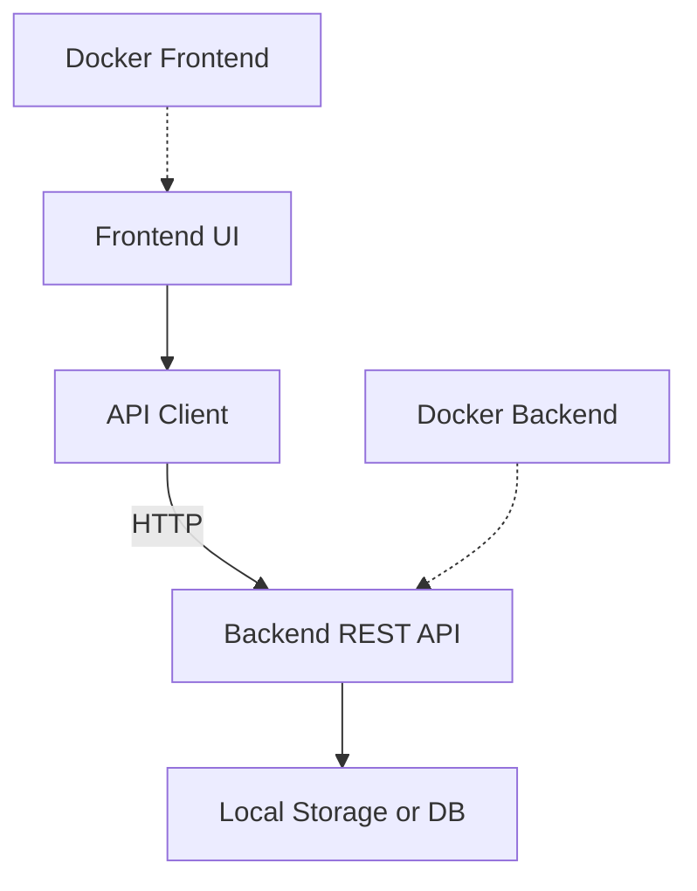

# Project Management App Documentation

## Overview

This application is a local-first project and task management tool with a React-based UI. It supports project creation, team management, task assignment, and a two-column homepage for projects and "Today's To Do List".

---

## Main Features

### 1. Homepage

- **Two-column layout**:
  - **Projects**: List of all projects, each clickable to view details.
  - **Today's To Do List**: Aggregated list of all tasks from all projects.
- **Navigation**: Buttons for login, system settings, and other features.

### 2. Project Creation

- The "Create Project" button on the homepage navigates to a dedicated project creation page.
- The project creation page includes:
  - **Project Name** (required)
  - **Deadline** (optional, date picker)
  - **Team Members**: Add multiple members with name and role fields, inline (no dialogs)
  - **Tasks**: Add multiple tasks with name, status, assignee (from team members), and optional deadline, inline (no dialogs)
  - **Subtasks**: Each task can have subtasks, each with a name, status, and assignee (from team members), all managed inline.
- All additions and edits are performed inline on the form.
- "Create" saves the project and returns to the homepage; "Cancel" discards changes.
- All features are accessible without browser dialogs or prompts.

### 3. Project Page

- View and edit project details, including renaming and deadline.
- Add/remove team members and tasks inline.
- Assign/reassign tasks and subtasks to team members using dropdowns.
- Inline editing for deadlines and dependencies.
- Drag-and-drop reordering for tasks and subtasks.
- Delete project returns to homepage.
- Navigation: "Back to Home" and "Delete Project".

### 4. Task & Subtask Management

- Tasks and subtasks can be created with or without an assignee.
- Both tasks and subtasks default to first team member if present.
- All tasks are visible in the "Today's To Do List" column on the homepage.
- Drag-and-drop reordering for both tasks and subtasks.
- Dependencies can be set between tasks and subtasks.

### 5. Team Member Management

- Team members and tasks can be added during project creation and from the project page.
- Tasks and subtasks can be assigned to any team member or left unassigned.
- Removing a team member unassigns their tasks and subtasks.
- All tasks appear in the "Today's To Do List" column on the homepage.

### 6. Gantt Chart Visualization

- Each project page includes a Gantt chart view of all tasks and subtasks with start/end dates.
- Full Gantt chart page available for expanded visualization.
- Visualizes dependencies and durations for tasks and subtasks.

### 7. Login Page

- Simple login form (email and password, no backend auth yet).
- Navigation back to homepage after login.

---

## UI Structure

---

## Future Documentation Updates

- Add backend API documentation.
- Add screenshots or UI wireframes.
- Add advanced usage and troubleshooting.
---

## Backend & API Overview

- **Backend:** Node.js server (see [`backend/index.js`](../backend/index.js:1)), manages project, team, and task data.
- **API:** RESTful endpoints for CRUD operations on projects, tasks, and team members.
- **Local-first:** Data is stored locally by default; future updates may add remote sync.

---

## Running the Application Locally

1. **Install dependencies:**
   - Frontend: `cd frontend && npm install`
   - Backend: `cd backend && npm install`
2. **Start backend:** `npm start` (from `backend` directory)
3. **Start frontend:** `npm start` (from `frontend` directory, default port: 3002)
4. **Access app:** [http://localhost:3002](http://localhost:3002)

---

## Deployment

- **Docker:** Both frontend and backend have Dockerfiles for containerized deployment.
- **docker-compose:** Use `docker-compose.yml` for multi-container setup.
- **Ports:** Frontend runs on 3002 by default; backend port can be configured.

---

## Tech Stack

- React (frontend)
- Node.js (backend)
- Docker (deployment)
- Local-first storage

---
---

## Software Architecture Diagram

- **Frontend:** React app for UI, communicates with backend via REST API.
- **Backend:** Node.js server, handles business logic and data storage.
- **Local-first:** Data stored locally, with potential for future remote sync.
- **Deployment:** Both frontend and backend can be containerized with Docker.

---

## User Flow Diagram

- **Typical flow:** User logs in, creates a project, adds team members and tasks, assigns work, plans sprints, and tracks tasks via the To Do List.

---